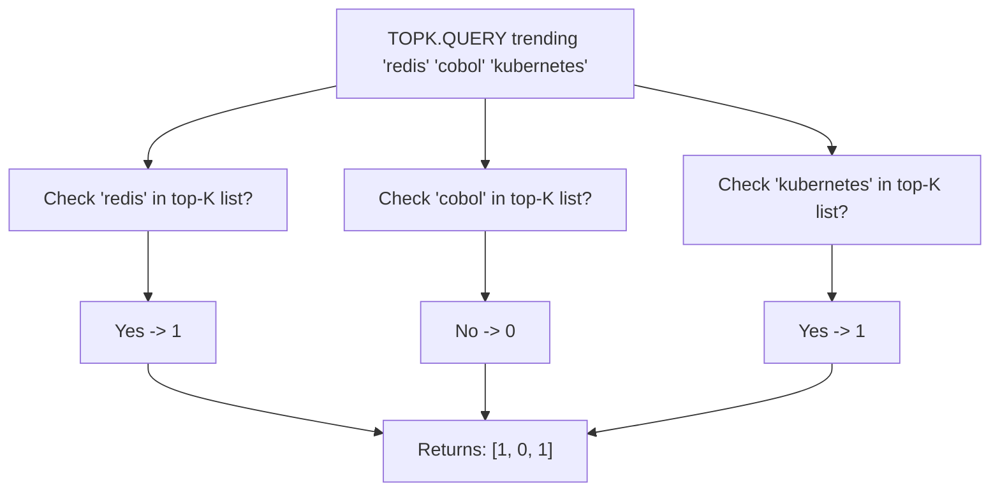

# How to Use TOPK.QUERY in Redis TopK Structure

Author: [nawazdhandala](https://www.github.com/nawazdhandala)

Tags: Redis, RedisBloom, TopK, Probabilistic, Command

Description: Learn how to use TOPK.QUERY in Redis to check whether specific items are currently in the top-K list without retrieving the full ranking.

---

## How TOPK.QUERY Works

`TOPK.QUERY` checks whether specific items are currently present in the top-K list. It is a membership query: it returns `1` if the item is in the top K, or `0` if it is not. This is useful when you know the items you care about and just want to verify their top-K status without fetching the entire list.



## Syntax

```redis
TOPK.QUERY key item [item ...]
```

- `key` - the TopK structure key
- `item [item ...]` - one or more items to check

Returns an array of integers, one per item:
- `1` - item is currently in the top-K list
- `0` - item is not currently in the top-K list

## Examples

### Check If Items Are Trending

```redis
TOPK.RESERVE search_terms 10 2000 7 0.9

TOPK.ADD search_terms "redis" "redis" "redis" "docker" "docker"
TOPK.ADD search_terms "kubernetes"

TOPK.QUERY search_terms "redis" "docker" "kubernetes" "mongodb"
```

```text
1) (integer) 1
2) (integer) 1
3) (integer) 1
4) (integer) 0
```

`mongodb` was never added, so it is not in the top K.

### Check a Single Item

```redis
TOPK.QUERY trending_products "product:bestseller"
```

```text
1) (integer) 1
```

### Check After Eviction

After many more items are added, a less frequent item may be evicted:

```redis
-- After many more items and higher-frequency competitors:
TOPK.QUERY search_terms "kubernetes"
```

```text
1) (integer) 0
```

`kubernetes` was evicted from the top K as more popular items took its place.

## Use Cases

### Checking if a Product Is a Best Seller

Before applying a "Best Seller" badge, verify the product is in the top K:

```redis
TOPK.QUERY top_sellers "product:1234"
-- If 1: show the badge
-- If 0: no badge
```

### Personalized Notifications

Alert users when a content item they care about becomes trending:

```redis
-- User follows "topic:redis"
-- Check if it has made it into trending topics
TOPK.QUERY trending_topics "topic:redis"
-- If 1: send notification "Redis is trending!"
```

### Search Quality Gate

Only show "trending" label for queries that are in the top K:

```redis
-- User searched for "redis performance"
TOPK.QUERY trending_searches "redis performance"
-- If 1: tag result page with "Trending search"
```

### Batch Feature Flagging

Check whether multiple features are among the top-K most used:

```redis
TOPK.QUERY feature_usage "feature:dark_mode" "feature:export_csv" "feature:api_v2"
```

```text
1) (integer) 1
2) (integer) 0
3) (integer) 1
```

Only `dark_mode` and `api_v2` are top features; `export_csv` has not made the top K.

## TOPK.QUERY vs TOPK.LIST

| Use Case | Command |
|----------|---------|
| Check specific items | `TOPK.QUERY` |
| Get the full ranked list | `TOPK.LIST` |
| Get counts alongside ranks | `TOPK.LIST WITHCOUNT` |

Use `TOPK.QUERY` when you have candidate items to check. Use `TOPK.LIST` to discover what the top items are.

## Accuracy Notes

`TOPK.QUERY` reflects the current internal state of the Heavy Hitters algorithm. Because TopK is approximate:
- A `1` result means the item is in the top K based on current estimates
- A `0` result means the item is not in the current top K, but it may have been recently

The results are accurate enough for practical applications like trending displays and recommendation systems.

## Summary

`TOPK.QUERY` checks whether specific items are currently in the top-K list and returns `1` (present) or `0` (absent) per item. Use it for efficient batch membership checks against the top-K ranking without retrieving the full list. It is ideal for applying "trending" labels, checking best-seller status, and driving personalized notifications based on top-K membership.
