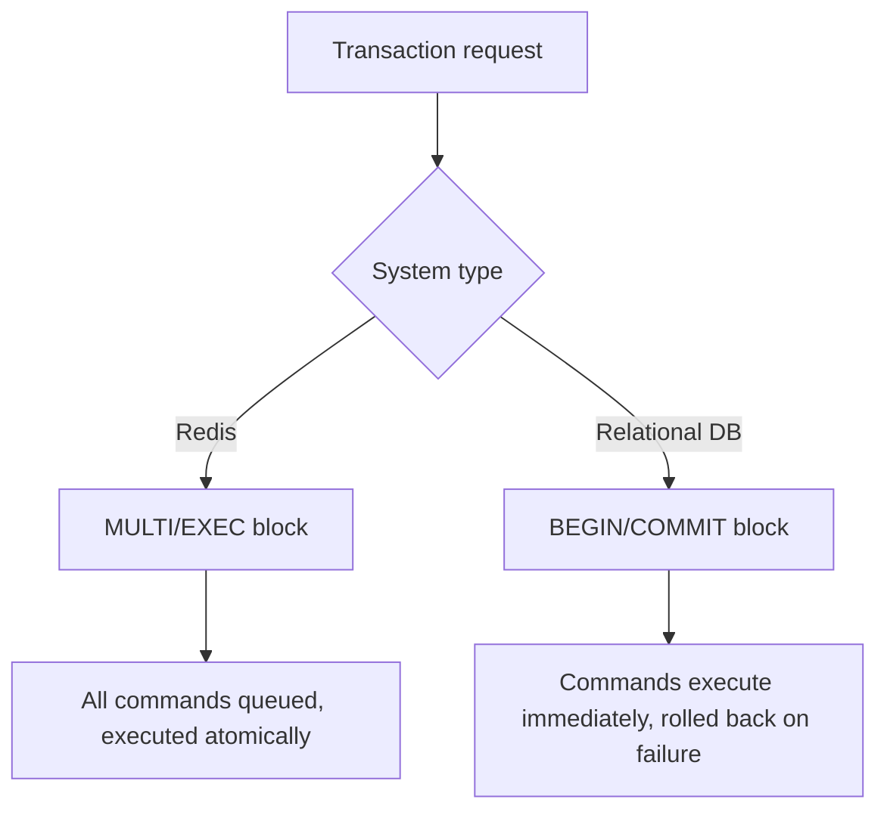
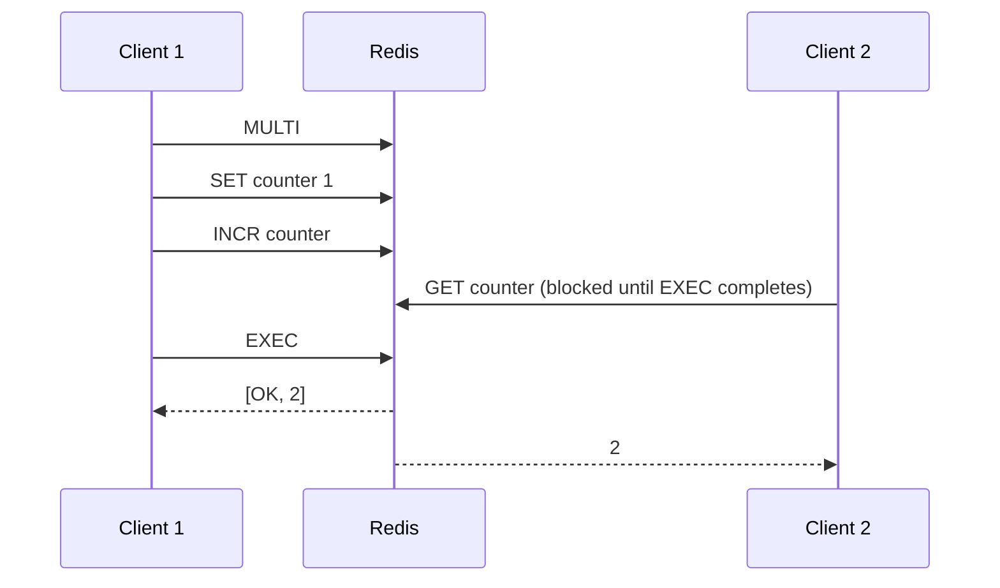
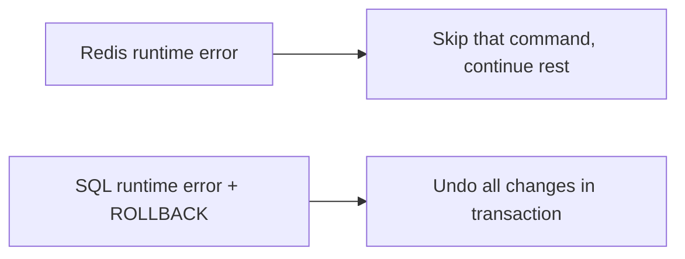

# How Transactions Work in Redis vs Traditional Databases

Author: [nawazdhandala](https://www.github.com/nawazdhandala)

Tags: Redis, Transaction, Database, ACID, MULTI, EXEC

Description: Compare how Redis transactions differ from ACID transactions in relational databases, covering atomicity, isolation, error handling, and rollback behavior.

---

## Overview

Both Redis and relational databases (PostgreSQL, MySQL) provide a mechanism called "transactions" that groups multiple operations together, but the semantics and guarantees differ significantly. Understanding those differences prevents subtle bugs when switching between the two models.



## ACID Properties Compared

| Property | Redis | Relational DB |
|---|---|---|
| Atomicity | All queued commands run or none run | Full rollback on any failure |
| Consistency | No foreign keys or constraints | Constraints enforced throughout |
| Isolation | Single-threaded execution, no interleaving | Configurable isolation levels |
| Durability | Depends on AOF/RDB config | WAL ensures commit survives crash |

### Atomicity

In Redis, atomicity means that no other client's commands can interleave with the queued commands between MULTI and EXEC. The entire block executes as a single atomic sequence. However, Redis does NOT roll back commands that fail at runtime.

In a relational database, atomicity means the entire transaction is rolled back if any statement fails, leaving the database as if the transaction never happened.

### Isolation

Redis uses a single-threaded command execution model. While a MULTI/EXEC block is executing, no other client command can run. This is the highest possible isolation level (serializable), achieved without any locking overhead.

Relational databases provide configurable isolation levels: READ UNCOMMITTED, READ COMMITTED, REPEATABLE READ, and SERIALIZABLE. Lower levels permit phenomena like dirty reads and phantom reads in exchange for throughput.



## Error Handling

This is the most important difference between Redis and traditional databases.

### Redis: two types of errors

**Syntax errors** (detected at queue time) abort the entire transaction:

```redis
MULTI
SET key1 value1
UNKNOWNCMD key2  -- Syntax error, detected immediately
SET key3 value3
EXEC
-- Returns: EXECABORT Transaction discarded because of previous errors.
-- Nothing was executed
```

**Runtime errors** (detected at execute time) do NOT abort the transaction:

```redis
MULTI
SET strkey "hello"
INCR strkey       -- Will fail at runtime: not an integer
SET key3 "world"
EXEC
-- Returns:
-- 1) OK           (SET succeeded)
-- 2) ERR ...      (INCR failed, but transaction continues)
-- 3) OK           (SET succeeded)
```

### Traditional database: unified rollback

```sql
BEGIN;
INSERT INTO accounts (id, balance) VALUES (1, 1000);
UPDATE accounts SET balance = balance - 200 WHERE id = 99;  -- No row 99 exists
COMMIT;
-- Depending on constraints, the whole transaction may roll back
-- With proper error handling, explicit ROLLBACK clears everything
```



## Optimistic Locking vs Pessimistic Locking

Redis uses optimistic locking via WATCH/MULTI/EXEC. No locks are held during the watch period. If a watched key changes, the transaction is aborted and the client must retry.

Traditional databases typically support both:
- **Pessimistic locking**: `SELECT ... FOR UPDATE` holds a row lock until COMMIT
- **Optimistic locking**: Implemented at the application layer using version columns

```redis
-- Redis optimistic locking
WATCH account:1
balance = GET account:1
MULTI
SET account:1 [balance - 100]
EXEC   -- Returns nil if account:1 changed since WATCH
```

```sql
-- PostgreSQL pessimistic locking
BEGIN;
SELECT balance FROM accounts WHERE id = 1 FOR UPDATE;
UPDATE accounts SET balance = balance - 100 WHERE id = 1;
COMMIT;
```

## No Savepoints or Partial Rollbacks

Redis has no equivalent of savepoints. You cannot roll back part of a transaction. The only options are:
- Let the full block run (EXEC)
- Discard the full block (DISCARD)

Traditional databases support savepoints for partial rollbacks:

```sql
BEGIN;
INSERT INTO log (msg) VALUES ('started');
SAVEPOINT sp1;
UPDATE critical_table SET val = 99;  -- May fail
ROLLBACK TO sp1;                     -- Partial rollback to savepoint
COMMIT;
```

## Performance Characteristics

| Aspect | Redis MULTI/EXEC | Relational DB transaction |
|---|---|---|
| Overhead per transaction | Very low (in-memory, single thread) | Higher (WAL writes, lock management) |
| Round trips | 2 (MULTI + EXEC) plus N commands | N+2 (BEGIN, N statements, COMMIT) |
| Pipelining | Naturally pipelined | Requires explicit client pipelining |
| Throughput | Hundreds of thousands/sec | Thousands to tens of thousands/sec |

## When to Use Each

Use Redis transactions when:
- You need to batch multiple reads and writes atomically without interleaving
- Your data model is simple and does not require constraint enforcement
- You need extremely high throughput
- You can handle retries for optimistic lock failures

Use relational database transactions when:
- You need full rollback on any failure
- Your schema enforces referential integrity and constraints
- You need configurable isolation levels for complex concurrent workloads
- You need savepoints for fine-grained control

## Summary

Redis transactions (MULTI/EXEC) guarantee atomic execution in the sense that no other client can interleave commands, but they do not provide rollback for runtime errors. Relational database transactions guarantee full ACID semantics including rollback, savepoints, and configurable isolation. Redis trades rollback capability for extreme simplicity and throughput, while relational databases trade throughput for richer consistency guarantees.
