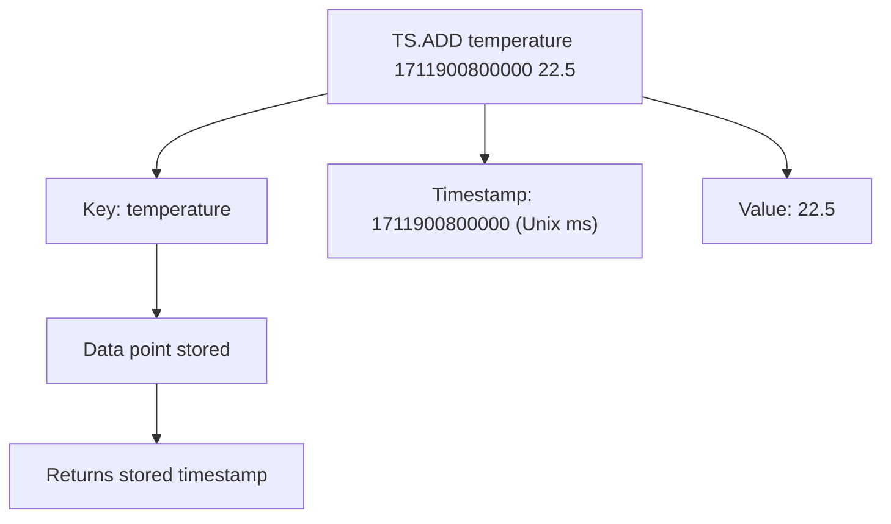

# How to Use TS.ADD in Redis Time Series to Add Data Points

Author: [nawazdhandala](https://www.github.com/nawazdhandala)

Tags: Redis, Time Series, RedisTimeSeries, Command

Description: Learn how to use TS.ADD in Redis Time Series to insert a single timestamp-value data point, with auto-creation, timestamp asterisk, and duplicate policy options.

---

## How TS.ADD Works

`TS.ADD` inserts a single data point into a Redis Time Series key. A data point consists of a Unix timestamp in milliseconds and a floating-point value. If the key does not exist, `TS.ADD` can auto-create it with optional configuration. Using `*` as the timestamp inserts the current server time.



## Syntax

```redis
TS.ADD key timestamp value
  [RETENTION retentionPeriod]
  [ENCODING [COMPRESSED|UNCOMPRESSED]]
  [CHUNK_SIZE chunkSize]
  [DUPLICATE_POLICY policy]
  [IGNORE ignoreMaxTimediff ignoreMaxValDiff]
  [LABELS {label value}...]
  [ON_DUPLICATE policy]
```

- `key` - the time series key
- `timestamp` - Unix timestamp in milliseconds, or `*` for current server time
- `value` - the floating-point data value
- Additional options auto-create the series if it does not exist

Returns the timestamp of the inserted sample.

## Examples

### Add with Explicit Timestamp

```redis
TS.ADD temperature 1711900800000 22.5
```

```text
(integer) 1711900800000
```

### Add with Auto-Timestamp

```redis
TS.ADD temperature * 23.1
```

```text
(integer) 1711900812345
```

Redis uses its current clock for the timestamp.

### Auto-Create Series on First Insert

```redis
TS.ADD new-sensor * 19.8 RETENTION 86400000 LABELS region eu type humidity
```

If `new-sensor` does not exist, it is created with the given configuration.

### Add to Existing Series

```redis
TS.CREATE api:latency RETENTION 86400000
TS.ADD api:latency * 145.3
TS.ADD api:latency * 167.8
TS.ADD api:latency * 132.1
```

### Override Duplicate Policy per Insert

```redis
TS.ADD strict-sensor 1711900800000 55.0 ON_DUPLICATE LAST
```

Overrides the series-level duplicate policy for this single insert.

## Use Cases

### Recording Sensor Readings

```redis
-- Record temperature every minute
TS.ADD sensor:temp:room-1 * 21.4
```

### Logging API Latency

```redis
-- After each request completes
TS.ADD api:latency:checkout * 183
```

### Recording Custom Event Values

```redis
-- Cart value at checkout
TS.ADD ecommerce:cart-value * 129.99
```

### Historical Backfill

When migrating historical data, use explicit timestamps:

```redis
TS.ADD sales:daily 1704067200000 15230.50
TS.ADD sales:daily 1704153600000 18450.75
TS.ADD sales:daily 1704240000000 12100.00
```

## TS.ADD vs TS.MADD

`TS.ADD` inserts a single sample. `TS.MADD` inserts multiple samples across multiple series in one command, reducing round-trips.

```redis
-- Single insert
TS.ADD temperature * 22.5

-- Batch insert (more efficient for multiple series)
TS.MADD temperature * 22.5 humidity * 65.0 pressure * 1013.2
```

## Timestamp Rules

- Timestamps must be greater than or equal to the last timestamp in the series (unless duplicate policy allows it).
- Out-of-order inserts are rejected by default.
- Use `*` to always insert at the current time without managing timestamps.

```redis
-- This fails if 1000 is before the last stored timestamp
TS.ADD latency 1000 50.0
-- Error: TSDB: Timestamp cannot be older than oldest timestamp
```

## Performance Considerations

- Each `TS.ADD` call is O(M) where M is the number of compaction rules attached to the series.
- Use `TS.MADD` to batch inserts across series and reduce network round-trips.
- Auto-creation with labels on every `TS.ADD` call is slower than pre-creating series with `TS.CREATE`.

## Summary

`TS.ADD` inserts a single timestamp-value pair into a Redis Time Series key, supports auto-creation with labels and retention, accepts `*` for current server time, and returns the stored timestamp. For high-throughput scenarios, batch with `TS.MADD` to reduce latency and network overhead.
