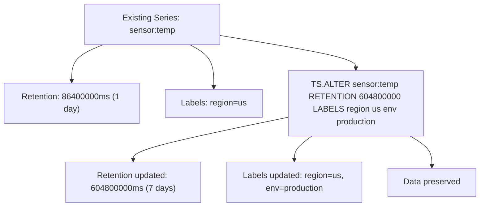

# How to Use TS.ALTER in Redis Time Series to Modify Series

Author: [nawazdhandala](https://www.github.com/nawazdhandala)

Tags: Redis, Time Series, RedisTimeSeries, Command

Description: Learn how to use TS.ALTER in Redis Time Series to modify the retention period, chunk size, duplicate policy, and labels of an existing series without deleting data.

---

## How TS.ALTER Works

`TS.ALTER` modifies the configuration of an existing Redis Time Series key. You can change the retention period, chunk size, duplicate policy, and labels without deleting any data or recreating the series. This allows you to adjust series configuration after creation as requirements change.



## Syntax

```redis
TS.ALTER key
  [RETENTION retentionPeriod]
  [CHUNK_SIZE chunkSize]
  [DUPLICATE_POLICY policy]
  [IGNORE ignoreMaxTimediff ignoreMaxValDiff]
  [LABELS {label value}...]
```

- `key` - the existing time series key
- All parameters are optional; only specified parameters are changed
- Returns `OK` on success
- Labels specified with `LABELS` replace all existing labels entirely

## Examples

### Change Retention Period

```redis
TS.CREATE sensor:temp RETENTION 86400000
-- Later, extend to 7 days
TS.ALTER sensor:temp RETENTION 604800000
TS.INFO sensor:temp
```

```text
9) "retentionTime"
10) (integer) 604800000
```

### Disable Retention (Keep Data Forever)

```redis
TS.ALTER sensor:temp RETENTION 0
```

Setting retention to 0 removes the expiry; data is kept indefinitely.

### Update Labels

```redis
TS.CREATE metrics:cpu LABELS env staging
-- After promotion to production
TS.ALTER metrics:cpu LABELS env production region us-east-1 host server-5
```

All previous labels are replaced. The response includes the new label set.

### Change Duplicate Policy

```redis
TS.CREATE sensor:strict DUPLICATE_POLICY BLOCK
-- Relax to allow last-write-wins
TS.ALTER sensor:strict DUPLICATE_POLICY LAST
```

### Change Chunk Size

```redis
TS.ALTER high-frequency-series CHUNK_SIZE 8192
```

Larger chunks reduce allocation overhead for dense series.

### Multiple Changes at Once

```redis
TS.ALTER api:latency
  RETENTION 2592000000
  DUPLICATE_POLICY LAST
  LABELS env production service api region eu-west-1
```

## Use Cases

### Extending Retention After Storage Upgrade

After adding more memory or disk capacity, extend retention for important metrics:

```redis
TS.ALTER production:latency RETENTION 2592000000
TS.ALTER production:cpu RETENTION 2592000000
TS.ALTER production:memory RETENTION 2592000000
```

### Updating Labels After Service Rename

When a service is renamed, update its time series labels:

```redis
TS.ALTER service:old-name:latency LABELS service new-name env production region us
```

### Adding Labels for New Dashboard Filters

A new dashboard filter by `team` requires adding the label to existing series:

```redis
TS.ALTER metrics:payments:latency LABELS service payments env production team checkout
TS.ALTER metrics:payments:errors LABELS service payments env production team checkout
```

### Reducing Retention to Save Memory

Trim retention when memory is constrained:

```redis
TS.ALTER verbose:metrics RETENTION 3600000
```

This immediately causes Redis to purge data older than 1 hour.

### Fixing a Misconfigured Duplicate Policy

If a series was accidentally created with BLOCK policy and now needs to accept updates:

```redis
TS.ALTER temperature:backfill DUPLICATE_POLICY LAST
```

## Label Replacement Behavior

`LABELS` in `TS.ALTER` replaces the entire label set, not merges:

```redis
-- Original labels: region=us, env=staging
TS.CREATE my-series LABELS region us env staging

-- This replaces ALL labels; region is removed
TS.ALTER my-series LABELS env production

-- After ALTER, labels are: env=production (region is gone)
TS.INFO my-series
```

To add a label while keeping existing ones, include all existing labels plus the new one:

```redis
TS.ALTER my-series LABELS env production region us host server-1
```

## TS.ALTER vs DEL + TS.CREATE

```redis
-- Non-destructive: change config, keep data
TS.ALTER existing-series RETENTION 604800000

-- Destructive: recreate from scratch (data lost)
DEL existing-series
TS.CREATE existing-series RETENTION 604800000
```

Always prefer `TS.ALTER` when modifying configuration on a series that already contains data.

## Performance Considerations

- `TS.ALTER` with a shorter retention period immediately triggers deletion of expired chunks.
- Label updates are O(number of labels) and do not affect stored data.
- Chunk size changes take effect for new chunks only; existing chunks retain their original size.

## Summary

`TS.ALTER` modifies the configuration of an existing Redis Time Series key in place, allowing you to update retention, chunk size, duplicate policy, and labels without deleting data. Use it when requirements change after a series has been created and populated with data.
