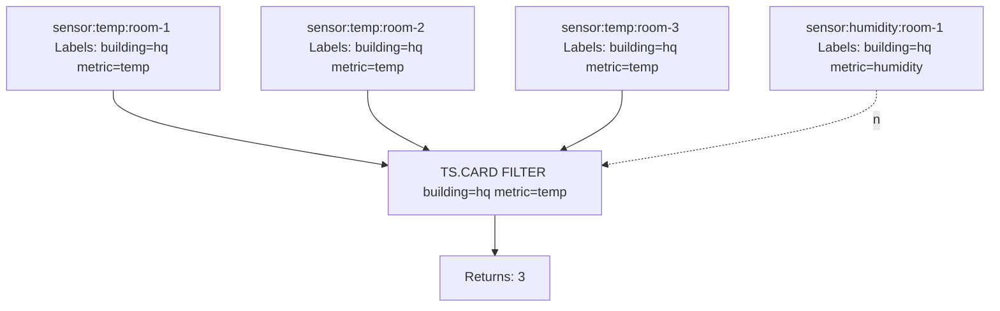

# How to Use TS.CARD in Redis Time Series

Author: [nawazdhandala](https://www.github.com/nawazdhandala)

Tags: Redis, Time Series, RedisTimeSeries, Command

Description: Learn how to use TS.CARD in Redis Time Series to count the number of time series keys that match a given set of label filter expressions.

---

## How TS.CARD Works

`TS.CARD` returns the count of Redis Time Series keys that match one or more label filter expressions. Unlike `TS.QUERYINDEX` which returns the actual key names, `TS.CARD` returns only the count. This is useful for monitoring how many series exist in a group, setting cardinality limits, and building dashboards that show series counts without the overhead of returning all key names.



## Syntax

```redis
TS.CARD FILTER filter...
```

- `FILTER` - one or more label filter expressions
- Returns an integer count of matching series

### Filter Expressions

| Expression | Meaning |
|---|---|
| `label=value` | Exact match |
| `label!=value` | Not equal |
| `label=` | Label does not exist |
| `label!=` | Label exists |
| `label=(v1,v2)` | Value is one of a list |
| `label!=(v1,v2)` | Value is not in list |

## Examples

### Count All Series with a Label

```redis
TS.CREATE temp:room-1 LABELS building hq metric temperature
TS.CREATE temp:room-2 LABELS building hq metric temperature
TS.CREATE temp:room-3 LABELS building hq metric temperature
TS.CREATE humidity:room-1 LABELS building hq metric humidity
TS.CARD FILTER building=hq metric=temperature
```

```text
(integer) 3
```

### Count All Series in an Environment

```redis
TS.CARD FILTER env=production
```

```text
(integer) 142
```

### Count with Multiple Filters

```redis
TS.CARD FILTER env=production service=api region=us-east-1
```

```text
(integer) 12
```

### Count Series Where Label Exists

```redis
TS.CARD FILTER experiment!=
```

Returns the number of series that have the `experiment` label with any value.

### Count Unlabeled (Raw) Series

```redis
TS.CARD FILTER compaction=
```

Returns series that do not have the `compaction` label - typically raw ingestion series.

### Count Series by Value List

```redis
TS.CARD FILTER env=(production,staging) metric=latency
```

```text
(integer) 28
```

## Use Cases

### Cardinality Monitoring

Track how many time series exist in each environment to detect runaway series creation:

```redis
TS.CARD FILTER env=production
TS.CARD FILTER env=staging
TS.CARD FILTER env=development
```

Alert if any count exceeds a configured threshold.

### Onboarding Validation

After a deployment creates time series for a new service, confirm the expected count:

```redis
TS.CARD FILTER service=new-service env=production
-- Should return 8 (expected number of metric series)
```

### Dashboard Series Count Widget

Display how many active sensors are reporting in a facility:

```redis
TS.CARD FILTER building=headquarters active=true
```

```text
(integer) 47
```

### Cleanup Audit

Count how many decommissioned-host series still exist:

```redis
TS.CARD FILTER host=decommissioned-server-42
```

If non-zero, those series should be deleted.

### Experiment Coverage

Count how many series are currently tagged with an experiment label:

```redis
TS.CARD FILTER experiment!=
```

## TS.CARD vs TS.QUERYINDEX

```redis
-- Returns the count only
TS.CARD FILTER env=production metric=cpu

-- Returns the key names
TS.QUERYINDEX env=production metric=cpu
```

Use `TS.CARD` when you only need the number of matching series. Use `TS.QUERYINDEX` when you need the actual key names for further processing.

## TS.CARD vs TS.MGET / TS.MRANGE

```redis
-- Count matching series (cheapest)
TS.CARD FILTER env=production metric=cpu

-- Get latest value from each matching series
TS.MGET FILTER env=production metric=cpu

-- Get time range from each matching series (most data)
TS.MRANGE -3600000 + FILTER env=production metric=cpu
```

`TS.CARD` is the lightest option when you only need to know "how many."

## Performance Considerations

- `TS.CARD` scans only the label index, not the actual time series data.
- It is faster than `TS.QUERYINDEX` for large result sets because it does not build a list of key names.
- Suitable for high-frequency monitoring and alerting on series cardinality.

## Summary

`TS.CARD` returns the count of Redis Time Series keys matching label filter expressions, without returning the key names or data. It is the most efficient way to monitor series cardinality, validate deployment completeness, count active sensors, and trigger alerts when series counts deviate from expected values.
