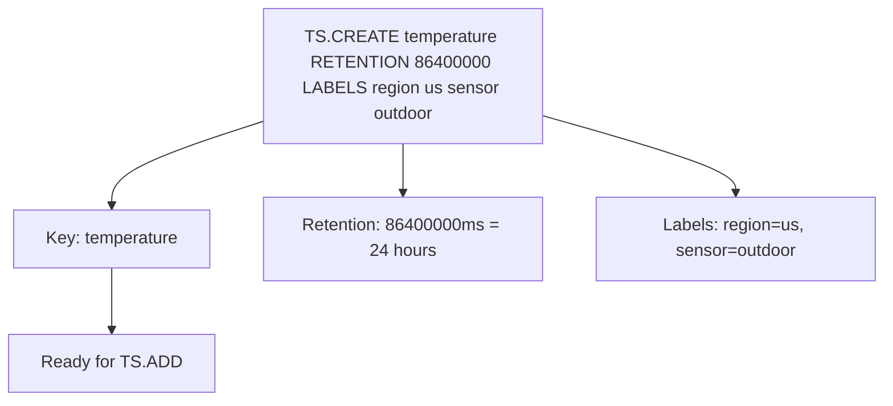

# How to Use TS.CREATE in Redis Time Series

Author: [nawazdhandala](https://www.github.com/nawazdhandala)

Tags: Redis, Time Series, RedisTimeSeries, Command

Description: Learn how to use TS.CREATE in Redis Time Series to create a new time series key with retention, chunk size, duplicate policy, and label configuration.

---

## How TS.CREATE Works

`TS.CREATE` initializes a new time series key in Redis. It configures the time series properties such as data retention, memory chunk size, duplicate sample handling policy, and metadata labels. You must create a time series before adding data with `TS.ADD` unless you use `TS.ADD` with auto-create behavior.



## Syntax

```redis
TS.CREATE key
  [RETENTION retentionPeriod]
  [ENCODING [COMPRESSED|UNCOMPRESSED]]
  [CHUNK_SIZE chunkSize]
  [DUPLICATE_POLICY policy]
  [IGNORE ignoreMaxTimediff ignoreMaxValDiff]
  [LABELS {label value}...]
```

- `key` - the name of the time series
- `RETENTION` - data retention period in milliseconds (0 = no expiry)
- `ENCODING` - COMPRESSED (default) uses Gorilla encoding; UNCOMPRESSED stores raw doubles
- `CHUNK_SIZE` - bytes per memory chunk (default: 4096)
- `DUPLICATE_POLICY` - behavior when a duplicate timestamp is added: BLOCK, FIRST, LAST, MIN, MAX, SUM
- `LABELS` - key-value metadata pairs for filtering with `TS.MRANGE` and `TS.QUERYINDEX`

## Examples

### Minimal Creation

```redis
TS.CREATE temperature
```

```text
OK
```

### With Retention (24 hours)

```redis
TS.CREATE api:latency RETENTION 86400000
```

Data older than 24 hours is automatically deleted.

### With Labels

```redis
TS.CREATE temperature:sensor-1 LABELS region us env production sensor indoor
```

Labels enable multi-series queries with `TS.MRANGE` and `TS.MGET`.

### Full Configuration

```redis
TS.CREATE metrics:cpu
  RETENTION 604800000
  ENCODING COMPRESSED
  CHUNK_SIZE 4096
  DUPLICATE_POLICY LAST
  LABELS host server-1 env staging metric cpu
```

- Retains 7 days of data
- Uses compressed encoding
- On duplicate timestamp, keeps the last value

### Uncompressed for High-Frequency Writes

```redis
TS.CREATE trades ENCODING UNCOMPRESSED CHUNK_SIZE 8192
```

Uncompressed encoding has lower CPU cost per write but uses more memory.

## Duplicate Policies

| Policy | Behavior |
|---|---|
| BLOCK | Error on duplicate timestamp |
| FIRST | Keep the first value added at that timestamp |
| LAST | Keep the most recently added value |
| MIN | Keep the smaller of the two values |
| MAX | Keep the larger of the two values |
| SUM | Add both values together |

```redis
-- Sensor that should reject duplicate readings
TS.CREATE strict-sensor DUPLICATE_POLICY BLOCK

-- Counter that should accumulate duplicate timestamps
TS.CREATE event-counter DUPLICATE_POLICY SUM

-- Metric where last write wins
TS.CREATE status-flag DUPLICATE_POLICY LAST
```

## Use Cases

### IoT Sensor Setup

```redis
TS.CREATE sensor:temperature:room-1
  RETENTION 2592000000
  LABELS building hq floor 2 room 101
  DUPLICATE_POLICY LAST

TS.CREATE sensor:humidity:room-1
  RETENTION 2592000000
  LABELS building hq floor 2 room 101
  DUPLICATE_POLICY LAST
```

30 days of retention with room metadata for facility management queries.

### Application Metrics

```redis
TS.CREATE app:requests:per-second
  RETENTION 86400000
  LABELS service api region us-east-1 env production

TS.CREATE app:error-rate
  RETENTION 86400000
  LABELS service api region us-east-1 env production
```

### Financial Tick Data

```redis
TS.CREATE price:BTC-USD
  ENCODING UNCOMPRESSED
  DUPLICATE_POLICY LAST
  LABELS asset BTC currency USD exchange binance
```

## Key Does Not Already Exist Check

```redis
-- TS.CREATE fails if key already exists
TS.CREATE existing-key
-- Error: TSDB: key already exists
```

Use `DEL` before recreating or use `TS.ALTER` to update configuration.

## Performance Considerations

- COMPRESSED encoding reduces memory by 50-90% for typical float series.
- CHUNK_SIZE affects how Redis allocates memory blocks; larger chunks reduce fragmentation for dense series.
- Labels are stored in memory per key; keep label counts reasonable.

## Summary

`TS.CREATE` initializes a Redis Time Series key with retention policy, encoding, duplicate handling, and metadata labels. Proper configuration at creation time determines memory efficiency, query capability via labels, and data lifecycle management - all of which cannot be changed as easily after data has been ingested.
