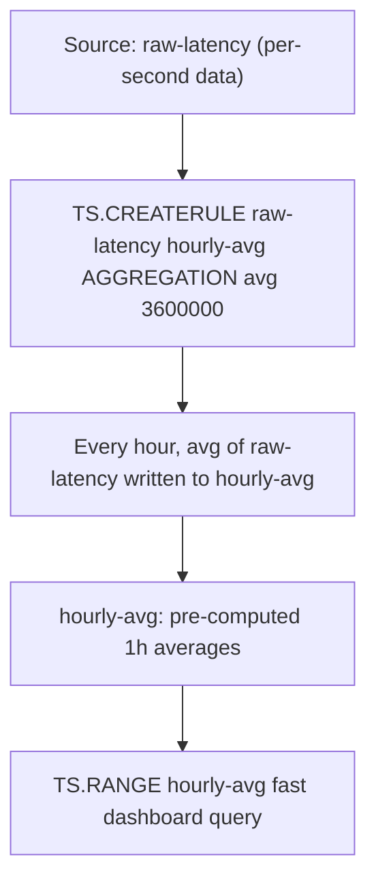

# How to Use TS.CREATERULE in Redis Time Series for Aggregation Rules

Author: [nawazdhandala](https://www.github.com/nawazdhandala)

Tags: Redis, Time Series, RedisTimeSeries, Command

Description: Learn how to use TS.CREATERULE in Redis Time Series to create automatic compaction rules that downsample data into aggregated series.

---

## How TS.CREATERULE Works

`TS.CREATERULE` attaches a compaction rule to a source time series. Whenever new data is added to the source series, Redis automatically computes aggregated values (avg, sum, min, max, etc.) over fixed time buckets and writes them to a destination series. This provides automatic downsampling without any application-side aggregation logic.



## Syntax

```redis
TS.CREATERULE sourceKey destKey
  AGGREGATION aggregator bucketDuration
  [ALIGNTIMESTAMP alignTimestamp]
```

- `sourceKey` - the source time series that receives raw data
- `destKey` - must exist before creating the rule; receives aggregated data
- `AGGREGATION` - aggregation function and bucket size in milliseconds
- `ALIGNTIMESTAMP` - align bucket boundaries to this timestamp (default: 0 = epoch)

### Aggregation Functions

`avg`, `sum`, `min`, `max`, `range`, `count`, `first`, `last`, `std.p`, `std.s`, `var.p`, `var.s`, `twa`

## Examples

### Create a 1-Hour Average Compaction

```redis
TS.CREATE raw:latency RETENTION 86400000 LABELS metric latency
TS.CREATE hourly:latency RETENTION 2592000000 LABELS metric latency agg avg
TS.CREATERULE raw:latency hourly:latency AGGREGATION avg 3600000
```

Now every sample added to `raw:latency` contributes to the hourly average in `hourly:latency`.

### Multiple Rules on One Source

```redis
TS.CREATE min5:latency RETENTION 604800000 LABELS metric latency agg avg
TS.CREATE hourly:latency RETENTION 2592000000 LABELS metric latency agg avg
TS.CREATE daily:latency LABELS metric latency agg avg

TS.CREATERULE raw:latency min5:latency AGGREGATION avg 300000
TS.CREATERULE raw:latency hourly:latency AGGREGATION avg 3600000
TS.CREATERULE raw:latency daily:latency AGGREGATION avg 86400000
```

### Max Rule for Spike Detection

```redis
TS.CREATE raw:cpu LABELS metric cpu
TS.CREATE hourly:cpu:max LABELS metric cpu agg max
TS.CREATERULE raw:cpu hourly:cpu:max AGGREGATION max 3600000
```

The hourly max catches spikes that a mean-based rule would hide.

### Count Rule for Request Volume

```redis
TS.CREATE raw:requests LABELS metric requests
TS.CREATE hourly:requests:count LABELS metric requests agg count
TS.CREATERULE raw:requests hourly:requests:count AGGREGATION count 3600000
```

### Aligned Buckets

```redis
-- Align bucket boundaries to midnight UTC
TS.CREATERULE raw:sales daily:sales AGGREGATION sum 86400000 ALIGNTIMESTAMP 0
```

## Use Cases

### Tiered Storage (Hot/Warm/Cold)

Keep raw data for 24 hours and downsampled data for 90 days:

```redis
TS.CREATE raw:temp RETENTION 86400000
TS.CREATE hourly:temp RETENTION 7776000000
TS.CREATE daily:temp
TS.CREATERULE raw:temp hourly:temp AGGREGATION avg 3600000
TS.CREATERULE raw:temp daily:temp AGGREGATION avg 86400000
```

### Fast Dashboard Queries

Pre-compute aggregations at ingestion time so dashboards read from compact series:

```redis
-- Dashboard reads from hourly:latency, not raw:latency
TS.RANGE hourly:latency -2592000000 + AGGREGATION avg 3600000
```

### Anomaly Detection with Min/Max

```redis
TS.CREATERULE raw:voltage hourly:voltage:min AGGREGATION min 3600000
TS.CREATERULE raw:voltage hourly:voltage:max AGGREGATION max 3600000
```

Alert when hourly min drops below threshold or hourly max spikes above it.

### Daily Business Metrics

Sum daily transactions without storing per-second data long-term:

```redis
TS.CREATERULE raw:transactions daily:transactions AGGREGATION sum 86400000
```

## Compaction Behavior Details

- Buckets are not finalized until the next bucket starts.
- The current (incomplete) bucket is updated as new data arrives.
- Use `LATEST` in `TS.GET` or `TS.RANGE` queries to include the current partial bucket.
- Compaction is triggered by new data arriving; sparse series may have delayed aggregation.

```redis
-- Include the current partial hour bucket
TS.GET hourly:latency LATEST
TS.RANGE hourly:latency -86400000 + LATEST
```

## Performance Considerations

- Each compaction rule adds O(1) overhead per `TS.ADD` call.
- Multiple rules on one source are evaluated in parallel per write.
- Pre-created compaction series dramatically reduce dashboard query time.
- Set appropriate retention on destination series to avoid unbounded growth.

## Summary

`TS.CREATERULE` automates time series downsampling by attaching compaction rules to a source series. Each new data point triggers incremental aggregation into one or more destination series, enabling tiered retention, fast dashboard queries, and automatic metric summarization without any application-side aggregation code.
