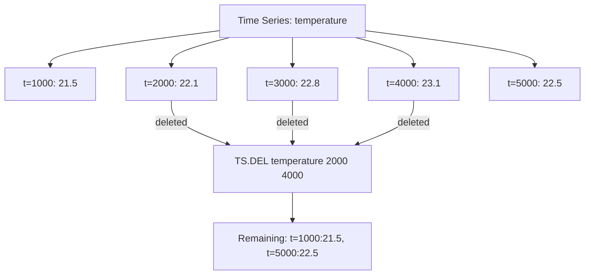

# How to Use TS.DEL in Redis Time Series to Delete Data Points

Author: [nawazdhandala](https://www.github.com/nawazdhandala)

Tags: Redis, Time Series, RedisTimeSeries, Command

Description: Learn how to use TS.DEL in Redis Time Series to delete all data points within a specified timestamp range from a time series key.

---

## How TS.DEL Works

`TS.DEL` deletes all data points in a Redis Time Series key that fall within a specified timestamp range (inclusive). The key itself is not deleted; only the data points in the range are removed. This is useful for compliance data purges, removing erroneous data, and manual data lifecycle management.



## Syntax

```redis
TS.DEL key fromTimestamp toTimestamp
```

- `key` - the time series key
- `fromTimestamp` - start of deletion range (inclusive) in Unix milliseconds; use `-` for earliest
- `toTimestamp` - end of deletion range (inclusive) in Unix milliseconds; use `+` for latest
- Returns the number of deleted data points

## Examples

### Delete a Time Range

```redis
TS.CREATE temperature
TS.ADD temperature 1000 21.5
TS.ADD temperature 2000 22.1
TS.ADD temperature 3000 22.8
TS.ADD temperature 4000 23.1
TS.ADD temperature 5000 22.5
TS.DEL temperature 2000 4000
```

```text
(integer) 3
```

Three data points were deleted.

### Verify Deletion

```redis
TS.RANGE temperature - +
```

```text
1) 1) (integer) 1000
   2) "21.5"
2) 1) (integer) 5000
   2) "22.5"
```

### Delete All Data

```redis
TS.DEL temperature - +
```

```text
(integer) 2
```

The series key still exists but is now empty.

### Delete Only Old Data (Manual Retention)

```redis
-- Delete data older than 30 days
TS.DEL sensor:temp - 1709308800000
```

### Delete a Specific Erroneous Reading

Delete a single bad data point by providing the same timestamp as both boundaries:

```redis
TS.DEL sensor:temp 1711900800000 1711900800000
```

```text
(integer) 1
```

## Use Cases

### GDPR / Data Deletion Compliance

Remove all time series data for a user who requested deletion:

```redis
TS.DEL user:42:activity - +
TS.DEL user:42:sessions - +
TS.DEL user:42:purchases - +
```

The series keys remain but all data points are deleted.

### Removing Erroneous Sensor Readings

A sensor malfunction produced bad data for 10 minutes:

```redis
TS.DEL sensor:voltage 1711900800000 1711901400000
```

### Correcting a Historical Import

After identifying that a batch import wrote incorrect values for a specific day:

```redis
TS.DEL historical:sales 1704067200000 1704153600000
-- Then re-import the correct data for that day
```

### Rolling Window Manual Purge

If retention is not configured, manually purge data older than the desired window:

```redis
TS.DEL metrics:cpu - 1711296000000
```

### Clearing Test Data from Production

After a test run accidentally wrote to a production series:

```redis
TS.DEL prod:latency:api 1711900800000 1711901000000
```

## TS.DEL vs DEL (Key Deletion)

```redis
-- Remove data points in a range; key and series structure remain
TS.DEL temperature 2000 4000

-- Remove the entire key and all its data
DEL temperature
```

Use `TS.DEL` when you want to remove specific data while keeping the series. Use `DEL` when you want to remove the series entirely.

## TS.DEL vs Retention Policy

```redis
-- Automatic: Redis handles deletion based on age
TS.CREATE sensor RETENTION 86400000

-- Manual: application deletes specific ranges
TS.DEL sensor 1700000000000 1700086400000
```

Retention policy is more efficient for routine data lifecycle management. `TS.DEL` is for targeted, on-demand deletion.

## Performance Considerations

- `TS.DEL` is O(N) where N is the number of deleted samples plus the chunk reorganization cost.
- Deleting large ranges is slower than automatic retention-based expiry because retention is chunk-based.
- After deletion, Redis may reorganize the underlying chunk structure.
- For regular data lifecycle management, prefer the `RETENTION` parameter in `TS.CREATE` or `TS.ALTER`.

## Summary

`TS.DEL` removes all data points in a Redis Time Series key within a specified timestamp range, returning the count of deleted samples while preserving the series key. Use it for compliance purges, correcting erroneous data, and manual data lifecycle management when the built-in retention policy does not provide sufficient control.
