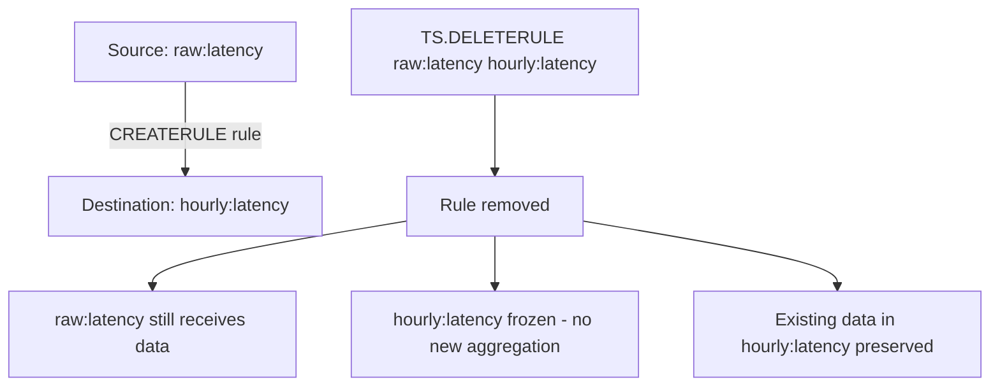

# How to Use TS.DELETERULE in Redis Time Series

Author: [nawazdhandala](https://www.github.com/nawazdhandala)

Tags: Redis, Time Series, RedisTimeSeries, Command

Description: Learn how to use TS.DELETERULE in Redis Time Series to remove a compaction rule from a source series, stopping automatic aggregation to the destination.

---

## How TS.DELETERULE Works

`TS.DELETERULE` removes an existing compaction rule that was created with `TS.CREATERULE`. After deletion, new data added to the source series will no longer be automatically aggregated into the destination series. The destination series and its existing data are not deleted; only the rule linking the two series is removed.



## Syntax

```redis
TS.DELETERULE sourceKey destKey
```

- `sourceKey` - the source series that has the compaction rule
- `destKey` - the destination series the rule writes to
- Returns `OK` on success
- Returns an error if no such rule exists

## Examples

### Delete a Compaction Rule

```redis
TS.CREATE raw:latency LABELS metric latency
TS.CREATE hourly:latency LABELS metric latency agg avg
TS.CREATERULE raw:latency hourly:latency AGGREGATION avg 3600000

-- Confirm rule exists
TS.INFO raw:latency
-- rules field shows the hourly:latency rule

TS.DELETERULE raw:latency hourly:latency
```

```text
OK
```

### Verify Rule is Removed

```redis
TS.INFO raw:latency
```

```text
21) "rules"
22) (empty array)
```

### Delete One Rule While Keeping Others

```redis
TS.CREATE raw:cpu LABELS metric cpu
TS.CREATE min5:cpu LABELS metric cpu agg avg
TS.CREATE hourly:cpu LABELS metric cpu agg avg
TS.CREATERULE raw:cpu min5:cpu AGGREGATION avg 300000
TS.CREATERULE raw:cpu hourly:cpu AGGREGATION avg 3600000

-- Remove only the 5-minute rule
TS.DELETERULE raw:cpu min5:cpu

-- hourly:cpu rule remains active
TS.INFO raw:cpu
```

### Error on Non-Existent Rule

```redis
TS.DELETERULE raw:latency non-existent-dest
```

```text
(error) TSDB: compaction rule does not exist
```

## Use Cases

### Changing Aggregation Granularity

To change a bucket size, delete the old rule and create a new one:

```redis
-- Remove the old 1-hour rule
TS.DELETERULE raw:latency hourly:latency

-- Create a new 30-minute rule with same destination
TS.CREATE min30:latency LABELS metric latency agg avg
TS.CREATERULE raw:latency min30:latency AGGREGATION avg 1800000
```

### Stopping Aggregation for Decommissioned Metrics

When retiring a downsampled series from a dashboard:

```redis
TS.DELETERULE raw:old-metric downsampled:old-metric
```

The source series continues to receive data; the now-unused destination no longer grows.

### Replacing Max Rule with Avg Rule

```redis
-- Old rule: max per hour
TS.DELETERULE raw:temp hourly:temp:max

-- New rule: avg per hour
TS.CREATE hourly:temp:avg LABELS metric temp agg avg
TS.CREATERULE raw:temp hourly:temp:avg AGGREGATION avg 3600000
```

### Cleanup After Experiment

During an experiment, extra compaction rules capture experimental metrics. Remove them after:

```redis
TS.DELETERULE experiment:raw experiment:hourly-sum
TS.DELETERULE experiment:raw experiment:hourly-count
```

## Effect on Existing Data

Deleting a rule does not affect data already written to the destination:

```redis
-- Before deletion: hourly:latency has 30 days of data
TS.RANGE hourly:latency - + COUNT 5
-- Returns 5 existing data points

TS.DELETERULE raw:latency hourly:latency

-- After deletion: existing data still queryable
TS.RANGE hourly:latency - + COUNT 5
-- Still returns the same 5 data points
```

## TS.DELETERULE vs DEL

```redis
-- Remove only the rule (keep both series and their data)
TS.DELETERULE raw:latency hourly:latency

-- Delete the destination series and all its data
DEL hourly:latency

-- Delete the source series (also removes attached rules automatically)
DEL raw:latency
```

## Performance Considerations

- `TS.DELETERULE` is O(N) where N is the number of rules on the source series.
- After deletion, `TS.ADD` operations on the source no longer incur the overhead of the removed rule.
- Removing unused rules reduces write amplification for the source series.

## Summary

`TS.DELETERULE` removes a compaction rule from a source Redis Time Series key, stopping automatic aggregation into the destination series while preserving all existing data in both series. Use it to change aggregation granularity, retire unused downsampled series, and clean up experimental compaction configurations.
