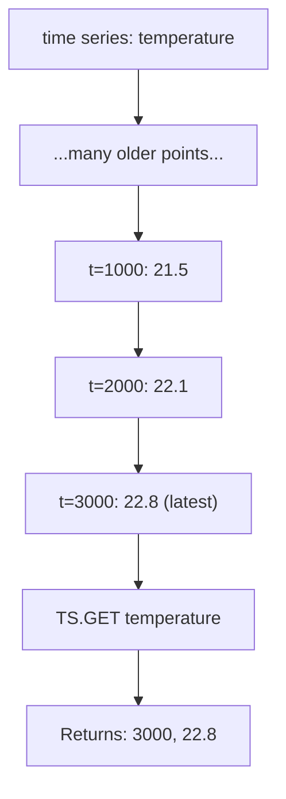

# How to Use TS.GET in Redis Time Series to Get Latest Value

Author: [nawazdhandala](https://www.github.com/nawazdhandala)

Tags: Redis, Time Series, RedisTimeSeries, Command

Description: Learn how to use TS.GET in Redis Time Series to retrieve the most recent timestamp-value pair from a single time series key.

---

## How TS.GET Works

`TS.GET` returns the last (most recent) data point from a Redis Time Series key. It returns both the timestamp and the value of the most recently inserted sample. This is the simplest way to check the current state of a metric without querying a range of data.



## Syntax

```redis
TS.GET key [LATEST]
```

- `key` - the time series key
- `LATEST` - if used with compaction rules, include the latest (not yet finalized) bucket
- Returns a two-element array: `[timestamp, value]`
- Returns empty array if the series has no data

## Examples

### Basic Get Latest

```redis
TS.CREATE temperature
TS.ADD temperature 1000 21.5
TS.ADD temperature 2000 22.1
TS.ADD temperature 3000 22.8
TS.GET temperature
```

```text
1) (integer) 3000
2) "22.8"
```

### Empty Series

```redis
TS.CREATE empty-series
TS.GET empty-series
```

```text
(empty array)
```

### Live Monitoring

Get the current CPU usage:

```redis
TS.GET metrics:cpu:server-1
```

```text
1) (integer) 1711900812000
2) "41.3"
```

### Get Latest with Compaction Rule

When a downsampled series has a compaction rule, the latest bucket may not be finalized. Use LATEST to include partial bucket data:

```redis
TS.GET temperature:hourly LATEST
```

## Use Cases

### Dashboard Current Value Widgets

Show the most recent sensor reading on a dashboard without fetching historical data:

```redis
TS.GET sensor:temperature:room-1
TS.GET sensor:humidity:room-1
TS.GET sensor:co2:room-1
```

### Health Check - Is Service Reporting?

Check if a service has written a heartbeat recently:

```redis
TS.GET heartbeat:payment-service
-- If timestamp is older than 60s, service may be down
```

### Current Inventory Level

```redis
TS.GET inventory:product-42
```

```text
1) (integer) 1711900800000
2) "847"
```

### Alerting Threshold Check

Read the latest value and compare to threshold in application code:

```redis
TS.GET metrics:error-rate:api
-- If value > 5.0, trigger alert
```

### Current Price Feed

```redis
TS.GET price:BTC-USD
```

```text
1) (integer) 1711900812000
2) "69425.50"
```

## TS.GET vs TS.MGET

`TS.GET` retrieves the latest value from one series. `TS.MGET` retrieves the latest value from multiple series matching label filters.

```redis
-- Single series
TS.GET temperature:sensor-1

-- All temperature sensors in building HQ
TS.MGET FILTER building=hq metric=temperature
```

## TS.GET vs TS.RANGE

```redis
-- Last data point only (fast)
TS.GET latency:api

-- Last 60 seconds of data points
TS.RANGE latency:api -60000 +
```

Use `TS.GET` when you need only the current value. Use `TS.RANGE` when you need a history.

## Performance Considerations

- `TS.GET` is O(1) - it reads the last entry from the series index.
- It does not scan the entire series.
- Use `TS.MGET` with label filters to get the latest value from many series in one command.

## Summary

`TS.GET` retrieves the most recent timestamp-value pair from a Redis Time Series key in O(1) time. It is the fastest way to check the current state of a metric and is suitable for dashboard widgets, alert checks, health monitoring, and any use case requiring only the latest reading without historical context.
