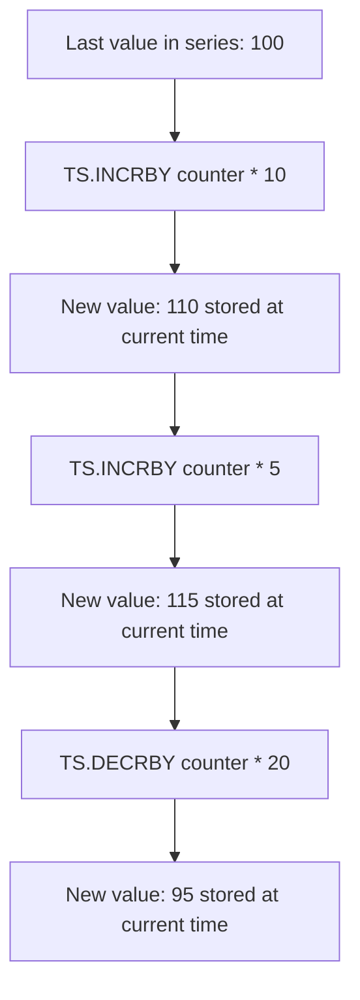

# How to Use TS.INCRBY and TS.DECRBY in Redis Time Series

Author: [nawazdhandala](https://www.github.com/nawazdhandala)

Tags: Redis, Time Series, RedisTimeSeries, Command

Description: Learn how to use TS.INCRBY and TS.DECRBY in Redis Time Series to increment or decrement the last value in a series by a delta amount.

---

## How TS.INCRBY and TS.DECRBY Work

`TS.INCRBY` adds a delta value to the last sample in a time series and stores the new value as a new data point. `TS.DECRBY` subtracts a delta. Both commands are atomic and useful for maintaining running counters, gauges, and cumulative totals directly in a time series without reading the current value first.



## Syntax

```redis
TS.INCRBY key value
  [TIMESTAMP timestamp]
  [RETENTION retentionPeriod]
  [UNCOMPRESSED]
  [CHUNK_SIZE chunkSize]
  [LABELS {label value}...]

TS.DECRBY key value
  [TIMESTAMP timestamp]
  [RETENTION retentionPeriod]
  [UNCOMPRESSED]
  [CHUNK_SIZE chunkSize]
  [LABELS {label value}...]
```

- `key` - the time series key (auto-created if it does not exist)
- `value` - the delta to add (INCRBY) or subtract (DECRBY)
- `TIMESTAMP` - explicit timestamp; defaults to current server time
- Returns the timestamp of the new sample

## Examples

### Basic Increment

```redis
TS.CREATE requests
TS.INCRBY requests * 1
TS.INCRBY requests * 1
TS.INCRBY requests * 1
TS.GET requests
```

```text
1) (integer) 1711900812000
2) "3"
```

### Increment by Larger Delta

```redis
TS.CREATE bytes-received
TS.INCRBY bytes-received * 1024
TS.INCRBY bytes-received * 2048
TS.GET bytes-received
```

```text
1) (integer) 1711900812002
2) "3072"
```

### Basic Decrement

```redis
TS.CREATE inventory
TS.ADD inventory * 1000
TS.DECRBY inventory * 5
TS.GET inventory
```

```text
1) (integer) 1711900812001
2) "995"
```

### With Explicit Timestamp

```redis
TS.INCRBY page-views 1 TIMESTAMP 1711900800000
TS.INCRBY page-views 1 TIMESTAMP 1711900860000
TS.INCRBY page-views 1 TIMESTAMP 1711900920000
TS.RANGE page-views 0 -1
```

### Auto-Create with Labels

```redis
TS.INCRBY errors:api * 1 RETENTION 86400000 LABELS service api env production
```

If `errors:api` does not exist, it is created automatically.

## Use Cases

### Request Counter

Count HTTP requests per endpoint over time:

```redis
-- Called on each request
TS.INCRBY requests:api:checkout * 1
```

Query the rate over the last hour:

```redis
TS.RANGE requests:api:checkout -1h + AGGREGATION sum 60000
```

### Error Rate Tracking

Increment on each error, decrement when errors are resolved:

```redis
-- On error
TS.INCRBY active-errors:service * 1

-- On resolution
TS.DECRBY active-errors:service * 1
```

### Cumulative Byte Counter

Track cumulative network bytes transferred:

```redis
-- After each packet
TS.INCRBY network:bytes-out * 1500
```

### Inventory Level Tracking

```redis
-- Stock added
TS.INCRBY inventory:product-42 * 100

-- Stock sold
TS.DECRBY inventory:product-42 * 3
```

### Event Scoring

Add weight-based increments for scored events:

```redis
TS.INCRBY score:user-1 * 10
TS.INCRBY score:user-1 * 5
TS.INCRBY score:user-1 * 25
TS.GET score:user-1
```

```text
1) (integer) 1711900812000
2) "40"
```

## TS.INCRBY vs TS.ADD

```redis
-- TS.ADD sets an absolute value
TS.ADD counter * 42

-- TS.INCRBY adds a delta to the last value
TS.INCRBY counter * 1
-- If last value was 42, new value is 43
```

Use `TS.INCRBY/DECRBY` when you are tracking cumulative changes and do not want to read the current value before writing.

## First Insert Behavior

When the series is empty, `TS.INCRBY` uses 0 as the starting value:

```redis
TSCREATE new-counter
TS.INCRBY new-counter * 5
TS.GET new-counter
```

```text
1) (integer) 1711900812000
2) "5"
```

## Performance Considerations

- Both commands are O(M) where M is the number of compaction rules.
- Auto-creation with labels adds overhead on the first call only.
- Each call stores a new data point; use with care in extremely high-frequency scenarios.

## Summary

`TS.INCRBY` and `TS.DECRBY` atomically add or subtract a delta from the last value in a Redis Time Series key and store the result as a new data point. They are ideal for counters, gauges, inventory levels, and any metric that changes by a known delta rather than by an absolute value.
