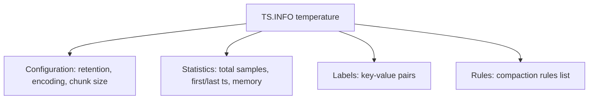

# How to Use TS.INFO in Redis Time Series to Get Metadata

Author: [nawazdhandala](https://www.github.com/nawazdhandala)

Tags: Redis, Time Series, RedisTimeSeries, Command

Description: Learn how to use TS.INFO in Redis Time Series to inspect series metadata including retention, chunk count, labels, compaction rules, and sample statistics.

---

## How TS.INFO Works

`TS.INFO` returns comprehensive metadata about a Redis Time Series key. This includes the configuration set at creation time (retention, encoding, chunk size, duplicate policy), current statistics (total samples, memory usage, first and last timestamps), and any compaction rules attached to the series. It is the primary diagnostic command for understanding a series.



## Syntax

```redis
TS.INFO key [DEBUG]
```

- `key` - the time series key
- `DEBUG` - returns additional internal chunk information

## Fields Returned

| Field | Description |
|---|---|
| totalSamples | Total number of data points in the series |
| memoryUsage | Memory used by the series in bytes |
| firstTimestamp | Timestamp of the oldest stored sample |
| lastTimestamp | Timestamp of the most recent sample |
| retentionTime | Retention period in milliseconds (0 = no expiry) |
| chunkCount | Number of memory chunks allocated |
| chunkSize | Bytes per memory chunk |
| chunkType | COMPRESSED or UNCOMPRESSED |
| duplicatePolicy | How duplicate timestamps are handled |
| labels | List of key-value label pairs |
| sourceKey | If this is a compaction target, the source series key |
| rules | List of compaction rules |

## Examples

### Basic Series Info

```redis
TS.CREATE temperature RETENTION 86400000 LABELS region us sensor outdoor
TS.ADD temperature * 22.5
TS.ADD temperature * 23.1
TS.INFO temperature
```

```text
 1) "totalSamples"
 2) (integer) 2
 3) "memoryUsage"
 4) (integer) 4304
 5) "firstTimestamp"
 6) (integer) 1711900812000
 7) "lastTimestamp"
 8) (integer) 1711900872000
 9) "retentionTime"
10) (integer) 86400000
11) "chunkCount"
12) (integer) 1
13) "chunkSize"
14) (integer) 4096
15) "chunkType"
16) "compressed"
17) "duplicatePolicy"
18) (nil)
19) "labels"
20) 1) 1) "region"
      2) "us"
   2) 1) "sensor"
      2) "outdoor"
21) "sourceKey"
22) (nil)
23) "rules"
24) (empty array)
```

### Check Compaction Rules

```redis
TS.CREATE raw-data LABELS metric cpu
TS.CREATE hourly-avg LABELS metric cpu agg avg
TS.CREATERULE raw-data hourly-avg AGGREGATION avg 3600000
TS.INFO raw-data
```

The `rules` field shows:

```text
23) "rules"
24) 1) 1) "compactionKey"
      2) "hourly-avg"
   2) 1) "bucketDuration"
      2) (integer) 3600000
   3) 1) "aggregationType"
      2) "avg"
```

### Series with Duplicate Policy

```redis
TS.CREATE strict-sensor DUPLICATE_POLICY BLOCK
TS.INFO strict-sensor
```

```text
17) "duplicatePolicy"
18) "block"
```

### Check Memory Usage Across Series

```redis
TS.INFO metrics:cpu:server-1
TS.INFO metrics:cpu:server-2
TS.INFO metrics:cpu:server-3
-- Compare memoryUsage fields
```

## Use Cases

### Validating Series Configuration

After creating a series, confirm all settings are correct:

```redis
TS.INFO api:latency
-- Check: retentionTime, chunkType, duplicatePolicy, labels
```

### Monitoring Series Growth

Track how many samples a series has accumulated:

```redis
TS.INFO events:user-actions
-- totalSamples: 1843200
```

### Diagnosing Missing Data

Check firstTimestamp and lastTimestamp to verify data ingestion is active:

```redis
TS.INFO heartbeat:payment-service
-- If lastTimestamp is older than 60s, ingestion may have stopped
```

### Auditing Compaction Rule Setup

Confirm compaction rules are correctly attached:

```redis
TS.INFO raw-sensor-data
-- rules field should list the compaction targets
```

### Memory Capacity Planning

Sum memory across all time series for capacity planning:

```redis
TS.INFO series:1
TS.INFO series:2
-- Add up memoryUsage values
```

## TS.INFO vs TS.QUERYINDEX

```redis
-- Metadata about one series
TS.INFO temperature

-- Find all series matching a label filter
TS.QUERYINDEX metric=temperature
```

## Performance Considerations

- `TS.INFO` is O(N) where N is the number of compaction rules; typically O(1) for simple series.
- The `DEBUG` option adds chunk-level detail and is more expensive; use only for diagnostics.
- Call `TS.INFO` sparingly in hot paths; it is a diagnostic tool, not a data retrieval command.

## Summary

`TS.INFO` returns comprehensive metadata about a Redis Time Series key, including sample counts, memory usage, retention settings, labels, and attached compaction rules. Use it to validate configuration, diagnose ingestion issues, audit compaction setups, and plan capacity for time series workloads.
