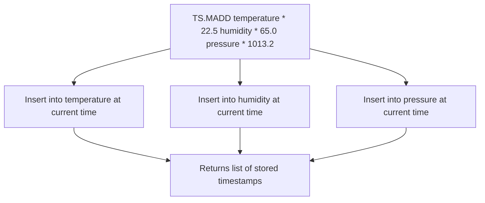

# How to Use TS.MADD in Redis Time Series for Batch Inserts

Author: [nawazdhandala](https://www.github.com/nawazdhandala)

Tags: Redis, Time Series, RedisTimeSeries, Command

Description: Learn how to use TS.MADD in Redis Time Series to insert multiple data points across multiple series in a single command for efficient batch ingestion.

---

## How TS.MADD Works

`TS.MADD` (Multiple ADD) inserts multiple timestamp-value pairs across one or more time series keys in a single Redis command. This reduces network round-trips compared to calling `TS.ADD` individually for each data point and is the primary method for high-throughput time series ingestion.



## Syntax

```redis
TS.MADD {key timestamp value}...
```

- Each triplet is `key timestamp value`
- `timestamp` - Unix milliseconds or `*` for current server time
- Multiple triplets are provided in sequence
- Returns an array of stored timestamps, one per triplet

## Examples

### Insert into Multiple Series at Once

```redis
TS.MADD temperature * 22.5 humidity * 65.0 pressure * 1013.2
```

```text
1) (integer) 1711900812000
2) (integer) 1711900812001
3) (integer) 1711900812002
```

Each series receives its data point with the server time.

### Explicit Timestamps

```redis
TS.MADD sensor:temp 1711900800000 21.3 sensor:temp 1711900860000 21.7 sensor:temp 1711900920000 22.1
```

Insert three data points into the same series with explicit timestamps.

### Multiple Series with Explicit Timestamps

```redis
TS.MADD
  cpu:usage 1711900800000 45.2
  memory:usage 1711900800000 62.8
  disk:io 1711900800000 120.5
  network:rx 1711900800000 8421
```

All four series receive data at the same timestamp.

### Handling a Returned Error

If one insert fails, the error appears in the response array but others succeed:

```redis
TS.MADD good-series * 10.0 bad-series 100 9999.0 good-series * 11.0
```

```text
1) (integer) 1711900812000
2) (error) TSDB: Timestamp cannot be older than oldest timestamp
3) (integer) 1711900812001
```

## Use Cases

### IoT Multi-Sensor Batch

Collect readings from multiple sensors and insert in one call:

```redis
TS.MADD
  sensor:room1:temp * 21.5
  sensor:room1:humidity * 58.0
  sensor:room2:temp * 19.8
  sensor:room2:humidity * 61.5
```

### Application Metrics Flush

Flush a batch of application metrics at each collection interval:

```redis
TS.MADD
  metrics:api:requests * 142
  metrics:api:errors * 3
  metrics:api:latency_p50 * 87
  metrics:api:latency_p99 * 341
```

### Historical Data Import

Backfill multiple series from an external dataset:

```redis
TS.MADD
  price:BTC-USD 1704067200000 44250.00
  price:ETH-USD 1704067200000 2280.50
  price:BNB-USD 1704067200000 318.75
```

### Periodic Aggregation Collection

Collect system metrics every 10 seconds:

```redis
TS.MADD
  sys:cpu 1711900800000 41.3
  sys:mem 1711900800000 71.2
  sys:net:rx 1711900800000 5423
  sys:net:tx 1711900800000 2187
  sys:disk:read 1711900800000 8192
  sys:disk:write 1711900800000 4096
```

## TS.MADD vs TS.ADD

| Feature | TS.ADD | TS.MADD |
|---|---|---|
| Data points per call | 1 | Multiple |
| Series per call | 1 | Multiple |
| Network round-trips | 1 per point | 1 for all |
| Auto-create series | Yes | No |
| Error handling | Single error | Per-item errors in array |

```redis
-- Less efficient: 3 round-trips
TS.ADD temp * 22.5
TS.ADD humidity * 65.0
TS.ADD pressure * 1013.2

-- More efficient: 1 round-trip
TS.MADD temp * 22.5 humidity * 65.0 pressure * 1013.2
```

## Performance Considerations

- `TS.MADD` is processed as a single command but each insert is O(M) where M is the number of compaction rules.
- For very large batches, consider pipelining multiple `TS.MADD` calls.
- Series must exist before calling `TS.MADD`; use `TS.CREATE` to pre-create series.
- Timestamps within the same series must be in non-decreasing order.

## Summary

`TS.MADD` inserts multiple time series data points in a single Redis command, supporting multiple series and timestamps in one round-trip. Use it for IoT sensor batches, application metrics flushes, and historical imports where reducing network overhead is critical to ingestion throughput.
