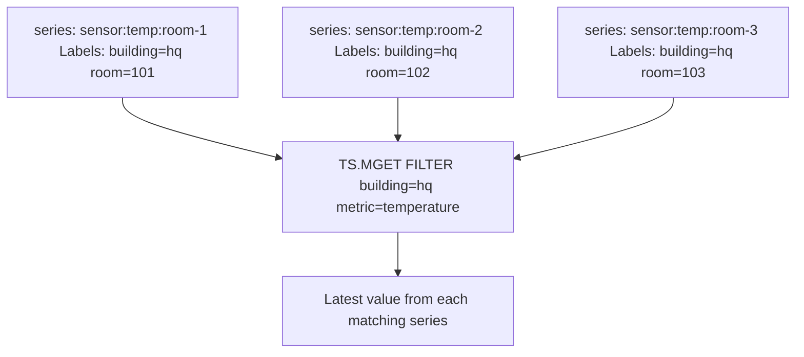

# How to Use TS.MGET in Redis Time Series for Multiple Keys

Author: [nawazdhandala](https://www.github.com/nawazdhandala)

Tags: Redis, Time Series, RedisTimeSeries, Command

Description: Learn how to use TS.MGET in Redis Time Series to retrieve the latest value from multiple series at once using label-based filtering.

---

## How TS.MGET Works

`TS.MGET` returns the most recent data point from multiple Redis Time Series keys that match a label filter. Instead of specifying individual key names, you provide filter expressions on the labels attached to series at creation time. This makes it easy to query all series belonging to a group (e.g., all sensors in a room or all metrics for a service).



## Syntax

```redis
TS.MGET [LATEST] [WITHLABELS | SELECTED_LABELS label...] FILTER filter...
```

- `LATEST` - include the most recent partial bucket for compacted series
- `WITHLABELS` - include all labels in the response
- `SELECTED_LABELS` - include only specified labels in the response
- `FILTER` - one or more label filter expressions

### Filter Expressions

| Expression | Meaning |
|---|---|
| `label=value` | Exact match |
| `label!=value` | Not equal |
| `label=` | Label does not exist |
| `label!=` | Label exists |
| `label=(v1,v2)` | Value is one of a list |
| `label!=(v1,v2)` | Value is not in list |

## Examples

### Get Latest from All Series with a Label

```redis
TS.CREATE temp:room-1 LABELS building hq metric temperature
TS.ADD temp:room-1 * 21.5
TS.CREATE temp:room-2 LABELS building hq metric temperature
TS.ADD temp:room-2 * 19.8
TS.MGET FILTER building=hq metric=temperature
```

```text
1) 1) "temp:room-1"
   2) (empty array)
   3) 1) (integer) 1711900812000
      2) "21.5"
2) 1) "temp:room-2"
   2) (empty array)
   3) 1) (integer) 1711900812001
      2) "19.8"
```

### Include Labels in Response

```redis
TS.MGET WITHLABELS FILTER building=hq metric=temperature
```

```text
1) 1) "temp:room-1"
   2) 1) 1) "building"
         2) "hq"
      2) 1) "metric"
         2) "temperature"
   3) 1) (integer) 1711900812000
      2) "21.5"
```

### Selected Labels Only

```redis
TS.MGET SELECTED_LABELS room FILTER building=hq metric=temperature
```

Returns only the `room` label with each result.

### Filter by Multiple Labels

```redis
TS.MGET FILTER env=production service=api region=us-east-1
```

Returns the latest data point from all series that have all three labels with those values.

### Filter with Value List

```redis
TS.MGET FILTER env=(production,staging) metric=cpu
```

Returns series where env is either production or staging.

## Use Cases

### Multi-Room Sensor Dashboard

Get the current temperature in every room of a building:

```redis
TS.MGET WITHLABELS FILTER building=headquarters metric=temperature
```

### Service Health Overview

Get the latest error rate for all services in production:

```redis
TS.MGET FILTER env=production metric=error-rate
```

### Fleet Monitoring

Get the latest CPU usage from all servers in a region:

```redis
TS.MGET SELECTED_LABELS host FILTER region=us-east-1 metric=cpu-usage
```

### Current Prices for a Set of Assets

```redis
TS.MGET FILTER exchange=binance type=price
```

## TS.MGET vs TS.GET

```redis
-- Single series (by key name)
TS.GET sensor:temp:room-1

-- Multiple series (by label filter)
TS.MGET FILTER building=hq metric=temperature
```

Use `TS.GET` when you know the exact key. Use `TS.MGET` when you want to query by logical group.

## TS.MGET vs TS.MRANGE

```redis
-- Latest value only, multiple series
TS.MGET FILTER env=production metric=cpu

-- Range of values, multiple series
TS.MRANGE -60000 + FILTER env=production metric=cpu
```

Use `TS.MGET` for current state. Use `TS.MRANGE` for historical analysis.

## Performance Considerations

- `TS.MGET` scans the label index to find matching series, then reads one data point per series.
- Label indexing is efficient for well-cardinality labels; avoid labels with thousands of unique values.
- Use `SELECTED_LABELS` instead of `WITHLABELS` to reduce response payload size.

## Summary

`TS.MGET` retrieves the latest data point from all Redis Time Series keys matching label filter expressions. It enables group-based queries without enumerating key names, making it ideal for multi-sensor dashboards, service health overviews, and fleet monitoring where series are organized by metadata labels.
