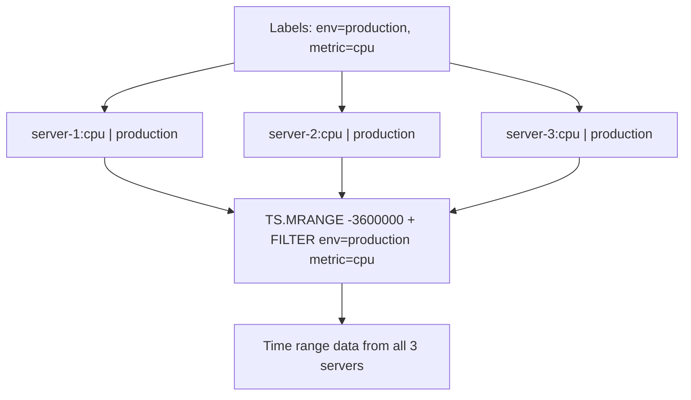

# How to Use TS.MRANGE in Redis Time Series for Multiple Series

Author: [nawazdhandala](https://www.github.com/nawazdhandala)

Tags: Redis, Time Series, RedisTimeSeries, Command

Description: Learn how to use TS.MRANGE in Redis Time Series to query a time range across multiple series simultaneously using label filters.

---

## How TS.MRANGE Works

`TS.MRANGE` queries a time range from multiple Redis Time Series keys that match a label filter. It combines the range query capabilities of `TS.RANGE` with the multi-series label filtering of `TS.MGET`, allowing you to query historical data across an entire fleet of sensors, services, or metrics in a single command.



## Syntax

```redis
TS.MRANGE fromTimestamp toTimestamp
  [LATEST]
  [FILTER_BY_TS ts...]
  [FILTER_BY_VALUE min max]
  [WITHLABELS | SELECTED_LABELS label...]
  [COUNT count]
  [ALIGN align]
  [AGGREGATION aggregator bucketDuration [BUCKETTIMESTAMP bt] [EMPTY]]
  [GROUPBY label REDUCE reducer]
  FILTER filter...
```

- `FILTER` is required; at least one filter expression must match a label value (not empty)
- `GROUPBY ... REDUCE` merges all matching series into one aggregated result per label value

## Examples

### Basic Multi-Series Range

```redis
TS.CREATE cpu:server-1 LABELS env production metric cpu
TS.ADD cpu:server-1 * 45.2
TS.CREATE cpu:server-2 LABELS env production metric cpu
TS.ADD cpu:server-2 * 61.8
TS.MRANGE - + FILTER env=production metric=cpu
```

```text
1) 1) "cpu:server-1"
   2) (empty array)
   3) 1) 1) (integer) 1711900812000
         2) "45.2"
2) 1) "cpu:server-2"
   2) (empty array)
   3) 1) 1) (integer) 1711900812000
         2) "61.8"
```

### With Aggregation

Get average CPU per 1-minute bucket for all production servers:

```redis
TS.MRANGE -3600000 + AGGREGATION avg 60000 FILTER env=production metric=cpu
```

### With Labels in Response

```redis
TS.MRANGE -3600000 + WITHLABELS AGGREGATION avg 60000 FILTER env=production metric=cpu
```

### GROUPBY - Merge Series by Label

Average CPU across all servers in each region:

```redis
TS.MRANGE -3600000 + AGGREGATION avg 60000 FILTER metric=cpu GROUPBY region REDUCE avg
```

Each unique value of the `region` label produces one output series.

### Filter by Value Range

Only return samples where CPU is above 80%:

```redis
TS.MRANGE -3600000 + FILTER_BY_VALUE 80 100 FILTER env=production metric=cpu
```

### Count Events Per Minute Across Services

```redis
TS.MRANGE -3600000 + AGGREGATION count 60000 FILTER env=production metric=requests GROUPBY service REDUCE sum
```

## Use Cases

### Fleet-Wide Performance Dashboard

Query all servers' CPU in one call for a Grafana panel:

```redis
TS.MRANGE -3600000 + WITHLABELS AGGREGATION avg 60000 FILTER env=production metric=cpu-usage
```

### Multi-Region Latency Comparison

Compare p95 latency across regions:

```redis
TS.MRANGE -86400000 + WITHLABELS AGGREGATION avg 3600000 FILTER service=api metric=latency-p95
```

### Incident Correlation

Get multiple metrics from a time window around an incident:

```redis
TS.MRANGE 1711900000000 1711903600000 WITHLABELS FILTER service=checkout
```

### Comparative A/B Analysis

Query both variants over the same time window:

```redis
TS.MRANGE 1711900800000 1711904400000 WITHLABELS FILTER experiment=checkout-redesign
```

## TS.MRANGE vs TS.RANGE

```redis
-- Single series, specific key
TS.RANGE cpu:server-1 -3600000 +

-- Multiple series, label-based
TS.MRANGE -3600000 + FILTER env=production metric=cpu
```

Use `TS.RANGE` for a single known key. Use `TS.MRANGE` for group-based queries.

## TS.MRANGE vs TS.MGET

```redis
-- Latest value only, multiple series
TS.MGET FILTER env=production metric=cpu

-- Time range, multiple series
TS.MRANGE -3600000 + FILTER env=production metric=cpu
```

## Performance Considerations

- `TS.MRANGE` fan-outs to all matching series; large label groups with wide time ranges can be slow.
- Use `AGGREGATION` to reduce data volume in the response.
- `GROUPBY ... REDUCE` is computed in Redis; it avoids sending raw per-series data to the client.
- Pre-create downsampled series with `TS.CREATERULE` to make dashboard queries faster.

## Summary

`TS.MRANGE` queries a time range from all Redis Time Series keys matching label filters, with optional aggregation, value filtering, and `GROUPBY` reduction. It is the command of choice for fleet-wide dashboards, multi-service comparisons, and incident correlation where querying multiple related series together is more efficient than individual `TS.RANGE` calls.
