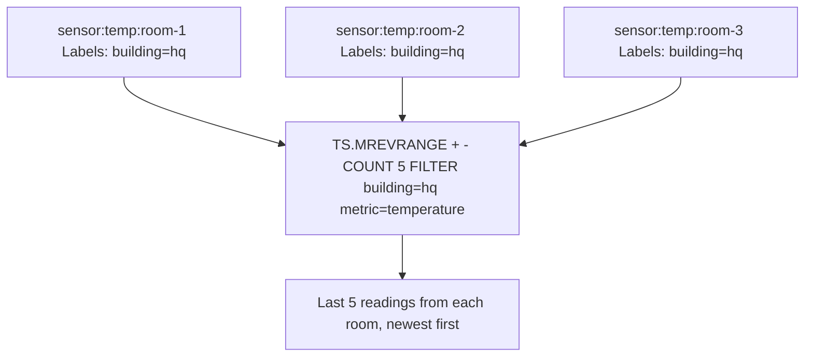

# How to Use TS.MREVRANGE in Redis Time Series

Author: [nawazdhandala](https://www.github.com/nawazdhandala)

Tags: Redis, Time Series, RedisTimeSeries, Command

Description: Learn how to use TS.MREVRANGE in Redis Time Series to query multiple series in reverse chronological order using label filters and aggregation.

---

## How TS.MREVRANGE Works

`TS.MREVRANGE` retrieves data points in reverse chronological order (newest first) from multiple Redis Time Series keys that match label filters. It is the multi-series, reverse-order version of `TS.MRANGE`. Like `TS.MRANGE`, it supports aggregation, value filtering, and `GROUPBY` reduction; results within each series are returned newest first.



## Syntax

```redis
TS.MREVRANGE fromTimestamp toTimestamp
  [LATEST]
  [FILTER_BY_TS ts...]
  [FILTER_BY_VALUE min max]
  [WITHLABELS | SELECTED_LABELS label...]
  [COUNT count]
  [ALIGN align]
  [AGGREGATION aggregator bucketDuration [BUCKETTIMESTAMP bt] [EMPTY]]
  [GROUPBY label REDUCE reducer]
  FILTER filter...
```

- `fromTimestamp` - end/upper time bound; use `+` for latest
- `toTimestamp` - start/lower time bound; use `-` for earliest
- Results within each series are returned newest first

## Examples

### Last 5 Samples from Multiple Series

```redis
TS.CREATE temp:room-1 LABELS building hq metric temperature
TS.ADD temp:room-1 1000 21.5
TS.ADD temp:room-1 2000 22.1
TS.CREATE temp:room-2 LABELS building hq metric temperature
TS.ADD temp:room-2 1000 19.8
TS.ADD temp:room-2 2000 20.3
TS.MREVRANGE + - COUNT 2 FILTER building=hq metric=temperature
```

```text
1) 1) "temp:room-1"
   2) (empty array)
   3) 1) 1) (integer) 2000
         2) "22.1"
      2) 1) (integer) 1000
         2) "21.5"
2) 1) "temp:room-2"
   2) (empty array)
   3) 1) 1) (integer) 2000
         2) "20.3"
      2) 1) (integer) 1000
         2) "19.8"
```

### With Labels and Aggregation

```redis
TS.MREVRANGE + -3600000 WITHLABELS AGGREGATION avg 60000 FILTER env=production metric=cpu
```

Returns average CPU per minute for the last hour, newest minute first, across all production servers.

### GROUPBY Region

```redis
TS.MREVRANGE + -3600000 AGGREGATION avg 60000 FILTER metric=latency GROUPBY region REDUCE avg
```

Returns average latency per region per minute, newest buckets first.

### Filter by Value

```redis
TS.MREVRANGE + - FILTER_BY_VALUE 90 100 COUNT 10 FILTER metric=cpu env=production
```

Returns only high-CPU samples (90-100%) from all production servers, newest first.

### Selected Labels Only

```redis
TS.MREVRANGE + -3600000 SELECTED_LABELS host env COUNT 20 FILTER metric=memory
```

Includes only `host` and `env` labels in each result entry.

## Use Cases

### Live Multi-Sensor Feed

Show the last 10 readings from every temperature sensor in a building:

```redis
TS.MREVRANGE + - COUNT 10 WITHLABELS FILTER building=headquarters metric=temperature
```

### Recent Error Spike Detection

Find the most recent high-error-rate samples across all services:

```redis
TS.MREVRANGE + - FILTER_BY_VALUE 5 100 COUNT 20 WITHLABELS FILTER metric=error-rate
```

### Post-Incident Analysis

Get the last hour of all metrics for a specific service, newest first:

```redis
TS.MREVRANGE + -3600000 WITHLABELS FILTER service=checkout
```

### Most Recent Aggregated Metrics

Get the last 5 aggregated 1-minute buckets per service:

```redis
TS.MREVRANGE + -3600000 COUNT 5 AGGREGATION avg 60000 WITHLABELS FILTER env=production
```

## TS.MREVRANGE vs TS.MRANGE

```redis
-- Oldest first
TS.MRANGE -3600000 + FILTER env=production metric=cpu

-- Newest first
TS.MREVRANGE + -3600000 FILTER env=production metric=cpu
```

Both return the same data, but in opposite order. Use `TS.MREVRANGE` when you need recent data first or when using `COUNT` to get the last N points per series.

## TS.MREVRANGE vs TS.MGET

```redis
-- Latest single value per series
TS.MGET FILTER env=production metric=cpu

-- Last N values per series, newest first
TS.MREVRANGE + - COUNT 10 FILTER env=production metric=cpu
```

`TS.MGET` returns one sample per series. `TS.MREVRANGE` returns multiple samples per series in reverse order.

## Performance Considerations

- `TS.MREVRANGE` with `COUNT` scans each matching series backward from the latest chunk, stopping early.
- For large series counts with wide time ranges, `AGGREGATION` is essential to control response size.
- `GROUPBY ... REDUCE` computation runs inside Redis, avoiding per-series data transfer.

## Summary

`TS.MREVRANGE` retrieves time series data in reverse chronological order from multiple series matching label filters, combining the multi-series label querying of `TS.MRANGE` with the newest-first ordering of `TS.REVRANGE`. It is the most efficient command for live multi-series feeds, recent anomaly detection, and post-incident analysis where you need the latest data from a group of related series.
