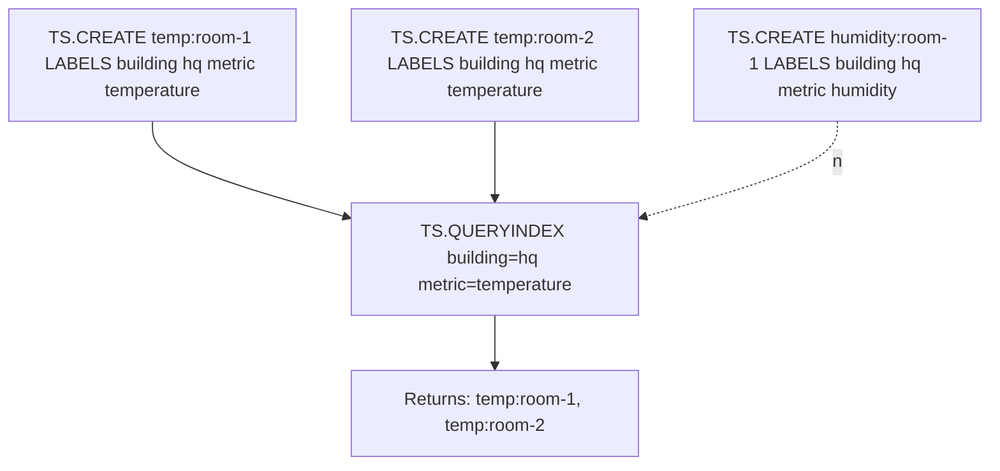

# How to Use TS.QUERYINDEX in Redis Time Series to Find Series

Author: [nawazdhandala](https://www.github.com/nawazdhandala)

Tags: Redis, Time Series, RedisTimeSeries, Command

Description: Learn how to use TS.QUERYINDEX in Redis Time Series to find all series keys that match a set of label filter expressions.

---

## How TS.QUERYINDEX Works

`TS.QUERYINDEX` returns the keys of all Redis Time Series that match one or more label filter expressions. Unlike `TS.MRANGE` or `TS.MGET` which return data, `TS.QUERYINDEX` returns only the key names. This is useful for discovering what series exist, building dynamic series lists, and validating that expected series have been created.



## Syntax

```redis
TS.QUERYINDEX filter...
```

- `filter` - one or more label filter expressions (at least one must match a value, not empty check)
- Returns an array of key names

### Filter Expressions

| Expression | Meaning |
|---|---|
| `label=value` | Exact match |
| `label!=value` | Not equal |
| `label=` | Label does not exist |
| `label!=` | Label exists |
| `label=(v1,v2)` | Value is one of a list |
| `label!=(v1,v2)` | Value is not in list |

## Examples

### Find All Series by Label

```redis
TS.CREATE sensor:temp:room-1 LABELS building hq metric temperature
TS.CREATE sensor:temp:room-2 LABELS building hq metric temperature
TS.CREATE sensor:humidity:room-1 LABELS building hq metric humidity
TS.QUERYINDEX building=hq metric=temperature
```

```text
1) "sensor:temp:room-1"
2) "sensor:temp:room-2"
```

### Find All Series for a Building

```redis
TS.QUERYINDEX building=hq
```

```text
1) "sensor:temp:room-1"
2) "sensor:temp:room-2"
3) "sensor:humidity:room-1"
```

### Filter by Multiple Labels

```redis
TS.QUERYINDEX env=production service=api region=us-east-1
```

Returns only series that have all three labels with those values.

### Find Series Where Label Exists

```redis
TS.QUERYINDEX experiment!=
```

Returns all series that have the `experiment` label (any value).

### Find Series Where Label Does Not Exist

```redis
TS.QUERYINDEX compaction=
```

Returns series that do not have the `compaction` label - useful for finding raw (non-compacted) series.

### Filter with Value List

```redis
TS.QUERYINDEX env=(production,staging) metric=latency
```

Returns series where `env` is either `production` or `staging`.

### Exclude a Specific Value

```redis
TS.QUERYINDEX env!=development metric=cpu
```

Returns all CPU series except those tagged as development.

## Use Cases

### Discovery - List All Series in a Group

Find all metric series for a specific service before querying them:

```redis
TS.QUERYINDEX service=payment-gateway
```

Use the returned keys as input to individual `TS.RANGE` calls or to verify completeness.

### Dynamic Dashboard Building

Build a UI that lists available metrics without hardcoding key names:

```redis
TS.QUERYINDEX env=production
-- Returns all series in production; render as a dropdown
```

### Validating Series Creation

After a deployment, confirm all expected series were created:

```redis
TS.QUERYINDEX service=new-service env=production
-- Should return the expected number of series
```

### Cleanup - Find and Delete Stale Series

Find series tagged with a decommissioned host:

```redis
TS.QUERYINDEX host=server-decommissioned-42
-- Then DEL each returned key
```

### Audit Active Experiments

Find all time series linked to running experiments:

```redis
TS.QUERYINDEX experiment!=
```

## TS.QUERYINDEX vs TS.MGET / TS.MRANGE

```redis
-- Returns keys only (no data)
TS.QUERYINDEX env=production metric=cpu

-- Returns latest value from matching series
TS.MGET FILTER env=production metric=cpu

-- Returns time range data from matching series
TS.MRANGE -3600000 + FILTER env=production metric=cpu
```

`TS.QUERYINDEX` is for discovery; `TS.MGET` and `TS.MRANGE` are for data retrieval.

## Performance Considerations

- `TS.QUERYINDEX` scans the label index; it is fast for well-cardinality labels.
- Avoid labels with very high cardinality (e.g., using a UUID as a label) as they expand the index size.
- The result set can be large; be prepared to handle many keys if the filter is broad.

## Summary

`TS.QUERYINDEX` returns the names of all Redis Time Series keys matching label filter expressions. Use it for series discovery, validating that expected series exist after ingestion, building dynamic dashboards, and identifying groups of series before issuing data queries with `TS.MRANGE` or `TS.MGET`.
