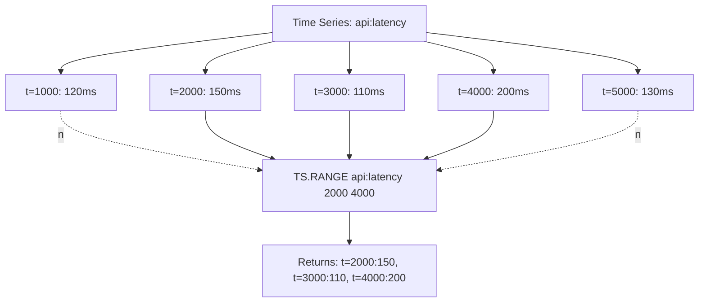

# How to Use TS.RANGE in Redis Time Series for Time Range Queries

Author: [nawazdhandala](https://www.github.com/nawazdhandala)

Tags: Redis, Time Series, RedisTimeSeries, Command

Description: Learn how to use TS.RANGE in Redis Time Series to query data points between two timestamps with optional aggregation, filtering, and limiting.

---

## How TS.RANGE Works

`TS.RANGE` retrieves all data points in a Redis Time Series key between a start and end timestamp. It supports optional aggregation (sum, avg, min, max, etc.) over time buckets, result count limits, and filtering by value. This is the primary command for querying historical data from a single series.



## Syntax

```redis
TS.RANGE key fromTimestamp toTimestamp
  [LATEST]
  [FILTER_BY_TS ts...]
  [FILTER_BY_VALUE min max]
  [COUNT count]
  [ALIGN align]
  [AGGREGATION aggregator bucketDuration [BUCKETTIMESTAMP bt] [EMPTY]]
```

- `fromTimestamp` - start time in Unix ms; use `-` for earliest
- `toTimestamp` - end time in Unix ms; use `+` for latest
- `COUNT` - limit the number of returned data points
- `FILTER_BY_VALUE` - only return samples within a value range
- `AGGREGATION` - aggregate samples into time buckets

### Aggregation Functions

`avg`, `sum`, `min`, `max`, `range`, `count`, `first`, `last`, `std.p`, `std.s`, `var.p`, `var.s`, `twa`

## Examples

### Full Range Query

```redis
TS.RANGE temperature - +
```

Returns all data points in the series.

### Specific Time Window

```redis
TS.RANGE temperature 1711900800000 1711904400000
```

Returns points between two Unix millisecond timestamps.

### Last 60 Seconds (Relative)

```redis
TS.RANGE temperature -60000 +
```

Subtract from the end using negative offsets relative to the latest timestamp.

### With Aggregation (1-Minute Buckets)

```redis
TS.RANGE api:latency 1711900800000 1711904400000 AGGREGATION avg 60000
```

Returns the average latency per 1-minute bucket.

### Limit Results

```redis
TS.RANGE temperature - + COUNT 10
```

Returns only the first 10 data points.

### Filter by Value Range

```redis
TS.RANGE temperature - + FILTER_BY_VALUE 0 30
```

Returns only samples where temperature is between 0 and 30.

### Multiple Aggregations Pattern

```redis
-- Average per 5 minutes
TS.RANGE api:latency 1711900800000 + AGGREGATION avg 300000

-- Max per 5 minutes
TS.RANGE api:latency 1711900800000 + AGGREGATION max 300000

-- Count per 5 minutes
TS.RANGE api:latency 1711900800000 + AGGREGATION count 300000
```

### Include Empty Buckets

```redis
TS.RANGE sensor:readings 1711900800000 1711908000000 AGGREGATION avg 60000 EMPTY
```

Buckets with no data return `NaN` instead of being skipped.

## Use Cases

### Grafana-Style Time Series Visualization

Query 1-hour downsampled data for a 7-day chart:

```redis
TS.RANGE api:latency 1711296000000 1711900800000 AGGREGATION avg 3600000
```

### Anomaly Detection Window

Get the last 5 minutes of raw samples to detect spikes:

```redis
TS.RANGE cpu:server-1 -300000 + COUNT 300
```

### SLO Compliance Report

Count requests exceeding 500ms threshold in the last 24 hours:

```redis
TS.RANGE api:latency -86400000 + FILTER_BY_VALUE 500 999999 AGGREGATION count 3600000
```

### Billing Meter Aggregation

Sum bytes transferred per hour for the last day:

```redis
TS.RANGE bytes:user-42 -86400000 + AGGREGATION sum 3600000
```

## TS.RANGE vs TS.REVRANGE

```redis
-- Oldest to newest
TS.RANGE temperature 0 1711904400000

-- Newest to oldest
TS.REVRANGE temperature 1711904400000 0
```

Use `TS.REVRANGE` when you want the most recent data first, such as fetching the last N samples.

## Performance Considerations

- `TS.RANGE` scans all chunks covering the requested time range; narrow the range when possible.
- `AGGREGATION` reduces the number of returned samples and network payload.
- `COUNT` stops scanning early once enough results are found.
- Use pre-computed compaction rules (`TS.CREATERULE`) to avoid aggregating raw data on every query.

## Summary

`TS.RANGE` queries data points from a Redis Time Series key between two timestamps, with optional aggregation into time buckets, value filtering, and result count limits. It is the foundation for dashboards, anomaly detection, compliance reports, and any historical analysis of time series data.
