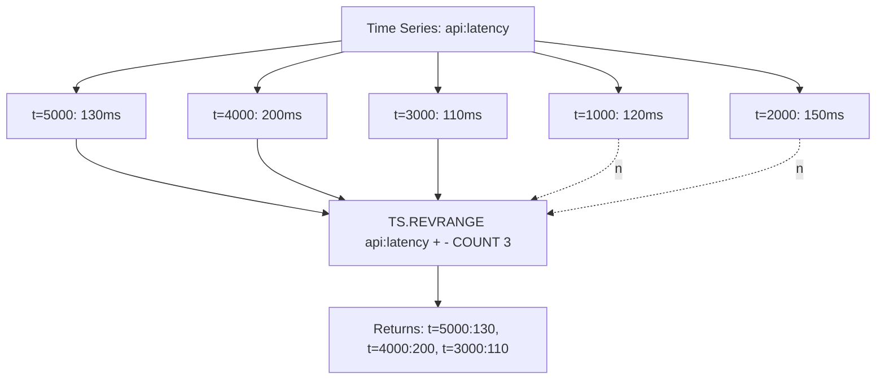

# How to Use TS.REVRANGE in Redis Time Series for Reverse Queries

Author: [nawazdhandala](https://www.github.com/nawazdhandala)

Tags: Redis, Time Series, RedisTimeSeries, Command

Description: Learn how to use TS.REVRANGE in Redis Time Series to query data points in reverse chronological order, getting the newest samples first.

---

## How TS.REVRANGE Works

`TS.REVRANGE` retrieves data points from a Redis Time Series key in reverse chronological order (newest first). It accepts the same parameters as `TS.RANGE` but returns results from the end timestamp backwards to the start timestamp. This is useful when you want the most recent N samples or need to paginate from the newest data backward.



## Syntax

```redis
TS.REVRANGE key fromTimestamp toTimestamp
  [LATEST]
  [FILTER_BY_TS ts...]
  [FILTER_BY_VALUE min max]
  [COUNT count]
  [ALIGN align]
  [AGGREGATION aggregator bucketDuration [BUCKETTIMESTAMP bt] [EMPTY]]
```

- `fromTimestamp` - end boundary (inclusive); use `+` for the most recent data
- `toTimestamp` - start boundary (inclusive); use `-` for the oldest data
- `COUNT` - stop after this many results
- Returns data newest-first

Note: `fromTimestamp` is still the higher bound and `toTimestamp` is the lower bound, same as `TS.RANGE`, but results are returned in descending order.

## Examples

### Get Last 10 Samples

```redis
TS.CREATE temperature
TS.ADD temperature 1000 21.5
TS.ADD temperature 2000 22.1
TS.ADD temperature 3000 22.8
TS.ADD temperature 4000 23.1
TS.ADD temperature 5000 22.5
TS.REVRANGE temperature + - COUNT 3
```

```text
1) 1) (integer) 5000
   2) "22.5"
2) 1) (integer) 4000
   2) "23.1"
3) 1) (integer) 3000
   2) "22.8"
```

### Most Recent 5 Minutes

```redis
TS.REVRANGE api:latency + -300000 COUNT 100
```

Returns up to 100 samples from the last 5 minutes, newest first.

### Reverse With Aggregation

```redis
TS.REVRANGE api:latency + -3600000 AGGREGATION avg 60000
```

Returns average per minute for the last hour, with the most recent minute first.

### Full Reverse Range

```redis
TS.REVRANGE temperature + -
```

Returns all data points newest first. Equivalent to reversing `TS.RANGE - +`.

### Filter by Value in Reverse

```redis
TS.REVRANGE temperature + - FILTER_BY_VALUE 22 25
```

Returns most recent samples where temperature is between 22 and 25, newest first.

## Use Cases

### Latest N Readings Display

Show the 20 most recent sensor readings in a live feed:

```redis
TS.REVRANGE sensor:vibration + - COUNT 20
```

### Recent Error Log Inspection

Get the last 50 high-latency requests:

```redis
TS.REVRANGE api:latency + - FILTER_BY_VALUE 500 999999 COUNT 50
```

### Paginating Recent History

Show the last 100 events, then the 100 before that:

```redis
-- Page 1: most recent 100
TS.REVRANGE events + - COUNT 100
-- Note the last timestamp from page 1 = T_last
-- Page 2: 100 before that
TS.REVRANGE events (T_last - 1) - COUNT 100
```

### Real-Time Trend Detection

Get the last 10 CPU readings to compute a short-term trend:

```redis
TS.REVRANGE cpu:server-1 + - COUNT 10
```

### Audit Trail (Most Recent First)

```redis
TS.REVRANGE audit:user-42 + - COUNT 25
```

## TS.REVRANGE vs TS.RANGE

```redis
-- Oldest first
TS.RANGE temperature 0 + COUNT 10

-- Newest first
TS.REVRANGE temperature + - COUNT 10
```

The data is the same but in reversed order. `TS.REVRANGE` with `COUNT` is more efficient for "last N samples" queries because it stops scanning after N results.

## TS.REVRANGE vs TS.GET

```redis
-- Single latest value
TS.GET temperature

-- Latest N values
TS.REVRANGE temperature + - COUNT 10
```

`TS.GET` retrieves only one point. `TS.REVRANGE` is used when you need multiple recent points.

## Performance Considerations

- `TS.REVRANGE` with `COUNT` scans from the latest chunk backward and stops early; it is more efficient than `TS.RANGE` followed by reversing the result.
- Without `COUNT`, it scans the entire requested range.
- For very wide ranges, use `AGGREGATION` to reduce data volume.

## Summary

`TS.REVRANGE` retrieves time series data in reverse chronological order (newest first), with the same aggregation and filtering options as `TS.RANGE`. It is the most efficient way to retrieve the last N samples, build reverse-chronological feeds, and paginate through recent history in a Redis Time Series key.
