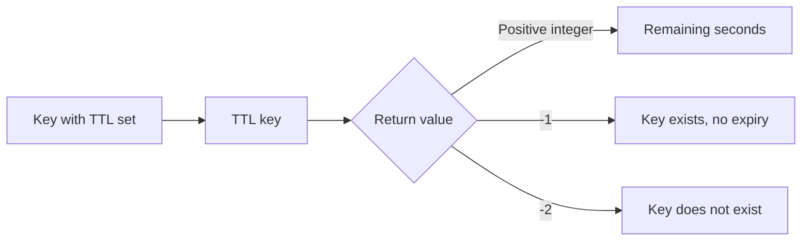

# How to Use TTL and PTTL in Redis to Check Remaining Time

Author: [nawazdhandala](https://www.github.com/nawazdhandala)

Tags: Redis, TTL, PTTL, Key Expiration, Cache

Description: Learn how to use TTL and PTTL in Redis to inspect the remaining time-to-live on keys in seconds or milliseconds, with examples and special return value handling.

---

## How TTL and PTTL Work

TTL returns the remaining time-to-live of a key in seconds. PTTL does the same in milliseconds. These commands are essential for inspecting key expiration without modifying it, allowing you to make decisions based on how much time remains before a key expires.



## Syntax

```redis
TTL key
PTTL key
```

Both commands take a single argument: the key name.

## Return Values

| Return Value | Meaning |
|---|---|
| Positive integer | Remaining TTL in seconds (TTL) or milliseconds (PTTL) |
| -1 | Key exists but has no expiry set |
| -2 | Key does not exist (or has already expired) |

## Examples

### Check TTL on a key with expiration

```redis
SET cache:homepage "html-content"
EXPIRE cache:homepage 300

TTL cache:homepage
```

```text
(integer) 298
```

### Check PTTL for millisecond precision

```redis
PTTL cache:homepage
```

```text
(integer) 296423
```

### Key with no expiration set

```redis
SET permanent:config "value"
TTL permanent:config
```

```text
(integer) -1
```

Returns -1 meaning the key exists but will never expire.

### Non-existent key

```redis
TTL ghost:key
```

```text
(integer) -2
```

Returns -2 when the key does not exist at all.

### Key that has already expired

```redis
SET short:lived "data"
EXPIRE short:lived 1
```

Wait for the key to expire, then:

```redis
TTL short:lived
```

```text
(integer) -2
```

After expiry, the key is gone, so TTL returns -2.

### Monitoring a session countdown

```redis
SET session:abc "active"
EXPIRE session:abc 1800

# Check immediately
TTL session:abc
```

```text
(integer) 1800
```

```redis
# Check again after some time has passed
TTL session:abc
```

```text
(integer) 1743
```

### Using PTTL for precise cache freshness

```redis
SET price:BTC "42000"
PEXPIRE price:BTC 10000

PTTL price:BTC
```

```text
(integer) 9876
```

This shows there are about 9.9 seconds left before the cached price expires.

## Practical Patterns

### Decide whether to refresh a cache entry

Before making an expensive computation, check if the current cache value has enough time left:

```redis
TTL expensive:computation
```

```text
(integer) 15
```

If there are only 15 seconds left, you might trigger a background refresh now rather than waiting for expiry under load.

### Validate a session without touching it

```redis
TTL session:user789
```

If the result is positive, the session is still valid. If -2, it has expired and the user needs to log in again. If -1, the session has no TTL - which may indicate a bug.

## Use Cases

**Session validation** - Check whether a session key is still valid and how much time remains before expiry.

**Cache warmup decisions** - Detect keys nearing expiration and proactively refresh them to avoid cache misses under traffic.

**Lock monitoring** - Inspect distributed lock TTLs to diagnose lock contention or leaks.

**Debugging expiration configuration** - Verify that EXPIRE or PEXPIRE was correctly applied to a key during development.

## Summary

TTL and PTTL are read-only inspection commands that reveal the remaining lifetime of a Redis key. TTL returns seconds; PTTL returns milliseconds. The special return values -1 (no expiry) and -2 (key not found) are important to handle correctly in application code. Use these commands to build smart cache refresh logic, validate sessions, and debug expiration behavior in your Redis-backed applications.
