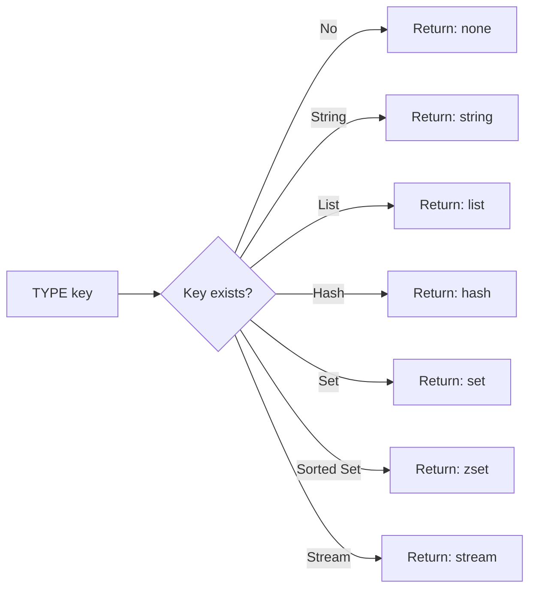

# How to Use TYPE in Redis to Check the Data Type of a Key

Author: [nawazdhandala](https://www.github.com/nawazdhandala)

Tags: Redis, TYPE, Key Management, Data Structure, Inspection

Description: Learn how to use the TYPE command in Redis to determine the data type of a key, understand the possible return values, and use it in keyspace inspection workflows.

---

## How TYPE Works

TYPE returns a string indicating the data type stored at a key. Redis supports several core data types, and TYPE lets you inspect which one is being used before performing type-specific operations. If the key does not exist, TYPE returns "none".



## Syntax

```redis
TYPE key
```

Returns one of: `string`, `list`, `hash`, `set`, `zset`, `stream`, or `none`.

## Examples

### Check type of a string key

```redis
SET greeting "hello"
TYPE greeting
```

```text
string
```

### Check type of a list

```redis
RPUSH queue:jobs "job1" "job2"
TYPE queue:jobs
```

```text
list
```

### Check type of a hash

```redis
HSET user:1 name "alice" email "alice@example.com"
TYPE user:1
```

```text
hash
```

### Check type of a set

```redis
SADD tags "redis" "cache" "database"
TYPE tags
```

```text
set
```

### Check type of a sorted set

```redis
ZADD leaderboard 1500 "alice" 2000 "bob"
TYPE leaderboard
```

```text
zset
```

### Check type of a stream

```redis
XADD events:log "*" action "user-login" user "alice"
TYPE events:log
```

```text
stream
```

### Non-existent key

```redis
TYPE missing:key
```

```text
none
```

### Type of an expired key

```redis
SET temp:key "value"
EXPIRE temp:key 1
```

Wait for expiry, then:

```redis
TYPE temp:key
```

```text
none
```

## Using TYPE with SCAN

The SCAN command accepts a TYPE filter to only return keys of a specific type:

```redis
SCAN 0 MATCH * TYPE hash
```

This is more efficient than scanning all keys and then checking their types.

## Use Cases

**Safe type-aware operations** - Before calling LRANGE or LLEN, verify the key is actually a list to avoid type errors.

**Keyspace debugging** - Identify unexpected key types (e.g., a string where a hash was expected) during incident investigation.

**Migration validation** - After migrating data, verify that keys have the expected types to confirm the migration succeeded.

**Multi-type key cleanup** - When purging data, use TYPE to confirm you are operating on the correct data structure before deleting.

**Monitoring and reporting** - Count how many keys of each type exist in the keyspace to understand memory usage patterns.

## TYPE vs OBJECT ENCODING

TYPE tells you the high-level logical type (list, hash, etc.). OBJECT ENCODING tells you the underlying internal representation:

```redis
RPUSH small:list "a" "b" "c"
TYPE small:list
```

```text
list
```

```redis
OBJECT ENCODING small:list
```

```text
listpack
```

Once the list grows beyond the listpack threshold:

```redis
OBJECT ENCODING large:list
```

```text
quicklist
```

Use TYPE for application-level type checking; use OBJECT ENCODING for performance tuning.

## Error When Operating on Wrong Type

If you try to perform a list operation on a string key, Redis returns a WRONGTYPE error:

```redis
SET mykey "value"
LRANGE mykey 0 -1
```

```text
(error) WRONGTYPE Operation against a key holding the wrong kind of value
```

Using TYPE before such operations allows you to handle this gracefully in application code.

## Summary

TYPE is a simple, fast command that returns the logical data type of a Redis key. It is essential for defensive programming, debugging, and keyspace inspection. The seven return values are: string, list, hash, set, zset, stream, and none. Use TYPE to guard against WRONGTYPE errors, validate data migrations, and build tools that operate on keys of specific types. For iterating by type at scale, pair TYPE with SCAN's built-in TYPE filter rather than checking individually.
