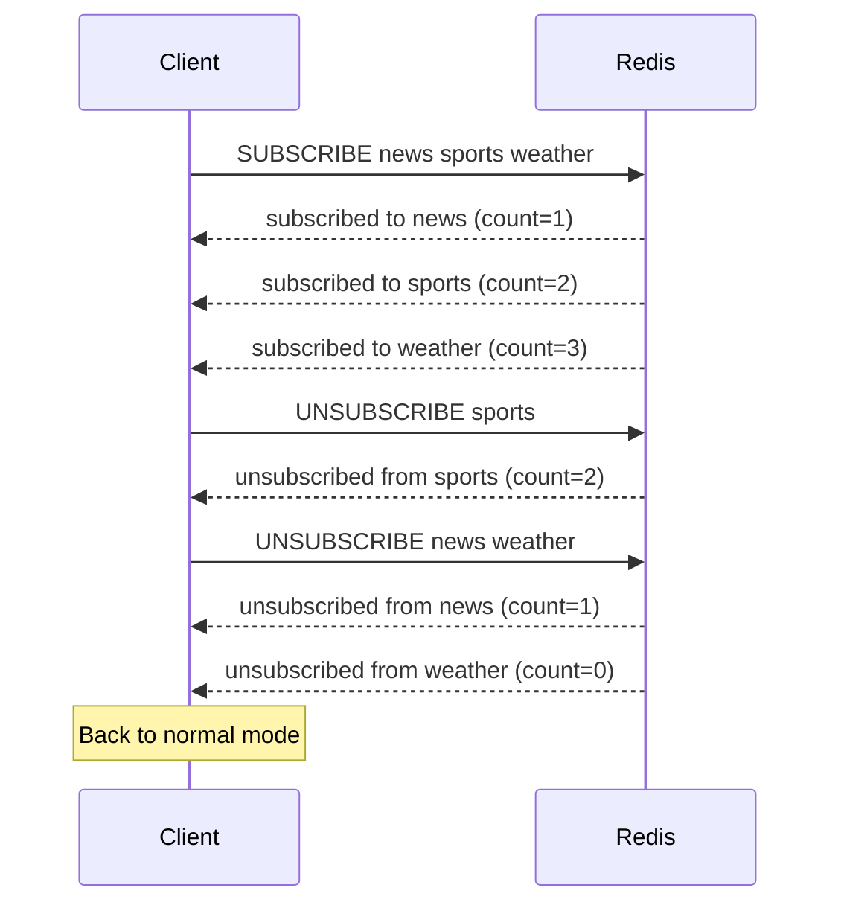

# How to Use UNSUBSCRIBE in Redis to Leave Channels

Author: [nawazdhandala](https://www.github.com/nawazdhandala)

Tags: Redis, Pub/Sub, UNSUBSCRIBE, Channel, Messaging

Description: Learn how to use UNSUBSCRIBE to leave one or more Redis Pub/Sub channels, and how the connection state changes after unsubscribing.

---

When a Redis client no longer needs to receive messages from a channel, it uses `UNSUBSCRIBE` to leave. Once unsubscribed from all channels, the connection returns to normal command mode and can execute any Redis command again.

## How UNSUBSCRIBE Works

`UNSUBSCRIBE` removes the client's subscription from the specified channels. For each channel unsubscribed, Redis sends a confirmation message. Once the subscription count reaches zero, the connection exits Pub/Sub mode.



## Syntax

```redis
UNSUBSCRIBE [channel [channel ...]]
```

- With channel names - unsubscribes from those specific channels
- With no arguments - unsubscribes from all currently subscribed channels

## Examples

### Unsubscribe from a Specific Channel

While in Pub/Sub mode, unsubscribe from one channel:

```redis
UNSUBSCRIBE sports
```

Response:

```text
1) "unsubscribe"
2) "sports"
3) (integer) 2
```

The three parts are: message type (`unsubscribe`), channel name, and remaining subscription count.

### Unsubscribe from Multiple Channels

```redis
UNSUBSCRIBE news sports
```

You receive one confirmation message per channel.

### Unsubscribe from All Channels

```redis
UNSUBSCRIBE
```

Redis sends one unsubscription message per channel the client was subscribed to, ending with count=0.

### Typical Subscriber Lifecycle

```redis
# Session 1: subscribe
SUBSCRIBE order-updates payment-events

# ... receive messages ...

# Later: leave only one channel
UNSUBSCRIBE payment-events

# ... continue receiving order-updates ...

# Finally: leave all and return to normal mode
UNSUBSCRIBE
SET mykey "now in normal mode"  # works after subscription count = 0
```

## Connection Mode Rules

While subscribed to at least one channel, only these commands are permitted:
- `SUBSCRIBE`, `UNSUBSCRIBE`
- `PSUBSCRIBE`, `PUNSUBSCRIBE`
- `PING` (returns a Pub/Sub style PONG)
- `RESET` (exits Pub/Sub mode immediately)
- `QUIT`

Any other command returns an error while in Pub/Sub mode.

## RESET vs UNSUBSCRIBE

`RESET` (Redis 6.2+) exits Pub/Sub mode immediately regardless of how many subscriptions are active:

```redis
RESET
# Connection returns to normal mode instantly
```

`UNSUBSCRIBE` with no arguments does the same but sends explicit confirmation for each channel.

## Use Cases

- **Dynamic channel management** - join and leave channels based on application state
- **Session cleanup** - unsubscribe all channels when a user session ends
- **Channel rotation** - leave old channels and join new ones during live updates
- **Graceful shutdown** - unsubscribe before closing connections to avoid spurious messages

## Summary

`UNSUBSCRIBE` is the counterpart to `SUBSCRIBE`, allowing clients to leave individual channels or exit Pub/Sub mode entirely. When the subscription count reaches zero, the connection is free to execute any Redis command. For an immediate exit without channel-by-channel cleanup, use `RESET` (Redis 6.2+).
