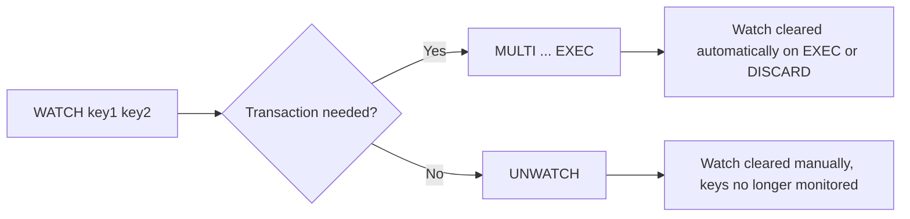
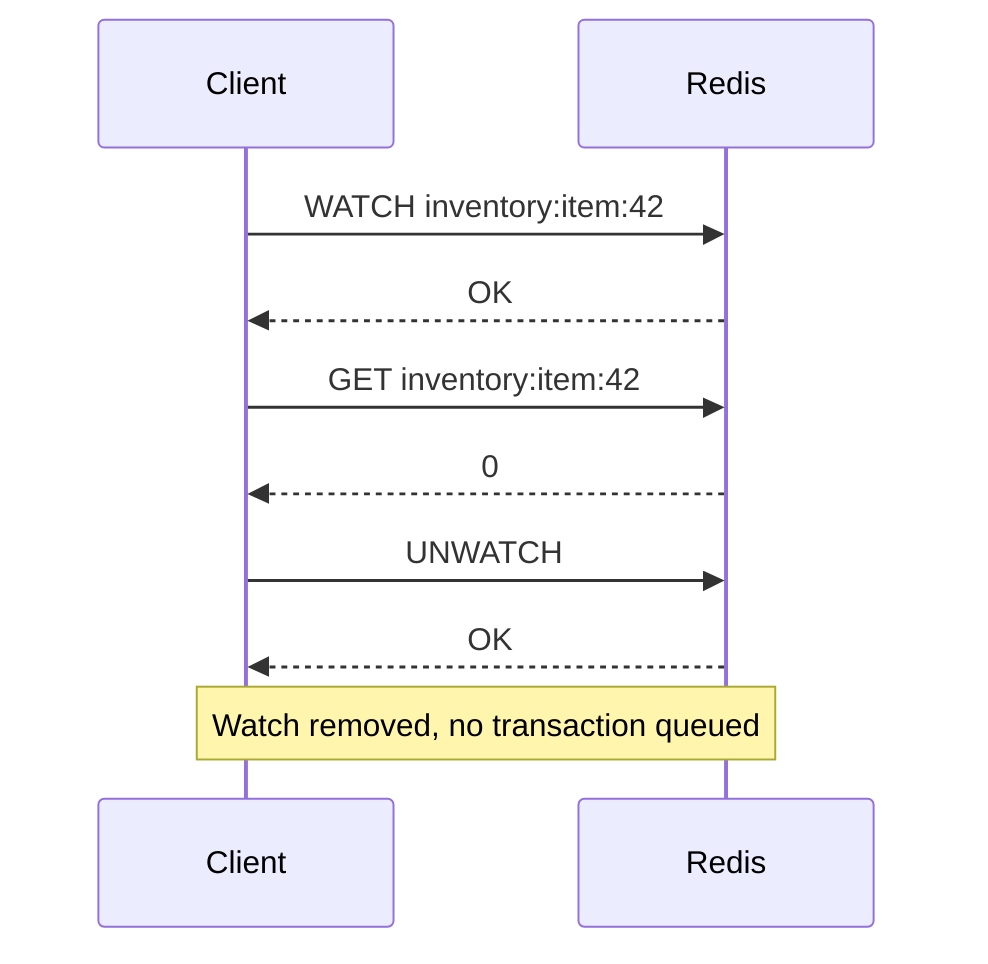
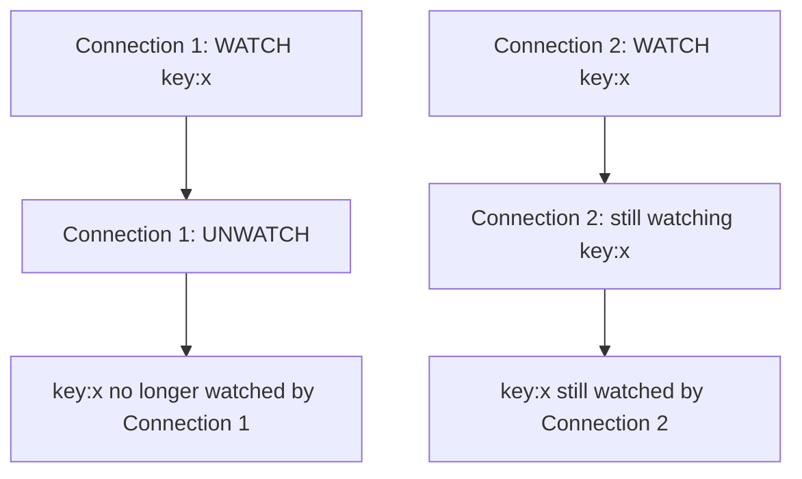

# How to Use UNWATCH in Redis to Remove All Watched Keys

Author: [nawazdhandala](https://www.github.com/nawazdhandala)

Tags: Redis, UNWATCH, WATCH, Transaction, Optimistic locking

Description: Learn how to use UNWATCH in Redis to cancel all watched keys, resetting optimistic locking state before starting a new transaction or abandoning the current one.

---

## What is UNWATCH

UNWATCH cancels the monitoring of all keys that were previously registered with WATCH on the current connection. After calling UNWATCH, the connection no longer holds any watch registrations, so a subsequent MULTI/EXEC block will not be aborted due to key modifications by other clients.

```redis
UNWATCH
```

UNWATCH takes no arguments. It always returns `OK`.



## When UNWATCH is Called Automatically

You do not always need to call UNWATCH manually. Redis automatically clears all watched keys for a connection in three situations:

- When `EXEC` is called (whether the transaction succeeds or is aborted)
- When `DISCARD` is called
- When the client connection closes

UNWATCH is only necessary when you want to abandon a watch without running a transaction at all.

## Basic Usage

### Typical optimistic locking pattern

```redis
WATCH account:balance

-- Read the current value
GET account:balance
-- Returns: 1000

MULTI
DECRBY account:balance 100
EXEC
-- If no other client changed account:balance, returns: [900]
-- If another client changed it, returns: (nil)
```

### Abandoning a watch without a transaction

```redis
WATCH order:123

-- Inspect the value
HGETALL order:123

-- Decide you no longer need the watch (e.g., the update is no longer needed)
UNWATCH
-- Returns: OK

-- Now you can run commands without transaction semantics
SET order:123:status completed
```

## Practical Patterns

### Retry loop with UNWATCH on abort

```redis
-- Pseudocode for a retry loop
LOOP:
    WATCH inventory:item:42

    qty = GET inventory:item:42

    IF qty == 0:
        UNWATCH   -- Abandon early, no transaction needed
        RETURN "out of stock"

    MULTI
    DECRBY inventory:item:42 1
    result = EXEC

    IF result == nil:
        GOTO LOOP   -- Retry; EXEC already cleared the watch
    ELSE:
        RETURN "success"
```



### Switching to a different key mid-flow

When your logic determines you need to watch a different key than originally planned, call UNWATCH first and then WATCH the correct key:

```redis
WATCH key:preliminary

-- Determine the real key to watch based on data
val = GET key:preliminary

UNWATCH
WATCH key:actual-target

MULTI
SET key:actual-target updated
EXEC
```

## UNWATCH vs DISCARD

| Command | Clears watched keys | Clears queued commands | When to use |
|---|---|---|---|
| `UNWATCH` | Yes | No | Before entering MULTI, to abandon a watch |
| `DISCARD` | Yes | Yes | After MULTI, to abort the queued transaction |

## Connection Isolation

UNWATCH only affects the calling connection. Other connections watching the same keys are not affected. Each Redis client connection maintains its own independent set of watched keys.



## Error Behavior

UNWATCH always returns `OK`, even if no keys are currently being watched. There is no error case for UNWATCH.

```redis
-- No prior WATCH
UNWATCH
-- Returns: OK

-- After EXEC already cleared watches
WATCH mykey
MULTI
SET mykey 1
EXEC
UNWATCH  -- Redundant but valid
-- Returns: OK
```

## Summary

UNWATCH removes all watched keys from the current connection, clearing any pending optimistic locking state without running a transaction. It is most useful when your code decides mid-flow that the transaction is no longer needed, allowing the connection to return to a clean state. EXEC and DISCARD both clear watches automatically, so UNWATCH is only needed when you want to abandon a watch before entering a MULTI block.
