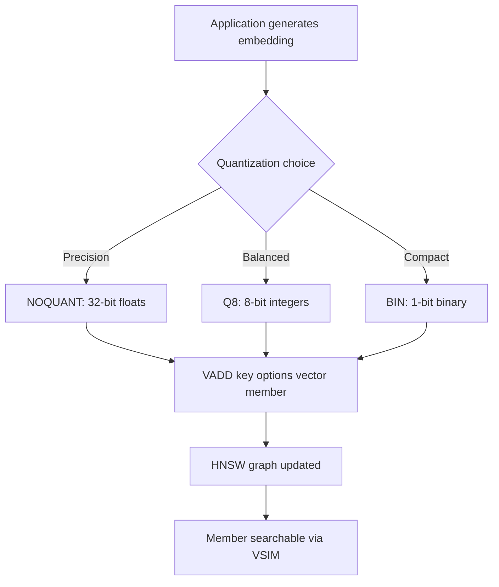

# How to Use VADD in Redis Vector Sets to Add Vectors

Author: [nawazdhandala](https://github.com/nawazdhandala)

Tags: Redis, Vector, Database, Search, Machine learning

Description: Learn how to use the VADD command in Redis vector sets to add high-dimensional vectors with optional quantization, attributes, and HNSW graph parameters.

---

## Introduction

Redis 8 introduced vector sets, a native data type optimized for storing and searching high-dimensional embeddings. The `VADD` command is the primary way to insert vectors into a vector set. It stores a floating-point vector alongside a member name, builds the internal HNSW (Hierarchical Navigable Small World) graph entry, and optionally accepts quantization and attribute options.

## VADD Syntax

```redis
VADD key [REDUCE dim] [NOQUANT | Q8 | BIN] [EF ef_construction] [SETATTR json] [CAS] vector member
```

- `key` - name of the vector set
- `vector` - space-separated floats representing the embedding
- `member` - unique string identifier for this vector
- `REDUCE dim` - project the vector down to `dim` dimensions using random projection
- `NOQUANT` - store as full 32-bit floats (highest precision, most memory)
- `Q8` - quantize to 8-bit integers (default, good balance)
- `BIN` - store as a binary vector (lowest memory)
- `EF ef_construction` - HNSW index build quality (higher = better recall, slower insert)
- `SETATTR json` - set a JSON attribute string on the member in one command
- `CAS` - only update if the vector has changed (compare-and-swap)

## Prerequisites

- Redis 8.0 or later
- `redis-cli` or a compatible client library

## Basic Usage

```redis
VADD embeddings 0.12 0.98 0.45 0.67 0.23 doc1
VADD embeddings 0.88 0.11 0.76 0.34 0.55 doc2
VADD embeddings 0.33 0.72 0.18 0.91 0.04 doc3
```

Each call returns `1` when the member is new or `0` when it already existed and was updated.

## Adding Vectors with Quantization Options

```redis
# Full 32-bit float precision
VADD embeddings NOQUANT 0.12 0.98 0.45 0.67 0.23 precise_doc

# 8-bit quantization (default)
VADD embeddings Q8 0.12 0.98 0.45 0.67 0.23 compact_doc

# Binary quantization (1 bit per dimension)
VADD embeddings BIN 0.12 0.98 0.45 0.67 0.23 binary_doc
```

## Adding Vectors with Attributes

The `SETATTR` option combines `VADD` and `VSETATTR` into a single round-trip:

```redis
VADD embeddings SETATTR '{"title":"Introduction to Redis","tags":["redis","database"]}' \
  0.12 0.98 0.45 0.67 0.23 doc1
```

## Workflow Diagram



## Adding Vectors in Python

```python
import redis
import numpy as np

r = redis.Redis(host="localhost", port=6379, decode_responses=True)

def add_vector(key, member, vector, attrs=None):
    # Flatten numpy array to list of strings
    vec_args = [str(v) for v in vector.tolist()]
    cmd = ["VADD", key]
    if attrs:
        cmd += ["SETATTR", attrs]
    cmd += vec_args + [member]
    return r.execute_command(*cmd)

embedding = np.random.rand(128).astype(np.float32)
add_vector("docs", "article_001", embedding, '{"title":"Redis Vectors"}')
```

## Adding Vectors in Node.js

```javascript
const Redis = require("ioredis");
const redis = new Redis();

async function addVector(key, member, vector, attrs) {
  const vecArgs = vector.map(String);
  const cmd = ["VADD", key];
  if (attrs) cmd.push("SETATTR", JSON.stringify(attrs));
  cmd.push(...vecArgs, member);
  return redis.call(...cmd);
}

const embedding = Array.from({ length: 128 }, () => Math.random());
await addVector("docs", "article_001", embedding, { title: "Redis Vectors" });
```

## Adding Vectors in Java with Jedis

```java
import redis.clients.jedis.Jedis;
import java.util.ArrayList;
import java.util.List;

try (Jedis jedis = new Jedis("localhost", 6379)) {
    List<String> args = new ArrayList<>();
    args.add("VADD");
    args.add("docs");
    float[] vector = {0.12f, 0.98f, 0.45f, 0.67f, 0.23f};
    for (float v : vector) {
        args.add(String.valueOf(v));
    }
    args.add("article_001");
    jedis.sendCommand(() -> "VADD".getBytes(), args.toArray(new String[0]));
}
```

## Tuning EF Construction

`EF` controls how many candidates the HNSW algorithm evaluates when inserting a new vector. Higher values produce a more accurate index at the cost of slower inserts:

```redis
# Fast insert, lower recall
VADD embeddings EF 100 0.12 0.98 0.45 0.67 doc_fast

# Slow insert, higher recall
VADD embeddings EF 400 0.12 0.98 0.45 0.67 doc_accurate
```

The default is 200.

## Dimensionality Reduction with REDUCE

If your embeddings are very large (e.g. 1536 dimensions from OpenAI), the `REDUCE` option projects them to a lower dimension using a stable random projection matrix. The same projection is applied consistently across all members of the key:

```redis
VADD embeddings REDUCE 64 0.12 0.98 ... (1536 floats) ... doc1
```

This reduces memory and search time at the cost of some accuracy.

## Batch Inserts with Pipeline

```python
pipe = r.pipeline()
for i, (member, vector) in enumerate(documents):
    vec_args = [str(v) for v in vector.tolist()]
    pipe.execute_command("VADD", "embeddings", *vec_args, member)
results = pipe.execute()
print(f"Inserted {sum(results)} new members")
```

## Memory Comparison

| Quantization | Memory per 128-dim vector |
|---|---|
| NOQUANT (float32) | ~512 bytes |
| Q8 (int8) | ~128 bytes |
| BIN (binary) | ~16 bytes |

Choose based on your recall vs. memory tradeoff.

## Summary

`VADD` is the entry point for building Redis vector sets. It supports multiple quantization modes (NOQUANT, Q8, BIN), inline attribute setting via SETATTR, dimensionality reduction via REDUCE, and HNSW construction tuning via EF. Use Q8 (the default) for most workloads, increase EF for higher recall requirements, and pipeline batch inserts for maximum throughput.
