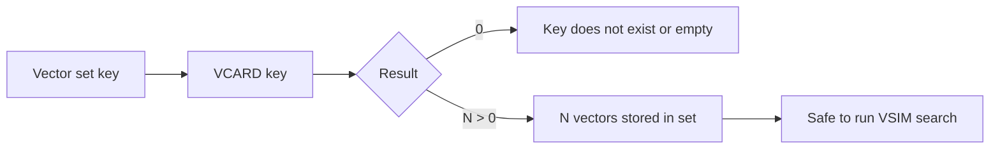

# How to Use VCARD in Redis Vector Sets to Count Vectors

Author: [nawazdhandala](https://github.com/nawazdhandala)

Tags: Redis, Vector, Database, Search, Machine Learning

Description: Learn how to use the VCARD command in Redis vector sets to count the number of vectors stored in a set, useful for monitoring and capacity planning.

---

## Introduction

When working with Redis vector sets you often need to know how many vectors are stored in a given set. The `VCARD` command returns the cardinality (the count of members) of a vector set in O(1) time, similar to how `SCARD` works for regular sets. This is useful for monitoring index size, enforcing capacity limits, and tracking ingestion progress.

## VCARD Syntax

```redis
VCARD key
```

Returns an integer: the number of members in the vector set, or `0` if the key does not exist.

## Prerequisites

- Redis 8.0 or later
- `redis-cli` or a compatible client library

## Basic Usage

```redis
VADD products 0.1 0.9 0.3 0.7 item1
VADD products 0.8 0.2 0.6 0.4 item2
VADD products 0.4 0.5 0.5 0.6 item3

VCARD products
```

Expected output:

```text
(integer) 3
```

## Checking Cardinality Before Search

```redis
VCARD embeddings
```

If the result is `0` the set is empty and `VSIM` would return no results.

## Workflow Diagram



## Using VCARD in Python

```python
import redis

r = redis.Redis(host="localhost", port=6379, decode_responses=True)

# Add some vectors
for i in range(10):
    vec = [str(i * 0.1), str(i * 0.05), str(i * 0.2), str(i * 0.15)]
    r.execute_command("VADD", "products", *vec, f"item{i}")

count = r.execute_command("VCARD", "products")
print(f"Vector set has {count} members")  # 10
```

## Using VCARD in Node.js

```javascript
const Redis = require("ioredis");
const redis = new Redis();

async function getVectorCount(key) {
  return redis.call("VCARD", key);
}

// Seed data
for (let i = 0; i < 5; i++) {
  const vec = [i * 0.1, i * 0.2, i * 0.3, i * 0.4].map(String);
  await redis.call("VADD", "products", ...vec, `item${i}`);
}

const count = await getVectorCount("products");
console.log(`Total vectors: ${count}`);  // 5
```

## Capacity Limit Pattern

A common pattern is to enforce a maximum size on a vector set before inserting new vectors:

```python
MAX_VECTORS = 100_000

def safe_add_vector(r, key, member, vector):
    count = r.execute_command("VCARD", key)
    if count >= MAX_VECTORS:
        raise RuntimeError(f"Vector set {key} is full ({count} members)")
    vec_args = [str(v) for v in vector]
    r.execute_command("VADD", key, *vec_args, member)
```

## Monitoring Ingestion Progress

```python
import time

total_documents = 50_000

for i, (member, vector) in enumerate(document_stream):
    vec_args = [str(v) for v in vector]
    r.execute_command("VADD", "embeddings", *vec_args, member)

    if i % 1000 == 0:
        current_count = r.execute_command("VCARD", "embeddings")
        pct = current_count / total_documents * 100
        print(f"Progress: {current_count}/{total_documents} ({pct:.1f}%)")
```

## VCARD vs VINFO

Both `VCARD` and `VINFO` can tell you the number of vectors, but they serve different purposes:

| Command | Purpose | Output |
|---|---|---|
| `VCARD key` | Fast cardinality check | Single integer |
| `VINFO key` | Full index statistics | Multiple fields including size |

Use `VCARD` when you only need the count. Use `VINFO` when you also need dimension, quantization, and graph statistics.

## Handling Non-Existent Keys

```redis
VCARD nonexistent_key
```

Returns `(integer) 0` -- the same as an empty set. This means you do not need to check for key existence separately before calling `VCARD`.

## Summary

`VCARD` is a simple but essential command for working with Redis vector sets. It returns the count of stored vectors in constant time, making it ideal for capacity checks, ingestion monitoring, and pre-search validation. For more detailed statistics including dimension and quantization info, use `VINFO`.
