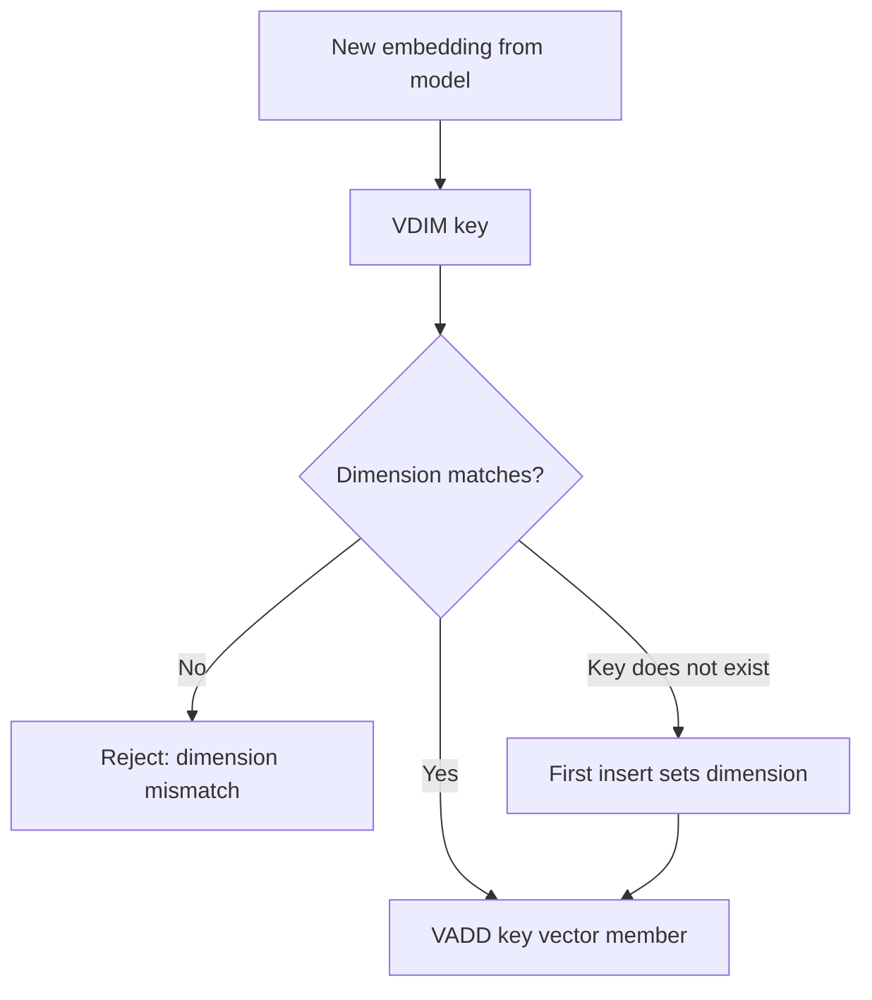

# How to Use VDIM in Redis Vector Sets to Get Dimension

Author: [nawazdhandala](https://github.com/nawazdhandala)

Tags: Redis, Vector, Database, Search, Machine learning

Description: Learn how to use the VDIM command in Redis vector sets to retrieve the dimensionality of stored vectors, useful for validation and debugging embeddings.

---

## Introduction

When working with multiple embedding models or managing several vector sets, knowing the dimensionality of the stored vectors is critical. The `VDIM` command returns the number of dimensions in the vectors stored in a Redis vector set. This is useful for validating that incoming embeddings match the expected dimension before insertion, and for debugging mismatches between embedding models.

## VDIM Syntax

```redis
VDIM key
```

Returns an integer representing the number of dimensions, or an error if the key does not exist or is not a vector set.

## Prerequisites

- Redis 8.0 or later
- `redis-cli` or a compatible client library

## Basic Usage

```redis
VADD embeddings 0.1 0.2 0.3 0.4 doc1
VADD embeddings 0.5 0.6 0.7 0.8 doc2

VDIM embeddings
```

Expected output:

```
(integer) 4
```

The dimension is set by the first `VADD` call and is immutable for the lifetime of the key.

## Dimension is Fixed at First Insert

Once the first vector is added, all subsequent vectors must have the same number of dimensions:

```redis
VADD fixed_dim 0.1 0.2 0.3 0.4 0.5 0.6 0.7 0.8 first_doc
VDIM fixed_dim
# Returns 8

# Attempting to add a 4-dim vector will fail
VADD fixed_dim 0.1 0.2 0.3 0.4 bad_doc
# ERR: wrong number of arguments / dimension mismatch
```

## Workflow Diagram



## Using VDIM for Pre-Insert Validation in Python

```python
import redis

r = redis.Redis(host="localhost", port=6379, decode_responses=True)

def validated_add(key, member, vector):
    try:
        expected_dim = int(r.execute_command("VDIM", key))
        if len(vector) != expected_dim:
            raise ValueError(
                f"Expected {expected_dim} dimensions, got {len(vector)}"
            )
    except Exception as e:
        # Key may not exist yet -- first insert
        if "ERR" in str(e) or "WRONGTYPE" in str(e):
            raise
        # Key does not exist, let VADD set the dimension
        pass

    vec_args = [str(v) for v in vector]
    r.execute_command("VADD", key, *vec_args, member)

# Works
validated_add("docs", "article1", [0.1, 0.2, 0.3, 0.4, 0.5, 0.6, 0.7, 0.8])

# Raises ValueError -- wrong number of dimensions
# validated_add("docs", "article2", [0.1, 0.2, 0.3])
```

## Using VDIM in Node.js

```javascript
const Redis = require("ioredis");
const redis = new Redis();

async function getVectorDimension(key) {
  try {
    return await redis.call("VDIM", key);
  } catch (err) {
    return null; // key does not exist
  }
}

async function safeAddVector(key, member, vector) {
  const dim = await getVectorDimension(key);
  if (dim !== null && vector.length !== dim) {
    throw new Error(`Dimension mismatch: expected ${dim}, got ${vector.length}`);
  }
  const vecArgs = vector.map(String);
  return redis.call("VADD", key, ...vecArgs, member);
}

await safeAddVector("docs", "article1", [0.1, 0.2, 0.3, 0.4]);
const dim = await getVectorDimension("docs");
console.log(`Vector dimension: ${dim}`);  // 4
```

## Common Embedding Dimensions

Different embedding models produce vectors of different sizes. Use `VDIM` to identify which model was used when building a vector set:

| Model | Dimension |
|---|---|
| OpenAI text-embedding-3-small | 1536 |
| OpenAI text-embedding-ada-002 | 1536 |
| OpenAI text-embedding-3-large | 3072 |
| Cohere embed-english-v3 | 1024 |
| sentence-transformers all-MiniLM-L6-v2 | 384 |
| sentence-transformers all-mpnet-base-v2 | 768 |

## VDIM After REDUCE

If `VADD` was called with the `REDUCE dim` option, `VDIM` returns the reduced dimension, not the original input dimension:

```redis
# Original vectors are 1536-dimensional, reduced to 64
VADD big_embeddings REDUCE 64 0.01 0.02 ... (1536 values) ... doc1

VDIM big_embeddings
# Returns 64
```

## Summary

`VDIM` is a lightweight diagnostic command that returns the number of dimensions stored in a Redis vector set. Use it to validate embedding dimensions before insertion, identify the embedding model used, and debug dimension mismatches. The dimension is set on first insert and is immutable for the key.
