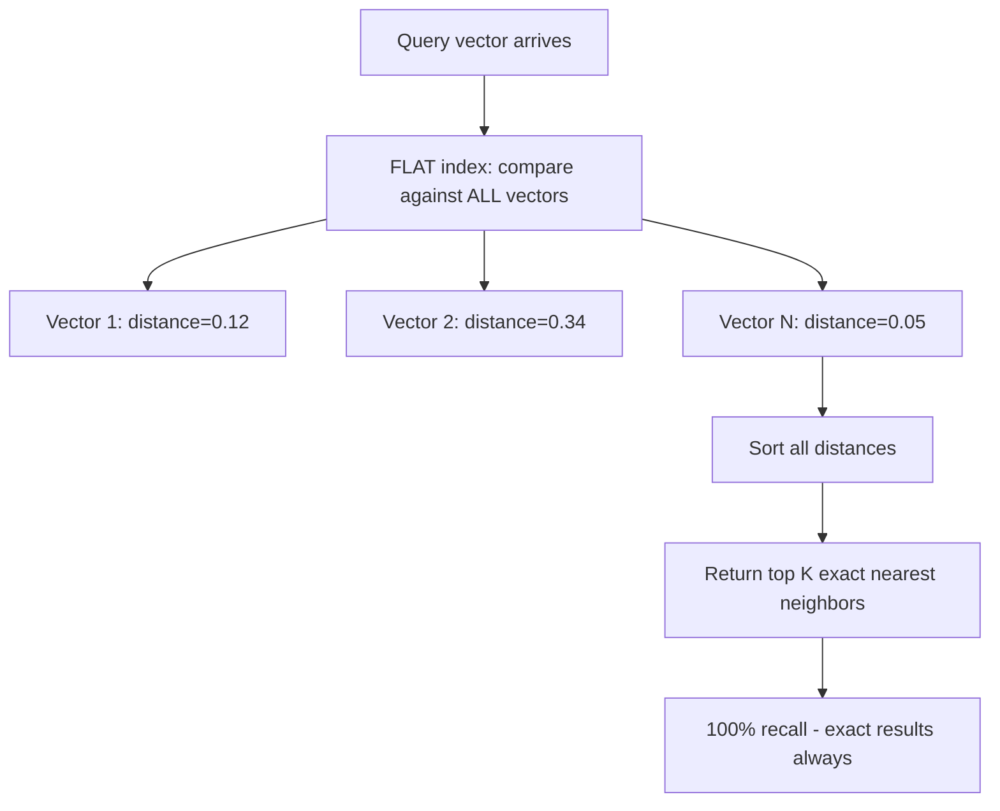
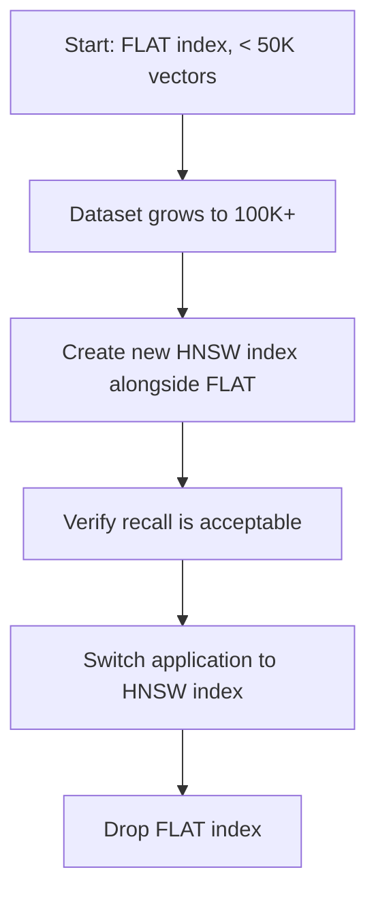

# How to Use Vector Similarity Search in Redis with FLAT Index

Author: [nawazdhandala](https://www.github.com/nawazdhandala)

Tags: Redis, RediSearch, Vector, FLAT, Search

Description: Learn how to create a FLAT vector index in Redis for exact brute-force nearest neighbor search and when to use it instead of the HNSW approximate index.

---

## What Is the FLAT Vector Index?

The FLAT index type in RediSearch performs brute-force (exact) nearest neighbor search by comparing the query vector against every stored vector in the dataset. Unlike HNSW which uses a graph structure for approximate search, FLAT always returns the true nearest neighbors. The tradeoff is linear search time: FLAT is practical for small datasets (under 50,000 vectors) where exact results are required.



## FLAT vs HNSW Comparison

| Aspect | FLAT | HNSW |
|--------|------|------|
| Search type | Exact (brute-force) | Approximate (graph) |
| Recall | 100% guaranteed | ~99% (tunable) |
| Query time | O(N) - linear | O(log N) - logarithmic |
| Build time | O(N) - instant | O(N log N) - slower |
| Memory | Lower | Higher |
| Best dataset size | < 50K vectors | > 50K vectors |
| Suitable for | Testing, small datasets | Production at scale |

## Creating a FLAT Vector Index

```redis
FT.CREATE documents
  ON HASH
  PREFIX 1 doc:
  SCHEMA
    title TEXT
    category TAG
    embedding VECTOR FLAT 6
      TYPE FLOAT32
      DIM 384
      DISTANCE_METRIC COSINE
```

The number `6` after `FLAT` is the count of additional attribute parameters that follow.

### FLAT Parameters

- `TYPE` - vector element type: `FLOAT32` or `FLOAT64`
- `DIM` - number of dimensions (must match your embedding model)
- `DISTANCE_METRIC` - `COSINE`, `L2`, or `IP`
- `BLOCK_SIZE` - optional, number of vectors per memory block (default 1024)

### Using BLOCK_SIZE

```redis
FT.CREATE documents
  ON HASH
  PREFIX 1 doc:
  SCHEMA
    embedding VECTOR FLAT 8
      TYPE FLOAT32
      DIM 128
      DISTANCE_METRIC L2
      BLOCK_SIZE 2048
```

Larger `BLOCK_SIZE` reduces memory overhead per block but uses more memory per allocation.

## Storing Vectors

Vectors are stored as raw bytes (little-endian IEEE 754 format):

```text
import numpy as np
import redis

r = redis.Redis()

-- Simulate a 384-dim text embedding
embedding = np.random.rand(384).astype(np.float32)

r.hset("doc:1", mapping={
    "title": "Introduction to Redis",
    "category": "tutorial",
    "embedding": embedding.tobytes()
})
```

## Querying with KNN

The query syntax for FLAT is identical to HNSW:

```redis
FT.SEARCH documents
  "*=>[KNN 5 @embedding $query_vec AS score]"
  PARAMS 2 query_vec <binary_vector_bytes>
  SORTBY score ASC
  RETURN 3 title category score
  DIALECT 2
```

With FLAT, the returned results are guaranteed to be the exact 5 nearest neighbors.

## Pre-Filtering with FLAT

```redis
-- Find exact nearest neighbors only in the "tutorial" category
FT.SEARCH documents
  "@category:{tutorial}=>[KNN 3 @embedding $query_vec AS score]"
  PARAMS 2 query_vec <binary_vector_bytes>
  SORTBY score ASC
  RETURN 3 title category score
  DIALECT 2
```

FLAT scans all vectors matching the pre-filter and returns exact results within that subset.

## Distance Metrics

### COSINE

Best for text embeddings. Measures angular similarity; values range from 0 (identical) to 2 (opposite):

```redis
FT.CREATE text_docs ON HASH PREFIX 1 tdoc:
  SCHEMA content TEXT
         vec VECTOR FLAT 6 TYPE FLOAT32 DIM 384 DISTANCE_METRIC COSINE
```

### L2 (Euclidean)

Best for image features, spatial data, or any case where magnitude matters:

```redis
FT.CREATE image_docs ON HASH PREFIX 1 img:
  SCHEMA filename TEXT
         vec VECTOR FLAT 6 TYPE FLOAT32 DIM 512 DISTANCE_METRIC L2
```

### IP (Inner Product)

For pre-normalized vectors where you want maximum dot product (higher = more similar):

```redis
FT.CREATE recs ON HASH PREFIX 1 rec:
  SCHEMA user_id TAG
         vec VECTOR FLAT 6 TYPE FLOAT32 DIM 64 DISTANCE_METRIC IP
-- Sort DESCENDING for inner product (higher is more similar)
```

## Practical Use Cases for FLAT

### Prototyping and Development

Use FLAT when building and testing your vector search pipeline before scaling:

```redis
-- Development index with FLAT for exact verification
FT.CREATE dev_docs ON HASH PREFIX 1 doc:
  SCHEMA content TEXT embedding VECTOR FLAT 6 TYPE FLOAT32 DIM 384 DISTANCE_METRIC COSINE
```

### Small Catalogs

Product catalogs with fewer than 10,000 items where exact matching is important:

```redis
FT.CREATE products ON HASH PREFIX 1 product:
  SCHEMA name TEXT description TEXT
         image_vec VECTOR FLAT 6 TYPE FLOAT32 DIM 512 DISTANCE_METRIC L2
```

### Benchmark Ground Truth

Use FLAT to measure the recall of your HNSW index by comparing results:

```redis
-- FLAT gives ground truth
FT.SEARCH flat_idx "*=>[KNN 10 @vec $q AS score]" PARAMS 2 q <bytes> DIALECT 2

-- HNSW gives approximate results
FT.SEARCH hnsw_idx "*=>[KNN 10 @vec $q AS score]" PARAMS 2 q <bytes> DIALECT 2

-- Compare: what percentage of FLAT results appear in HNSW results?
```

## Migrating FLAT to HNSW at Scale

As your dataset grows beyond the practical FLAT threshold, migrate to HNSW:



```redis
-- Create HNSW index
FT.CREATE docs_hnsw ON HASH PREFIX 1 doc:
  SCHEMA title TEXT embedding VECTOR HNSW 10
    TYPE FLOAT32 DIM 384 DISTANCE_METRIC COSINE
    M 16 EF_CONSTRUCTION 200 EF_RUNTIME 10

-- Existing hashes are automatically indexed
-- Test queries, compare results, then drop old index
FT.DROPINDEX docs_flat
```

## Summary

The FLAT vector index in RediSearch provides exact brute-force nearest neighbor search with 100% recall. It is ideal for small datasets (under 50K vectors), development, testing, and benchmarking. Create it with `VECTOR FLAT` in `FT.CREATE`, store embeddings as raw bytes in hash fields, and query using the same `KNN` syntax as HNSW with `DIALECT 2`. Migrate to HNSW when dataset size makes linear scan latency unacceptable.
