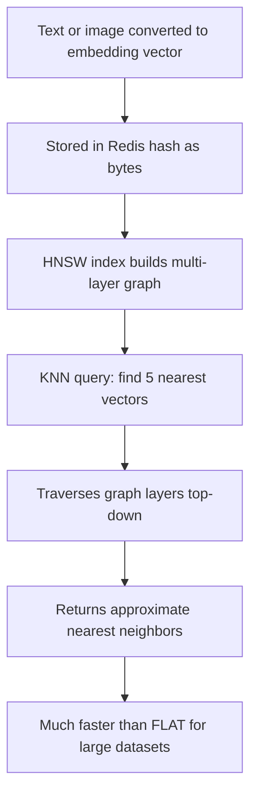
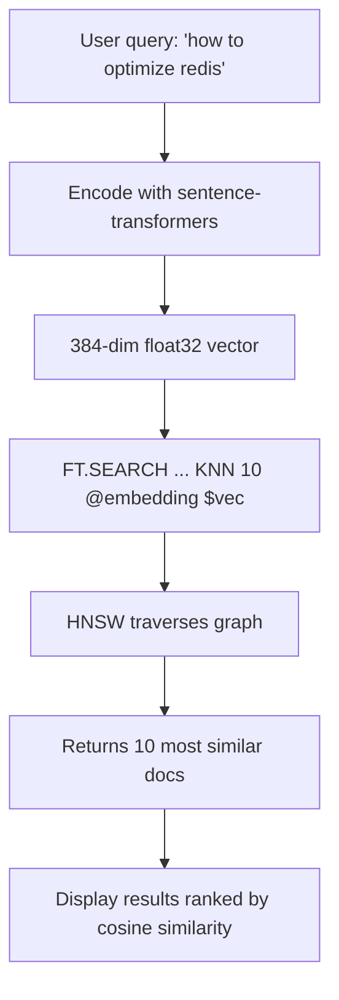

# How to Use Vector Similarity Search in Redis with HNSW Index

Author: [nawazdhandala](https://www.github.com/nawazdhandala)

Tags: Redis, RediSearch, Vector, HNSW, Search

Description: Learn how to create an HNSW vector index in Redis and perform approximate nearest neighbor search for semantic search and recommendation systems.

---

## What Is HNSW Vector Search?

HNSW (Hierarchical Navigable Small World) is a graph-based approximate nearest neighbor (ANN) algorithm. Redis implements it as a VECTOR field type in RediSearch, allowing you to store vector embeddings and find the most similar vectors using cosine, L2 (Euclidean), or inner product distance metrics. HNSW trades a small amount of accuracy for dramatically faster query times compared to brute-force FLAT search.



## When to Use HNSW vs FLAT

| Aspect | HNSW | FLAT |
|--------|------|------|
| Dataset size | Large (100K+) | Small (< 50K) |
| Query speed | Fast (logarithmic) | Slow (linear) |
| Accuracy | Approximate (99%+) | Exact |
| Memory | Higher | Lower |
| Build time | Slower | Instant |

## Creating an HNSW Vector Index

```redis
FT.CREATE documents
  ON HASH
  PREFIX 1 doc:
  SCHEMA
    title TEXT
    category TAG
    embedding VECTOR HNSW 10
      TYPE FLOAT32
      DIM 384
      DISTANCE_METRIC COSINE
      M 16
      EF_CONSTRUCTION 200
      EF_RUNTIME 10
```

### HNSW Parameters

- `TYPE` - vector element type: `FLOAT32` or `FLOAT64`
- `DIM` - number of dimensions in the vector (must match your embedding model)
- `DISTANCE_METRIC` - `COSINE`, `L2`, or `IP` (inner product)
- `M` - maximum number of graph connections per node per layer (default 16)
- `EF_CONSTRUCTION` - size of the candidate list during index build (default 200, higher = better quality but slower build)
- `EF_RUNTIME` - size of the candidate list at query time (default 10, higher = better accuracy but slower queries)

The number `10` after `HNSW` is the count of additional attribute parameters that follow.

## Storing Vectors

Vectors must be stored as raw bytes in little-endian IEEE 754 format. In Python:

```text
import numpy as np
import redis

r = redis.Redis()

-- 384-dimensional vector (e.g., from sentence-transformers)
vector = np.array([0.1, 0.2, 0.3, ...], dtype=np.float32)
r.hset("doc:1", mapping={
    "title": "Redis Performance Guide",
    "category": "database",
    "embedding": vector.tobytes()
})
```

In Redis CLI, use binary-safe strings. For testing, use placeholder vectors:

```redis
-- Store a simple 4-dimensional vector for demonstration
HSET doc:1 title "Redis Guide" category "database" embedding "\x00\x00\x80\x3f\x00\x00\x00\x40\x00\x00\x40\x40\x00\x00\x80\x40"
```

## Querying with KNN

Use `FT.SEARCH` with a `KNN` vector query to find the K nearest neighbors:

```redis
FT.SEARCH documents
  "*=>[KNN 5 @embedding $query_vec AS score]"
  PARAMS 2 query_vec <binary_vector_bytes>
  SORTBY score ASC
  RETURN 3 title category score
  DIALECT 2
```

- `*` - search all documents (or add pre-filters before `=>`)
- `KNN 5` - return 5 nearest neighbors
- `@embedding` - the VECTOR field to search
- `$query_vec` - parameter name for the query vector
- `AS score` - store the distance in this field
- `DIALECT 2` - required for vector search queries

## Pre-Filtering Before KNN

Combine vector search with metadata filters:

```redis
-- Find the 5 most similar documents in the "database" category
FT.SEARCH documents
  "@category:{database}=>[KNN 5 @embedding $query_vec AS score]"
  PARAMS 2 query_vec <binary_vector_bytes>
  SORTBY score ASC
  RETURN 3 title category score
  DIALECT 2
```

Pre-filters narrow the candidate set before HNSW traversal, which can be faster but reduces accuracy if the filtered set is very small.

## Distance Metrics

### COSINE (Most Common for Text)

Measures the angle between vectors. Best for text embeddings where direction matters more than magnitude:

```redis
DISTANCE_METRIC COSINE
-- Score range: 0 (identical) to 2 (opposite)
```

### L2 (Euclidean)

Measures straight-line distance. Good for image embeddings and spatial data:

```redis
DISTANCE_METRIC L2
-- Score: squared Euclidean distance, 0 = identical
```

### IP (Inner Product)

Dot product similarity. Requires pre-normalized vectors for meaningful results:

```redis
DISTANCE_METRIC IP
-- Higher IP = more similar (opposite of L2/COSINE)
-- Sort DESCENDING for inner product
```

## Tuning HNSW Parameters

### M Parameter (Graph Connections)

Higher M builds a denser graph with better recall but more memory:

```text
M 8   -- Low memory, lower recall (good for rough similarity)
M 16  -- Default, balanced
M 64  -- High recall, high memory
```

### EF_CONSTRUCTION (Build Quality)

Higher value improves index quality at the cost of slower build time:

```text
EF_CONSTRUCTION 100  -- Faster build, lower quality
EF_CONSTRUCTION 200  -- Default
EF_CONSTRUCTION 500  -- Slower build, higher quality
```

### EF_RUNTIME (Query Recall)

Override at query time per request:

```redis
FT.SEARCH documents
  "*=>[KNN 5 @embedding $query_vec EF_RUNTIME 50 AS score]"
  PARAMS 2 query_vec <bytes>
  DIALECT 2
```

Higher `EF_RUNTIME` increases recall but slows down queries.

## Checking Index Statistics

```redis
FT.INFO documents
```

Look for `indexing` status and the vector index size in the output.

## Practical Application: Semantic Document Search



## Summary

HNSW vector indexes in RediSearch provide fast approximate nearest neighbor search for large embedding datasets. Create them with `VECTOR HNSW` in `FT.CREATE`, store embeddings as raw bytes in hash fields, and query using `KNN` syntax with `DIALECT 2`. Tune `M`, `EF_CONSTRUCTION`, and `EF_RUNTIME` to balance build time, memory, query speed, and recall accuracy. Use COSINE distance for text embeddings and L2 for spatial or image embeddings.
