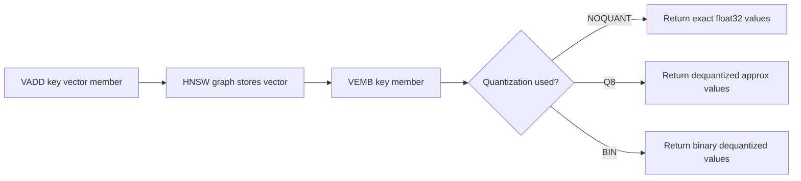

# How to Use VEMB in Redis Vector Sets to Get Embedding

Author: [nawazdhandala](https://github.com/nawazdhandala)

Tags: Redis, Vector, Database, Search, Machine learning

Description: Learn how to use the VEMB command in Redis vector sets to retrieve the stored embedding vector for a specific member, useful for debugging and recomputation.

---

## Introduction

Redis vector sets store embedding vectors alongside member names. The `VEMB` command retrieves the vector embedding for a specific member. This is useful for debugging, auditing the quality of stored embeddings, verifying that quantization did not degrade vectors beyond acceptable bounds, and computing the distance between two members without running a full similarity search.

## VEMB Syntax

```redis
VEMB key member
```

Returns a list of floating-point values representing the vector. If quantization (Q8 or BIN) was used at insert time, the returned values are the dequantized approximations, not the exact original floats.

## Prerequisites

- Redis 8.0 or later
- `redis-cli` or a compatible client library

## Basic Usage

```redis
VADD docs 0.10 0.25 0.50 0.75 article1
VADD docs 0.80 0.15 0.40 0.65 article2

VEMB docs article1
```

Expected output:

```
1) "0.10000000149011612"
2) "0.25"
3) "0.5"
4) "0.75"
```

Minor floating-point differences may appear due to quantization rounding.

## Workflow Diagram



## Retrieving and Inspecting a Vector in Python

```python
import redis
import numpy as np

r = redis.Redis(host="localhost", port=6379, decode_responses=True)

# Insert a known vector
original = [0.1, 0.2, 0.3, 0.4, 0.5, 0.6, 0.7, 0.8]
vec_args = [str(v) for v in original]
r.execute_command("VADD", "docs", *vec_args, "article1")

# Retrieve the stored vector
raw = r.execute_command("VEMB", "docs", "article1")
stored = [float(v) for v in raw]

# Compare with original
original_np = np.array(original)
stored_np = np.array(stored)
max_error = np.max(np.abs(original_np - stored_np))
print(f"Max quantization error: {max_error:.6f}")
```

## Computing Cosine Similarity Between Two Members

```python
def cosine_similarity(a, b):
    a = np.array(a)
    b = np.array(b)
    return float(np.dot(a, b) / (np.linalg.norm(a) * np.linalg.norm(b)))

raw1 = r.execute_command("VEMB", "docs", "article1")
raw2 = r.execute_command("VEMB", "docs", "article2")
v1 = [float(x) for x in raw1]
v2 = [float(x) for x in raw2]
score = cosine_similarity(v1, v2)
print(f"Cosine similarity: {score:.4f}")
```

## Using VEMB in Node.js

```javascript
const Redis = require("ioredis");
const redis = new Redis();

async function getEmbedding(key, member) {
  const raw = await redis.call("VEMB", key, member);
  return raw.map(Number);
}

async function run() {
  await redis.call("VADD", "docs", "0.1", "0.2", "0.3", "0.4", "article1");
  const vec = await getEmbedding("docs", "article1");
  console.log("Stored embedding:", vec);
}

run();
```

## Quantization Comparison Example

```redis
# Store with full precision
VADD docs_noquant NOQUANT 0.123456789 0.987654321 0.555555555 0.111111111 a
VEMB docs_noquant a

# Store with Q8 quantization
VADD docs_q8 Q8 0.123456789 0.987654321 0.555555555 0.111111111 a
VEMB docs_q8 a

# Store with binary quantization
VADD docs_bin BIN 0.123456789 0.987654321 0.555555555 0.111111111 a
VEMB docs_bin a
```

NOQUANT returns values very close to the originals. Q8 introduces small errors. BIN returns values near -1 or 1 depending on the sign of each component.

## Non-Existent Member Handling

```redis
VEMB docs nonexistent_member
```

Returns an empty array or nil. Always check before using the result:

```python
raw = r.execute_command("VEMB", "docs", "nonexistent")
if not raw:
    print("Member not found in vector set")
```

## Auditing Embedding Drift

If you re-encode documents with a new model version you can compare old and new embeddings to measure drift:

```python
def embedding_drift(r, key, member, new_vector):
    raw = r.execute_command("VEMB", key, member)
    if not raw:
        return None
    old_vec = np.array([float(x) for x in raw])
    new_vec = np.array(new_vector)
    return float(np.linalg.norm(old_vec - new_vec))

drift = embedding_drift(r, "docs", "article1", new_embedding)
if drift > 0.1:
    print(f"Significant drift detected: {drift:.4f} -- consider re-indexing")
```

## Summary

`VEMB` retrieves the stored embedding vector for a member in a Redis vector set. The returned values are dequantized approximations when Q8 or BIN quantization was used. Common uses include debugging quantization error, computing manual similarity scores, auditing embedding quality, and detecting drift when switching embedding models.
