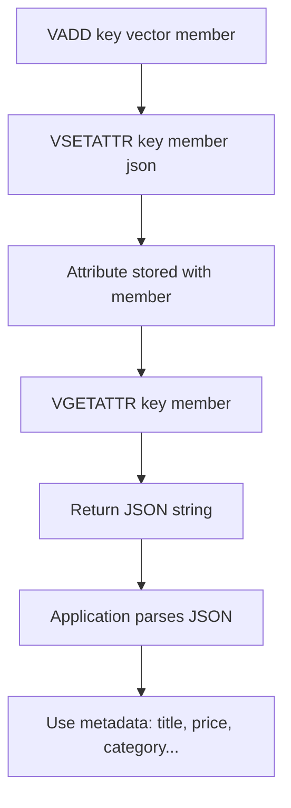

# How to Use VGETATTR in Redis Vector Sets for Attributes

Author: [nawazdhandala](https://github.com/nawazdhandala)

Tags: Redis, Vector, Database, Search, Machine learning

Description: Learn how to use the VGETATTR command in Redis vector sets to retrieve JSON metadata attributes stored alongside a vector member for richer search results.

---

## Introduction

Redis vector sets allow you to store JSON metadata alongside each vector using `VSETATTR`, and retrieve it with `VGETATTR`. This metadata -- called an attribute -- is a free-form JSON string that can hold any information relevant to the vector: document titles, categories, prices, URLs, or any other payload. `VGETATTR` fetches this JSON string for a specific member in O(1) time.

## VGETATTR Syntax

```redis
VGETATTR key member
```

Returns the JSON attribute string for the member, or `nil` if no attribute was set.

## Prerequisites

- Redis 8.0 or later
- `redis-cli` or a compatible client library

## Basic Example

```redis
VADD products 0.1 0.9 0.3 0.7 product:1001
VSETATTR products product:1001 '{"name":"Wireless Headphones","price":79.99,"category":"electronics","in_stock":true}'

VGETATTR products product:1001
```

Expected output:

```text
"{\"name\":\"Wireless Headphones\",\"price\":79.99,\"category\":\"electronics\",\"in_stock\":true}"
```

## Workflow Diagram



## Storing Rich Metadata

```redis
VADD articles 0.3 0.7 0.2 0.8 0.5 article:42
VSETATTR articles article:42 '{
  "title": "Getting Started with Redis",
  "author": "Jane Doe",
  "published": "2025-01-15",
  "tags": ["redis", "database", "tutorial"],
  "views": 12340
}'

VGETATTR articles article:42
```

## Retrieving Attributes in Python

```python
import redis
import json

r = redis.Redis(host="localhost", port=6379, decode_responses=True)

# Set up data
vec = ["0.3", "0.7", "0.2", "0.8", "0.5"]
r.execute_command("VADD", "articles", *vec, "article:42")
attrs = {
    "title": "Getting Started with Redis",
    "author": "Jane Doe",
    "tags": ["redis", "database"],
}
r.execute_command("VSETATTR", "articles", "article:42", json.dumps(attrs))

# Retrieve and parse
raw = r.execute_command("VGETATTR", "articles", "article:42")
if raw:
    metadata = json.loads(raw)
    print(metadata["title"])   # Getting Started with Redis
    print(metadata["author"])  # Jane Doe
```

## Retrieving Attributes in Node.js

```javascript
const Redis = require("ioredis");
const redis = new Redis();

async function getAttribute(key, member) {
  const raw = await redis.call("VGETATTR", key, member);
  return raw ? JSON.parse(raw) : null;
}

// Set up data
await redis.call("VADD", "articles", "0.3", "0.7", "0.2", "0.8", "article:42");
await redis.call(
  "VSETATTR", "articles", "article:42",
  JSON.stringify({ title: "Redis Intro", views: 500 })
);

const attr = await getAttribute("articles", "article:42");
console.log(attr.title);  // Redis Intro
```

## Combining VSIM with VGETATTR

A common pattern is to run `VSIM` to find the most similar vectors, then fetch their attributes individually:

```python
def search_with_attributes(r, key, query_vector, count=5):
    vec_args = [str(v) for v in query_vector]
    results = r.execute_command("VSIM", key, "VALUES", str(len(query_vector)), *vec_args, "COUNT", count)

    enriched = []
    for i in range(0, len(results), 2):
        member = results[i]
        score = float(results[i + 1])
        raw_attr = r.execute_command("VGETATTR", key, member)
        attrs = json.loads(raw_attr) if raw_attr else {}
        enriched.append({"member": member, "score": score, "attrs": attrs})
    return enriched
```

Or use `VSIM ... WITHATTRIBS` to retrieve attributes inline with results.

## Handling Missing Attributes

```python
raw = r.execute_command("VGETATTR", "articles", "article:99")
if raw is None:
    print("No attribute set for this member")
else:
    metadata = json.loads(raw)
```

## Bulk Attribute Retrieval with Pipeline

```python
members = ["article:1", "article:2", "article:3", "article:4", "article:5"]

pipe = r.pipeline()
for member in members:
    pipe.execute_command("VGETATTR", "articles", member)
raw_attrs = pipe.execute()

results = []
for member, raw in zip(members, raw_attrs):
    attrs = json.loads(raw) if raw else {}
    results.append({"member": member, **attrs})
```

## Summary

`VGETATTR` retrieves the JSON metadata attribute stored alongside a vector member in a Redis vector set. It works in O(1) time and returns `nil` for members without attributes. For best performance, use `VSIM ... WITHATTRIBS` to combine similarity search and attribute retrieval in a single command, or pipeline multiple `VGETATTR` calls to reduce round-trips.
