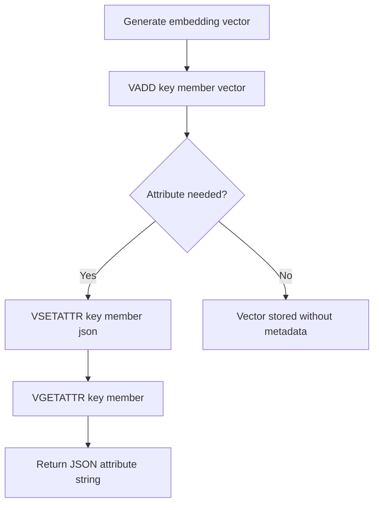

# How to Use VGETATTR and VSETATTR in Redis for Vector Metadata

Author: [nawazdhandala](https://github.com/nawazdhandala)

Tags: Redis, Vector, Database, Search, Machine learning

Description: Learn how to use VGETATTR and VSETATTR commands in Redis vector sets to store and retrieve JSON metadata attributes alongside your vectors.

---

## Introduction

Redis vector sets, introduced as a new data type in Redis 8, store floating-point vectors alongside optional JSON attributes. The `VSETATTR` command attaches a JSON string to a vector element, and `VGETATTR` retrieves that JSON string. This makes it easy to store metadata such as labels, categories, or payload data alongside high-dimensional embeddings without needing a separate key.

## How VSETATTR Works

`VSETATTR` stores a JSON attribute string on an existing member of a vector set. The syntax is:

```redis
VSETATTR key member json_string
```

If the member does not exist in the vector set the command returns an error. The attribute replaces any previously stored attribute for that member.

## How VGETATTR Works

`VGETATTR` retrieves the JSON attribute string previously set on a member:

```redis
VGETATTR key member
```

It returns the raw JSON string, or `nil` if no attribute has been set.

## Prerequisites

- Redis 8.0 or later with vector set support enabled
- `redis-cli` or a compatible client library

## Basic Example

First add vectors to a vector set using `VADD`, then attach metadata.

```redis
VADD products 0.1 0.9 0.3 0.7 shoes123
VADD products 0.8 0.2 0.6 0.4 bag456
VADD products 0.4 0.5 0.5 0.6 hat789

VSETATTR products shoes123 '{"name":"Running Shoes","category":"footwear","price":89.99}'
VSETATTR products bag456   '{"name":"Tote Bag","category":"accessories","price":34.99}'
VSETATTR products hat789   '{"name":"Sun Hat","category":"accessories","price":19.99}'

VGETATTR products shoes123
VGETATTR products bag456
```

Expected output for `VGETATTR products shoes123`:

```
"{\"name\":\"Running Shoes\",\"category\":\"footwear\",\"price\":89.99}"
```

## Workflow Diagram



## Combining with Similarity Search

The real power of `VGETATTR` comes when you combine it with `VSIM` to retrieve metadata for the nearest neighbours:

```redis
VSIM products ELE shoes123 COUNT 2 WITHATTRIBS
```

The `WITHATTRIBS` flag makes `VSIM` return both the similarity score and the stored attribute JSON in one round-trip.

## Using Attributes in Python

```python
import redis
import json

r = redis.Redis(host="localhost", port=6379, decode_responses=True)

# Add a vector (4-dimensional example)
r.execute_command("VADD", "products", "0.1", "0.9", "0.3", "0.7", "shoes123")

# Set metadata
attr = json.dumps({"name": "Running Shoes", "category": "footwear", "price": 89.99})
r.execute_command("VSETATTR", "products", "shoes123", attr)

# Retrieve metadata
raw = r.execute_command("VGETATTR", "products", "shoes123")
metadata = json.loads(raw)
print(metadata["name"])   # Running Shoes
print(metadata["price"])  # 89.99
```

## Using Attributes in Node.js with ioredis

```javascript
const Redis = require("ioredis");
const redis = new Redis();

async function run() {
  await redis.call("VADD", "products", "0.1", "0.9", "0.3", "0.7", "shoes123");

  const attr = JSON.stringify({ name: "Running Shoes", category: "footwear", price: 89.99 });
  await redis.call("VSETATTR", "products", "shoes123", attr);

  const raw = await redis.call("VGETATTR", "products", "shoes123");
  const metadata = JSON.parse(raw);
  console.log(metadata.name);  // Running Shoes
}

run();
```

## Updating Attributes

Attributes can be updated at any time by calling `VSETATTR` again. The new JSON replaces the old one atomically:

```redis
VSETATTR products shoes123 '{"name":"Trail Shoes","category":"footwear","price":109.99,"in_stock":true}'
VGETATTR products shoes123
```

## Removing Attributes

To remove an attribute pass an empty string:

```redis
VSETATTR products shoes123 ""
VGETATTR products shoes123
```

After passing an empty string `VGETATTR` returns `nil`.

## Error Handling

If the member does not exist in the key, `VSETATTR` returns a zero (falsy) integer reply. Always verify the vector was added before setting attributes:

```python
exists = r.execute_command("VSIM", "products", "ELE", "shoes123", "COUNT", 1)
if not exists:
    print("Member not found")
```

## Performance Considerations

- Attribute JSON is stored alongside vector metadata in the HNSW graph structure, so reads are O(1).
- Large JSON payloads increase per-element memory. Keep attributes concise and store large blobs in a separate key.
- Batch attribute updates in a pipeline to reduce round-trips:

```python
pipe = r.pipeline()
for member, attrs in items:
    pipe.execute_command("VSETATTR", "products", member, json.dumps(attrs))
pipe.execute()
```

## Summary

`VGETATTR` and `VSETATTR` give Redis vector sets the ability to carry rich JSON metadata alongside each vector. Use `VSETATTR` immediately after `VADD` to attach labels, categories, or payload data, then read it back with `VGETATTR` or retrieve it inline during similarity searches using `VSIM ... WITHATTRIBS`. Keep attribute payloads small for best memory efficiency.
