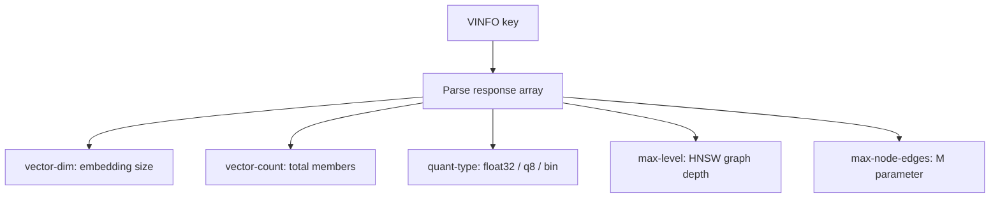

# How to Use VINFO in Redis Vector Sets to Get Statistics

Author: [nawazdhandala](https://github.com/nawazdhandala)

Tags: Redis, Vector, Database, Search, Machine learning

Description: Learn how to use the VINFO command in Redis vector sets to retrieve detailed statistics about a vector set including size, dimension, quantization, and HNSW graph parameters.

---

## Introduction

The `VINFO` command returns detailed metadata about a Redis vector set. Unlike `VCARD` which returns only the count, `VINFO` provides a comprehensive view of the index including the number of vectors, their dimensionality, the quantization type in use, and internal HNSW graph parameters. This makes it an essential debugging and monitoring tool when building vector search applications.

## VINFO Syntax

```redis
VINFO key
```

Returns an array of key-value pairs (like `HGETALL` format) describing the vector set. Returns an error if the key does not exist or is not a vector set.

## Prerequisites

- Redis 8.0 or later
- `redis-cli` or a compatible client library

## Basic Usage

```redis
VADD products 0.1 0.9 0.3 0.7 item1
VADD products 0.8 0.2 0.6 0.4 item2
VADD products 0.4 0.5 0.5 0.6 item3

VINFO products
```

Example output:

```text
 1) "vector-dim"
 2) (integer) 4
 3) "vector-count"
 4) (integer) 3
 5) "quant-type"
 6) "q8"
 7) "max-level"
 8) (integer) 0
 9) "max-node-edges"
10) (integer) 16
11) "ml"
12) "0.36067999899387363"
```

## Understanding VINFO Fields

| Field | Description |
|---|---|
| `vector-dim` | Number of dimensions in stored vectors |
| `vector-count` | Total number of members |
| `quant-type` | Quantization: `float32`, `q8`, or `bin` |
| `max-level` | Highest level in the HNSW graph (0 = only one layer) |
| `max-node-edges` | Maximum number of edges per node (M parameter) |
| `ml` | Level multiplier for the HNSW graph |

## Workflow Diagram



## Using VINFO in Python

```python
import redis

r = redis.Redis(host="localhost", port=6379, decode_responses=True)

def get_vinfo(r, key):
    raw = r.execute_command("VINFO", key)
    # Convert flat list to dict
    return {raw[i]: raw[i + 1] for i in range(0, len(raw), 2)}

# Seed data
for i in range(5):
    vec = [str(j * 0.1 + i * 0.01) for j in range(8)]
    r.execute_command("VADD", "docs", *vec, f"doc{i}")

info = get_vinfo(r, "docs")
print(f"Dimensions:    {info['vector-dim']}")
print(f"Total vectors: {info['vector-count']}")
print(f"Quantization:  {info['quant-type']}")
print(f"HNSW max-level: {info['max-level']}")
```

## Using VINFO in Node.js

```javascript
const Redis = require("ioredis");
const redis = new Redis();

async function getVinfo(key) {
  const raw = await redis.call("VINFO", key);
  const info = {};
  for (let i = 0; i < raw.length; i += 2) {
    info[raw[i]] = raw[i + 1];
  }
  return info;
}

const info = await getVinfo("docs");
console.log("Dimensions:", info["vector-dim"]);
console.log("Total vectors:", info["vector-count"]);
console.log("Quantization:", info["quant-type"]);
```

## Monitoring Vector Set Growth Over Time

```python
import time

def monitor_vinfo(r, key, interval_seconds=60):
    while True:
        try:
            info = get_vinfo(r, key)
            print(
                f"[{time.strftime('%H:%M:%S')}] "
                f"count={info['vector-count']} "
                f"dim={info['vector-dim']} "
                f"quant={info['quant-type']}"
            )
        except Exception as e:
            print(f"Error: {e}")
        time.sleep(interval_seconds)
```

## Comparing Multiple Vector Sets

```python
keys = ["embeddings_v1", "embeddings_v2", "embeddings_v3"]

for key in keys:
    try:
        info = get_vinfo(r, key)
        print(f"{key}: {info['vector-count']} vectors, {info['vector-dim']} dims, {info['quant-type']}")
    except Exception:
        print(f"{key}: does not exist")
```

## VINFO vs VCARD vs VDIM

| Command | Use case | Output |
|---|---|---|
| `VCARD key` | Quick count only | Integer |
| `VDIM key` | Quick dimension only | Integer |
| `VINFO key` | Full statistics | Array of fields |

Use `VINFO` when you need a complete picture of a vector set for debugging, capacity planning, or schema validation.

## Verifying Quantization After Bulk Insert

After a bulk import, verify the index was built with the expected quantization:

```python
info = get_vinfo(r, "products")
assert info["quant-type"] == "q8", f"Expected q8, got {info['quant-type']}"
assert int(info["vector-dim"]) == 1536, f"Expected 1536 dims, got {info['vector-dim']}"
print("Index verified successfully")
```

## Summary

`VINFO` provides a comprehensive snapshot of a Redis vector set including member count, vector dimensionality, quantization type, and HNSW graph parameters. Use it for debugging, schema validation, monitoring index growth, and comparing configurations across multiple vector sets. For lightweight checks, prefer `VCARD` for count-only and `VDIM` for dimension-only queries.
