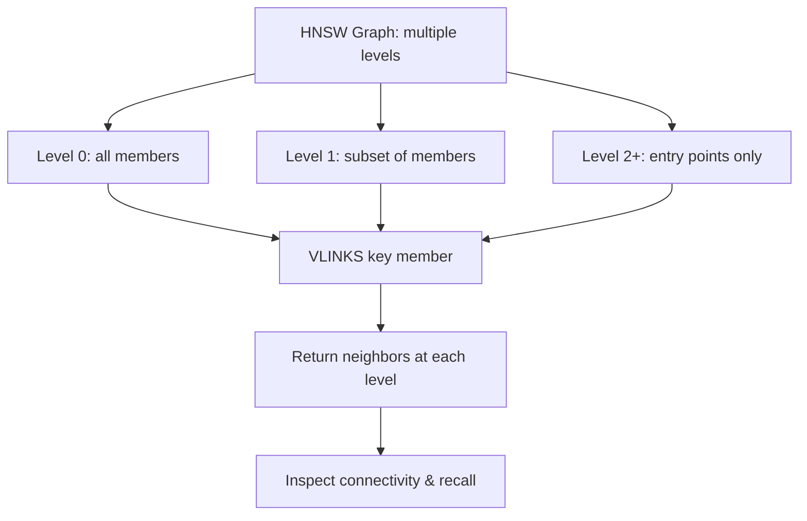

# How to Use VLINKS in Redis Vector Sets for Graph Links

Author: [nawazdhandala](https://github.com/nawazdhandala)

Tags: Redis, Vector, Database, Search, Machine learning

Description: Learn how to use the VLINKS command in Redis vector sets to inspect the internal HNSW graph links for a member, useful for debugging index quality and connectivity.

---

## Introduction

Redis vector sets use the HNSW (Hierarchical Navigable Small World) algorithm internally to enable fast approximate nearest-neighbor search. The `VLINKS` command exposes the internal graph structure by returning the neighbor links for a specific member at each HNSW level. This is primarily a debugging and introspection tool that lets you verify index connectivity, understand graph quality, and diagnose recall problems.

## VLINKS Syntax

```redis
VLINKS key member [WITHSCORES]
```

Returns an array of levels. Each level contains an array of member names that are linked to the given member in the HNSW graph. With `WITHSCORES`, each neighbor is followed by its distance score.

## Prerequisites

- Redis 8.0 or later
- `redis-cli` or a compatible client library

## Basic Usage

```redis
VADD items 0.1 0.9 0.3 0.7 a
VADD items 0.2 0.8 0.4 0.6 b
VADD items 0.3 0.7 0.5 0.5 c
VADD items 0.9 0.1 0.7 0.3 d
VADD items 0.8 0.2 0.6 0.4 e

VLINKS items a
```

Example output:

```
1) 1) "level 0"
   2) 1) "b"
      2) "c"
      3) "d"
```

## VLINKS with Scores

```redis
VLINKS items a WITHSCORES
```

Example output:

```
1) 1) "level 0"
   2) 1) "b"
      2) "0.97823"
      3) "c"
      4) "0.94512"
      5) "d"
      6) "0.71230"
```

Higher scores indicate closer neighbors in the cosine similarity space.

## Workflow Diagram



## Understanding HNSW Levels

The HNSW algorithm builds a multi-layer graph:
- **Level 0** contains all members with the most edges (M x 2 maximum edges)
- **Higher levels** contain progressively fewer members, acting as express lanes for search
- Most members only appear at level 0; a small fraction appear at level 1, even fewer at level 2, and so on

A healthy graph has well-connected members at level 0. If a member has very few level-0 neighbors, recall may suffer for queries near that member.

## Using VLINKS in Python

```python
import redis

r = redis.Redis(host="localhost", port=6379, decode_responses=True)

def get_vlinks(r, key, member, with_scores=False):
    cmd = ["VLINKS", key, member]
    if with_scores:
        cmd.append("WITHSCORES")
    return r.execute_command(*cmd)

# Seed
for i, (name, vec) in enumerate([
    ("a", ["0.1", "0.9", "0.3", "0.7"]),
    ("b", ["0.2", "0.8", "0.4", "0.6"]),
    ("c", ["0.3", "0.7", "0.5", "0.5"]),
    ("d", ["0.9", "0.1", "0.7", "0.3"]),
]):
    r.execute_command("VADD", "items", *vec, name)

links = get_vlinks(r, "items", "a", with_scores=True)
print("Graph links for 'a':", links)
```

## Using VLINKS in Node.js

```javascript
const Redis = require("ioredis");
const redis = new Redis();

async function getVlinks(key, member, withScores = false) {
  const cmd = ["VLINKS", key, member];
  if (withScores) cmd.push("WITHSCORES");
  return redis.call(...cmd);
}

// Seed
const members = [
  ["a", "0.1", "0.9", "0.3", "0.7"],
  ["b", "0.2", "0.8", "0.4", "0.6"],
  ["c", "0.9", "0.1", "0.7", "0.3"],
];
for (const [name, ...vec] of members) {
  await redis.call("VADD", "items", ...vec, name);
}

const links = await getVlinks("items", "a", true);
console.log("Neighbors of 'a':", links);
```

## Diagnosing Low Recall

If `VSIM` returns fewer results than expected, `VLINKS` can help identify isolated members:

```python
def check_connectivity(r, key):
    # Get all members via VSIM with a dummy query
    all_members_raw = r.execute_command("VSIM", key, "VALUES", "4",
                                        "0.5", "0.5", "0.5", "0.5", "COUNT", 1000)
    members = all_members_raw[::2]

    isolated = []
    for member in members:
        links = r.execute_command("VLINKS", key, member)
        # Count level-0 neighbors
        level0_neighbors = links[1] if links and len(links) > 1 else []
        if len(level0_neighbors) < 2:
            isolated.append(member)

    print(f"Isolated members (< 2 neighbors): {isolated}")
    return isolated
```

## Comparing Graph Density Before and After Re-Index

After changing EF construction or M parameters, compare graph density:

```python
import statistics

def avg_neighbors(r, key, sample_members):
    counts = []
    for member in sample_members:
        links = r.execute_command("VLINKS", key, member)
        level0 = links[1] if links and len(links) > 1 else []
        counts.append(len(level0))
    return statistics.mean(counts)
```

## Summary

`VLINKS` exposes the internal HNSW graph structure for a member in a Redis vector set, returning its neighbors at each graph level. Use it to audit index connectivity, diagnose low recall by identifying isolated members, and understand how HNSW levels distribute members. The `WITHSCORES` option adds distance scores to help assess neighbor quality. This command is most valuable as a debugging tool rather than a production data-retrieval command.
