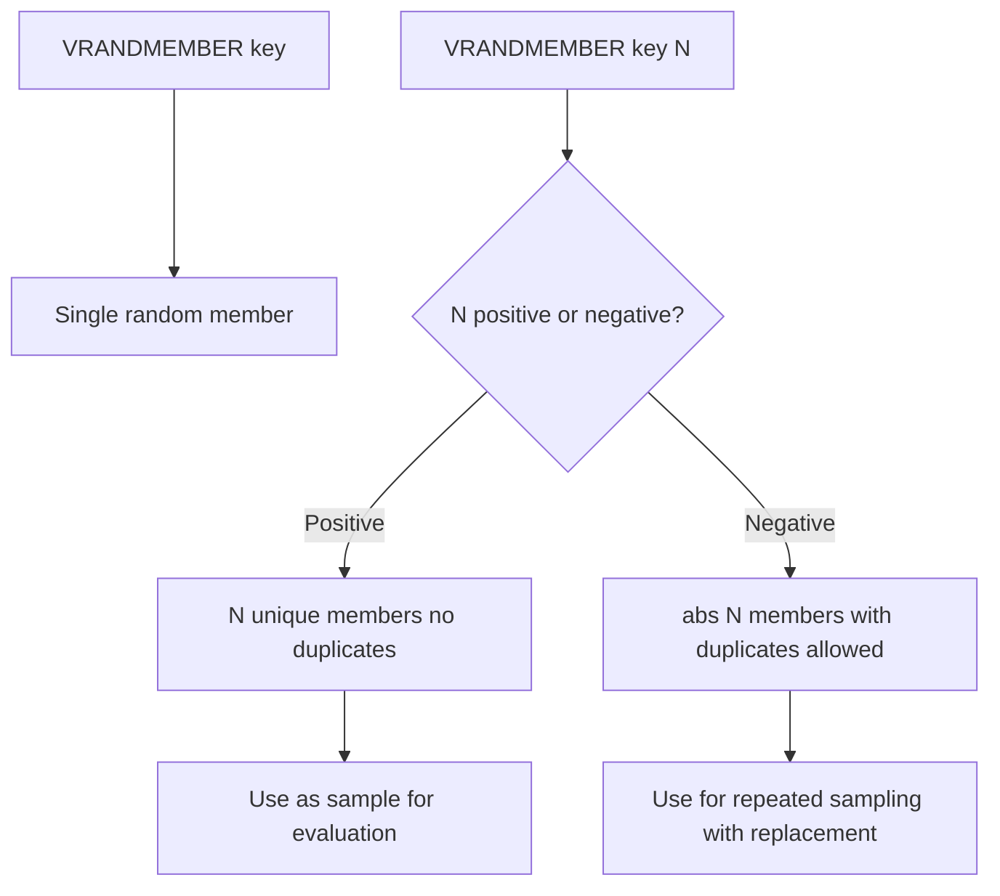

# How to Use VRANDMEMBER in Redis Vector Sets for Random Vectors

Author: [nawazdhandala](https://github.com/nawazdhandala)

Tags: Redis, Vector, Database, Search, Machine learning

Description: Learn how to use the VRANDMEMBER command in Redis vector sets to retrieve one or more random members, useful for sampling, testing, and exploration of vector data.

---

## Introduction

The `VRANDMEMBER` command returns one or more random members from a Redis vector set. It is modeled after the `SRANDMEMBER` command for regular sets. Common use cases include random sampling for evaluation, selecting seed vectors for clustering, building test harnesses, and exploring the contents of a large vector set without iterating all members.

## VRANDMEMBER Syntax

```redis
VRANDMEMBER key [count]
```

- Without `count`: returns a single random member name as a bulk string.
- With a positive `count`: returns up to `count` unique random members.
- With a negative `count`: returns exactly `|count|` members, allowing duplicates.

Returns `nil` if the key does not exist or the set is empty.

## Prerequisites

- Redis 8.0 or later
- `redis-cli` or a compatible client library

## Basic Usage

```redis
VADD docs 0.1 0.9 0.3 0.7 article1
VADD docs 0.8 0.2 0.6 0.4 article2
VADD docs 0.4 0.5 0.5 0.6 article3
VADD docs 0.7 0.3 0.8 0.2 article4
VADD docs 0.2 0.7 0.1 0.9 article5

# Single random member
VRANDMEMBER docs

# 3 unique random members
VRANDMEMBER docs 3

# 8 members with possible duplicates (set has only 5)
VRANDMEMBER docs -8
```

## Workflow Diagram



## Using VRANDMEMBER in Python

```python
import redis

r = redis.Redis(host="localhost", port=6379, decode_responses=True)

# Seed
vectors = {
    "article1": ["0.1", "0.9", "0.3", "0.7"],
    "article2": ["0.8", "0.2", "0.6", "0.4"],
    "article3": ["0.4", "0.5", "0.5", "0.6"],
    "article4": ["0.7", "0.3", "0.8", "0.2"],
    "article5": ["0.2", "0.7", "0.1", "0.9"],
}
for name, vec in vectors.items():
    r.execute_command("VADD", "docs", *vec, name)

# Single random member
single = r.execute_command("VRANDMEMBER", "docs")
print(f"Random member: {single}")

# Sample 3 unique members
sample = r.execute_command("VRANDMEMBER", "docs", 3)
print(f"Sample of 3: {sample}")
```

## Using VRANDMEMBER in Node.js

```javascript
const Redis = require("ioredis");
const redis = new Redis();

// Seed
const docs = [
  ["article1", "0.1", "0.9", "0.3", "0.7"],
  ["article2", "0.8", "0.2", "0.6", "0.4"],
  ["article3", "0.4", "0.5", "0.5", "0.6"],
];
for (const [name, ...vec] of docs) {
  await redis.call("VADD", "docs", ...vec, name);
}

// Single random member
const single = await redis.call("VRANDMEMBER", "docs");
console.log("Random:", single);

// Sample of 2 unique members
const sample = await redis.call("VRANDMEMBER", "docs", 2);
console.log("Sample:", sample);
```

## Random Sampling for Evaluation

A common use case is selecting a random sample of vectors to evaluate search recall:

```python
import random

def evaluate_recall(r, key, sample_size=100):
    members = r.execute_command("VRANDMEMBER", key, sample_size)
    hit_count = 0
    for member in members:
        # Get the stored embedding
        raw = r.execute_command("VEMB", key, member)
        vec = [float(x) for x in raw]
        # Run similarity search
        results = r.execute_command("VSIM", key, "VALUES", str(len(vec)),
                                    *[str(v) for v in vec], "COUNT", 1)
        top_member = results[0] if results else None
        if top_member == member:
            hit_count += 1

    recall_at_1 = hit_count / len(members)
    print(f"Recall@1 over {len(members)} samples: {recall_at_1:.3f}")
    return recall_at_1
```

## Selecting Seed Vectors for K-Means Clustering

```python
def kmeans_plus_plus_seeds(r, key, k):
    # Start with one random seed
    seeds = r.execute_command("VRANDMEMBER", key, 1)

    while len(seeds) < k:
        # Pick next seed proportional to distance (simplified: random candidate)
        candidates = r.execute_command("VRANDMEMBER", key, min(50, k * 10))
        # In a real implementation compute distances to existing seeds here
        seeds.append(candidates[0])

    return seeds

seeds = kmeans_plus_plus_seeds(r, "docs", k=5)
print(f"Initial cluster seeds: {seeds}")
```

## Positive vs Negative Count Behavior

```redis
# Set with 3 members: a, b, c

# Positive count: up to 3 unique members
VRANDMEMBER myset 5
# Returns: a, b, c  (at most 3, all unique)

# Negative count: exactly 5 with replacement
VRANDMEMBER myset -5
# Returns: a, b, a, c, b  (may repeat)
```

## Handling Empty or Non-Existent Keys

```python
result = r.execute_command("VRANDMEMBER", "nonexistent_key")
if result is None:
    print("Key does not exist or set is empty")

result = r.execute_command("VRANDMEMBER", "nonexistent_key", 5)
if not result:
    print("No members returned")
```

## Summary

`VRANDMEMBER` provides random member selection from Redis vector sets with flexible count semantics. Use a positive count for unique sampling (evaluation, testing), a negative count for sampling with replacement (Monte Carlo methods, random restarts), and no count for a single random pick. It is particularly useful for recall evaluation, clustering initialization, and exploratory analysis of large vector sets.
