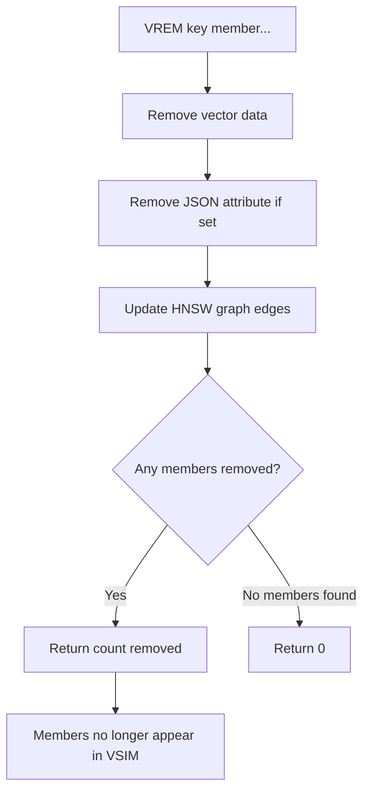

# How to Use VREM in Redis Vector Sets to Remove Vectors

Author: [nawazdhandala](https://github.com/nawazdhandala)

Tags: Redis, Vector, Database, Search, Machine Learning

Description: Learn how to use the VREM command in Redis vector sets to remove one or more vector members, and understand how deletion affects the HNSW index and search results.

---

## Introduction

When documents are deleted, products are discontinued, or embeddings need to be refreshed, you need to remove vectors from a Redis vector set. The `VREM` command removes one or more members from a vector set, cleaning up their associated vector data, attributes, and HNSW graph edges. After removal, the deleted members no longer appear in similarity search results.

## VREM Syntax

```redis
VREM key member [member ...]
```

Returns an integer: the number of members actually removed (members that did not exist are not counted).

## Prerequisites

- Redis 8.0 or later
- `redis-cli` or a compatible client library

## Basic Usage

```redis
VADD products 0.1 0.9 0.3 0.7 product:1
VADD products 0.8 0.2 0.6 0.4 product:2
VADD products 0.4 0.5 0.5 0.6 product:3

VCARD products
# 3

VREM products product:2

VCARD products
# 2
```

## Removing Multiple Members

```redis
VREM products product:1 product:3
# (integer) 2
```

## Workflow Diagram



## Using VREM in Python

```python
import redis

r = redis.Redis(host="localhost", port=6379, decode_responses=True)

# Setup
for i in range(5):
    vec = [str(i * 0.1 + 0.05 * j) for j in range(4)]
    r.execute_command("VADD", "products", *vec, f"product:{i}")

print("Before:", r.execute_command("VCARD", "products"))  # 5

# Remove a single member
removed = r.execute_command("VREM", "products", "product:2")
print(f"Removed {removed} member(s)")

# Remove multiple members
removed = r.execute_command("VREM", "products", "product:0", "product:4")
print(f"Removed {removed} member(s)")

print("After:", r.execute_command("VCARD", "products"))  # 2
```

## Using VREM in Node.js

```javascript
const Redis = require("ioredis");
const redis = new Redis();

async function removeVectors(key, ...members) {
  return redis.call("VREM", key, ...members);
}

// Setup
for (let i = 0; i < 5; i++) {
  const vec = [i * 0.1, i * 0.2, i * 0.3, i * 0.4].map(String);
  await redis.call("VADD", "products", ...vec, `product:${i}`);
}

const removed = await removeVectors("products", "product:1", "product:3");
console.log(`Removed: ${removed}`);  // 2

const remaining = await redis.call("VCARD", "products");
console.log(`Remaining: ${remaining}`);  // 3
```

## Batch Deletion Pattern

For large-scale removals, chunk the deletes to avoid blocking Redis:

```python
def batch_remove(r, key, members, batch_size=500):
    total_removed = 0
    for i in range(0, len(members), batch_size):
        batch = members[i:i + batch_size]
        removed = r.execute_command("VREM", key, *batch)
        total_removed += removed
        print(f"Batch {i // batch_size + 1}: removed {removed}")
    return total_removed

# Remove 2000 discontinued products
discontinued = [f"product:{i}" for i in range(2000)]
batch_remove(r, "products", discontinued)
```

## Update Pattern: Replace a Vector

To update a vector (e.g. re-encode a document with a new embedding model), remove and re-add:

```python
def update_vector(r, key, member, new_vector, new_attrs=None):
    r.execute_command("VREM", key, member)
    vec_args = [str(v) for v in new_vector]
    cmd = ["VADD", key]
    if new_attrs:
        import json
        cmd += ["SETATTR", json.dumps(new_attrs)]
    cmd += vec_args + [member]
    r.execute_command(*cmd)
```

Alternatively, calling `VADD` on an existing member updates its vector in place without needing `VREM` first.

## Verifying Removal from Search Results

```python
# Confirm removed member no longer appears in results
query_vec = ["0.8", "0.2", "0.6", "0.4"]
results = r.execute_command("VSIM", "products", "VALUES", "4", *query_vec, "COUNT", 10)
members_in_results = results[::2]
assert "product:2" not in members_in_results, "Deleted member still appearing in search!"
print("Removal verified -- deleted member not in search results")
```

## Removing Non-Existent Members

```redis
VREM products nonexistent_member
# (integer) 0
```

No error is returned. The count reflects only the members that actually existed.

## Handling VREM in a Deletion Sync Pipeline

When syncing deletes from a primary database:

```python
import time

def sync_deletes(r, key, deleted_ids):
    # Group by batch for efficiency
    pipe = r.pipeline()
    for doc_id in deleted_ids:
        member = f"doc:{doc_id}"
        pipe.execute_command("VREM", key, member)
    results = pipe.execute()
    removed_count = sum(results)
    print(f"Synced {removed_count} deletions to vector set '{key}'")
```

## Summary

`VREM` removes one or more members from a Redis vector set, cleaning up their vector data, attributes, and HNSW graph edges. It returns the count of successfully removed members (0 for non-existent members without error). Use batch processing for large-scale deletions, and either `VREM` + `VADD` or a direct `VADD` for updates. After removal, the member is immediately excluded from all subsequent `VSIM` search results.
