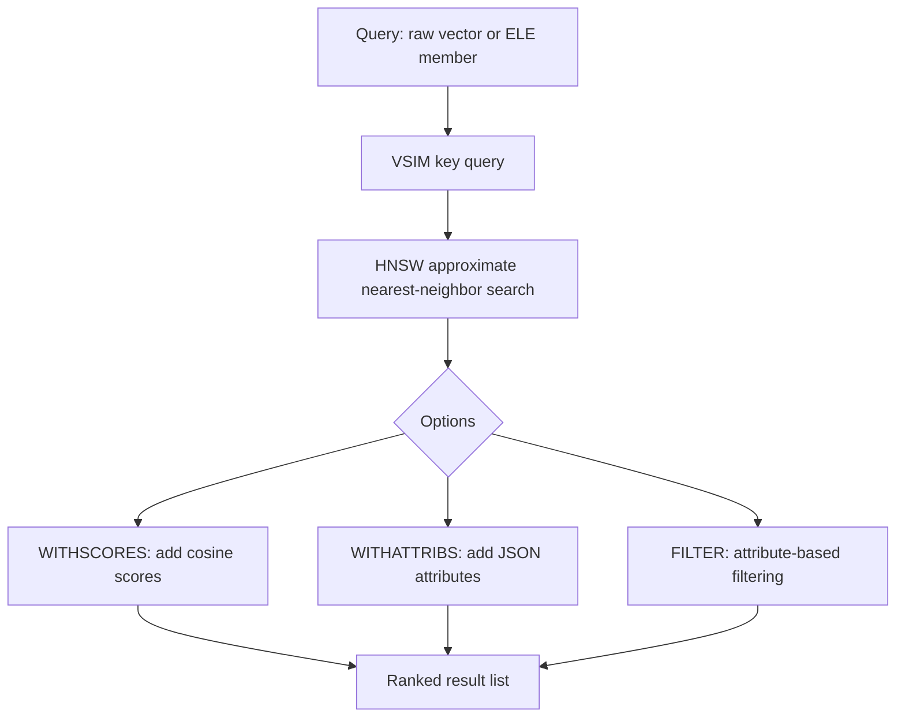

# How to Use VSIM in Redis Vector Sets for Similarity Search

Author: [nawazdhandala](https://github.com/nawazdhandala)

Tags: Redis, Vector, Database, Search, Machine learning

Description: Learn how to use the VSIM command in Redis vector sets to find the most similar vectors to a query, with options for count, filtering, scores, and attribute retrieval.

---

## Introduction

`VSIM` is the primary search command for Redis vector sets. Given a query vector or an existing member name, it returns the most similar members ranked by cosine similarity. It uses the HNSW (Hierarchical Navigable Small World) approximate nearest-neighbor algorithm, delivering sub-millisecond search times even on sets with millions of vectors.

## VSIM Syntax

```redis
VSIM key (ELE member | VALUES dim v1 v2 ... vN)
     [WITHSCORES] [WITHATTRIBS] [COUNT n] [EF ef_runtime]
     [FILTER expr] [FILTER-EF filter_ef]
```

- `ELE member` - search by an existing member's vector
- `VALUES dim v1...vN` - search by a raw vector of `dim` dimensions
- `WITHSCORES` - include cosine similarity scores in the response
- `WITHATTRIBS` - include JSON attribute strings in the response
- `COUNT n` - return up to n results (default: 10)
- `EF ef_runtime` - HNSW search width (higher = better recall, slower)
- `FILTER expr` - filter results by attribute JSON values
- `FILTER-EF` - number of candidates to consider for filter evaluation

## Prerequisites

- Redis 8.0 or later
- `redis-cli` or a compatible client library

## Basic Usage

### Search by Existing Element

```redis
VADD docs 0.1 0.9 0.3 0.7 article1
VADD docs 0.2 0.8 0.4 0.6 article2
VADD docs 0.9 0.1 0.7 0.3 article3
VADD docs 0.8 0.2 0.6 0.4 article4

VSIM docs ELE article1 COUNT 3
```

Returns the 3 members most similar to `article1` (including itself).

### Search by Raw Vector Values

```redis
VSIM docs VALUES 4 0.15 0.85 0.35 0.65 COUNT 3 WITHSCORES
```

## Full Response with Scores and Attributes

```redis
VADD products 0.1 0.9 0.3 0.7 shoes
VSETATTR products shoes '{"name":"Running Shoes","price":89.99,"category":"footwear"}'

VADD products 0.2 0.8 0.4 0.6 boots
VSETATTR products boots '{"name":"Hiking Boots","price":129.99,"category":"footwear"}'

VSIM products VALUES 4 0.12 0.88 0.32 0.68 COUNT 2 WITHSCORES WITHATTRIBS
```

Example output:

```
1) "shoes"
2) "0.99812"
3) "{\"name\":\"Running Shoes\",\"price\":89.99,\"category\":\"footwear\"}"
4) "boots"
5) "0.97341"
6) "{\"name\":\"Hiking Boots\",\"price\":129.99,\"category\":\"footwear\"}"
```

## Workflow Diagram



## Using VSIM in Python

```python
import redis
import json

r = redis.Redis(host="localhost", port=6379, decode_responses=True)

def vector_search(r, key, query_vector, count=10, with_scores=True, with_attribs=True):
    dim = len(query_vector)
    cmd = ["VSIM", key, "VALUES", str(dim)] + [str(v) for v in query_vector]
    cmd += ["COUNT", str(count)]
    if with_scores:
        cmd.append("WITHSCORES")
    if with_attribs:
        cmd.append("WITHATTRIBS")

    raw = r.execute_command(*cmd)

    results = []
    step = 1 + (1 if with_scores else 0) + (1 if with_attribs else 0)
    for i in range(0, len(raw), step):
        member = raw[i]
        score = float(raw[i + 1]) if with_scores else None
        attr_idx = i + 2 if with_scores else i + 1
        attrs = json.loads(raw[attr_idx]) if with_attribs and raw[attr_idx] else {}
        results.append({"member": member, "score": score, "attrs": attrs})

    return results

# Example search
results = vector_search(r, "products", [0.12, 0.88, 0.32, 0.68])
for r_item in results:
    print(f"{r_item['member']} (score={r_item['score']:.4f}): {r_item['attrs']}")
```

## Using VSIM in Node.js

```javascript
const Redis = require("ioredis");
const redis = new Redis();

async function vectorSearch(key, queryVector, count = 10) {
  const dim = queryVector.length;
  const vecArgs = queryVector.map(String);
  const raw = await redis.call(
    "VSIM", key, "VALUES", String(dim), ...vecArgs,
    "COUNT", String(count), "WITHSCORES", "WITHATTRIBS"
  );

  const results = [];
  for (let i = 0; i < raw.length; i += 3) {
    results.push({
      member: raw[i],
      score: parseFloat(raw[i + 1]),
      attrs: raw[i + 2] ? JSON.parse(raw[i + 2]) : {},
    });
  }
  return results;
}

const results = await vectorSearch("products", [0.12, 0.88, 0.32, 0.68]);
results.forEach(r => console.log(r.member, r.score.toFixed(4)));
```

## Attribute Filtering with FILTER

The `FILTER` option accepts a JSONPath-like filter expression to narrow results by attribute values:

```redis
# Only return products in the footwear category
VSIM products VALUES 4 0.12 0.88 0.32 0.68 COUNT 5 WITHSCORES FILTER ".category == \"footwear\""

# Only return products under $100
VSIM products VALUES 4 0.12 0.88 0.32 0.68 COUNT 5 WITHSCORES FILTER ".price < 100"
```

## Tuning EF for Recall vs. Latency

The `EF` parameter controls how many candidates the HNSW algorithm evaluates during search. Higher values find more accurate results at the cost of latency:

```redis
# Fast but potentially lower recall
VSIM docs VALUES 4 0.1 0.2 0.3 0.4 COUNT 10 EF 50

# Slower but higher recall
VSIM docs VALUES 4 0.1 0.2 0.3 0.4 COUNT 10 EF 500
```

The default EF is 10 x COUNT (so 100 for COUNT 10).

## Semantic Search Pipeline

```python
from sentence_transformers import SentenceTransformer

model = SentenceTransformer("all-MiniLM-L6-v2")

def semantic_search(r, index_key, query_text, count=5):
    embedding = model.encode(query_text).tolist()
    return vector_search(r, index_key, embedding, count=count)

results = semantic_search(r, "articles", "how to set up Redis in Docker", count=5)
for item in results:
    print(f"[{item['score']:.4f}] {item['attrs'].get('title', item['member'])}")
```

## Summary

`VSIM` is the core search command for Redis vector sets, enabling fast approximate nearest-neighbor search using the HNSW algorithm. Use `VALUES` for raw query vectors or `ELE` to search relative to a stored member. Combine `WITHSCORES` and `WITHATTRIBS` for richer results, use `FILTER` for attribute-based pre-filtering, and tune the `EF` parameter to balance recall accuracy against query latency.
