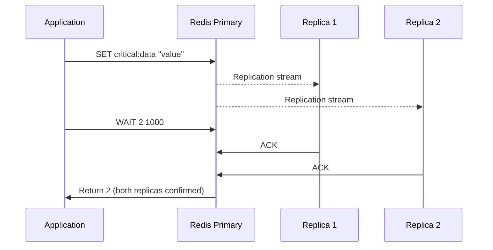

# How to Use WAIT in Redis for Synchronous Replication

Author: [nawazdhandala](https://www.github.com/nawazdhandala)

Tags: Redis, WAIT, Replication, Durability, Consistency

Description: Learn how to use the WAIT command in Redis to block until a specified number of replicas have acknowledged write operations, providing stronger durability guarantees.

---

## How WAIT Works

WAIT blocks the current client until a specified number of replicas have acknowledged replicating all write commands issued on the current connection, or until a timeout expires. It returns the actual number of replicas that acknowledged the writes within the timeout.

WAIT does not make Redis strongly consistent, but it reduces the window of data loss after a failover by ensuring writes have been propagated to N replicas before the application considers an operation complete.



## Syntax

```redis
WAIT numreplicas timeout
```

- `numreplicas` - number of replicas to wait for
- `timeout` - maximum wait time in milliseconds; 0 means block indefinitely

Returns the number of replicas that acknowledged the writes within the timeout. This may be less than `numreplicas` if the timeout expired first.

## Examples

### Wait for 1 replica to confirm a write

```redis
SET user:100:email "alice@example.com"
WAIT 1 1000
```

```text
(integer) 1
```

The write was replicated to at least 1 replica within 1 second.

### Wait for 2 replicas

```redis
SET payment:txn:789 "processed"
WAIT 2 2000
```

```text
(integer) 2
```

### Timeout before replication completes

If replicas are slow or disconnected:

```redis
WAIT 3 500
```

```text
(integer) 1
```

Only 1 replica acknowledged within 500ms. The application should treat this as a warning that full replication did not complete in time.

### WAIT returns 0 when there are no replicas

On a standalone Redis instance with no replicas configured:

```redis
SET key "value"
WAIT 1 1000
```

```text
(integer) 0
```

Returns 0 immediately because there are no replicas to wait for.

### Check replication lag before proceeding

```redis
LPUSH critical:queue "job-1" "job-2"
SET queue:last:updated "1748700000"

# Ensure both writes reached at least 1 replica
WAIT 1 5000
```

```text
(integer) 1
```

### Block indefinitely until replica confirms

```redis
SET important:flag "true"
WAIT 1 0
```

```text
(integer) 1
```

Timeout of 0 means wait as long as necessary.

## Durability Guarantee

WAIT reduces (but does not eliminate) data loss risk during failover. The typical scenario WAIT helps with:

1. Application writes to primary.
2. Primary acknowledges the write.
3. Primary crashes before replicating to any replica.
4. Replica is promoted with the write missing.

With WAIT, step 3 only proceeds after the write has been confirmed by N replicas. If WAIT returns fewer replicas than requested, the application can choose to reject the operation or retry.

## WAIT vs fsync Persistence

WAIT ensures replication acknowledgment across the network. It does not guarantee persistence to disk on replicas. For full durability, combine WAIT with replica-side AOF configuration (`appendfsync always`).

## Use Cases

**Financial transactions** - After committing a payment, wait for 1+ replicas to confirm before returning success to the user.

**Leader election handoff** - Before stepping down, ensure a critical key has been replicated to all replicas to prevent split-brain scenarios.

**Data pipeline checkpoints** - After processing a batch, wait for replicas to confirm before deleting the input data from the queue.

**Zero-downtime failover preparation** - Before a planned primary shutdown, use WAIT to confirm all recent writes are on replicas.

## Summary

WAIT blocks until a specified number of replicas have replicated all preceding writes from the current connection, or until a timeout expires. It returns the count of acknowledging replicas. WAIT is a powerful tool for reducing the data loss window during failovers at the cost of increased write latency. Use it for critical writes where losing data is unacceptable, and check the return value to confirm the desired replication depth was achieved.
