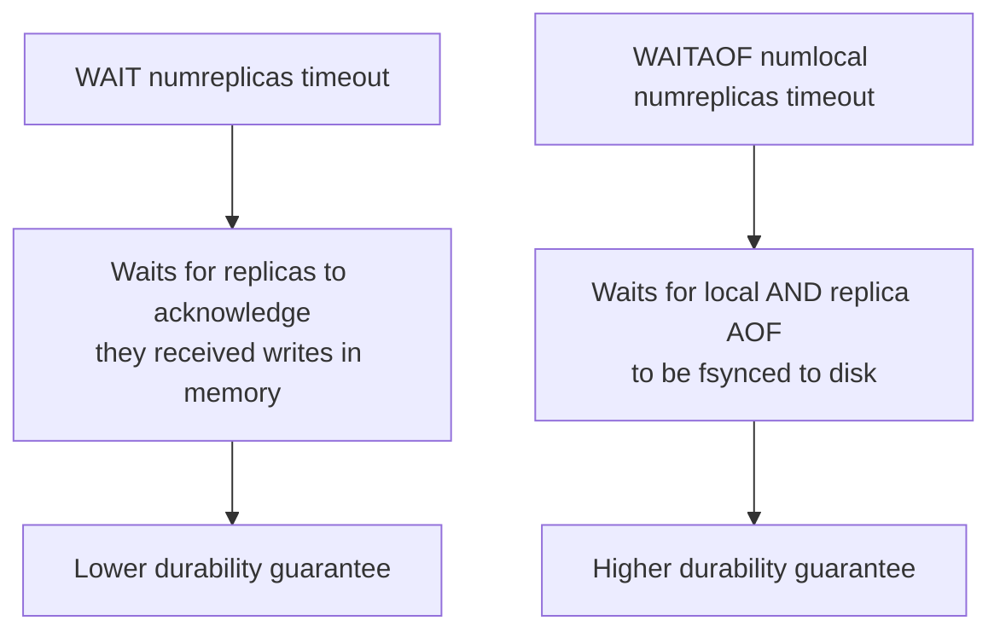
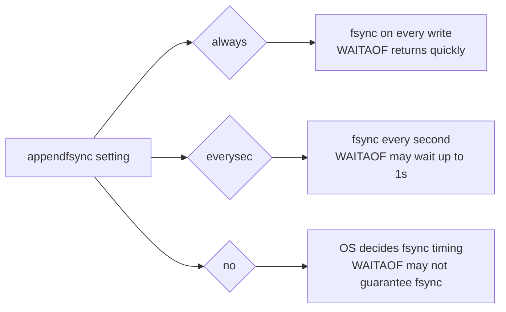
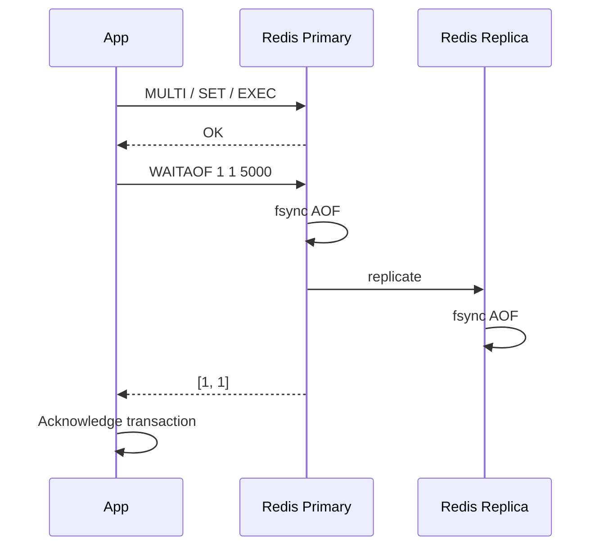

# How to Use WAITAOF in Redis for AOF Sync Guarantee

Author: [nawazdhandala](https://www.github.com/nawazdhandala)

Tags: Redis, Waitaof, AOF, Persistence, Durability

Description: Learn how to use the WAITAOF command in Redis 7.2+ to block until the AOF log is fsynced on the local server and a given number of replicas, ensuring write durability.

---

## Introduction

Introduced in Redis 7.2, `WAITAOF` blocks the calling client until the Append-Only File (AOF) has been fsynced on a specified number of local instances and replicas. It provides a fine-grained durability guarantee that goes beyond `WAIT`, which only checks replication offset acknowledgments without confirming that data has been persisted to disk.

## Basic Syntax

```redis
WAITAOF numlocal numreplicas timeout
```

- `numlocal` - number of local AOF syncs to wait for (0 or 1; only 0 or 1 is meaningful for a single instance)
- `numreplicas` - number of replicas that must have fsynced the AOF
- `timeout` - milliseconds to wait; 0 means wait indefinitely

Returns a two-element array: `[local_fsynced, replicas_fsynced]`.

## How WAITAOF Differs from WAIT



## Examples

### Wait for local AOF fsync

```redis
SET order:1001 "confirmed"
WAITAOF 1 0 0
# 1) (integer) 1   -- local fsynced
# 2) (integer) 0   -- no replicas required
```

### Wait for local + 1 replica AOF fsync

```redis
SET payment:5000 "processed"
WAITAOF 1 1 5000
# 1) (integer) 1
# 2) (integer) 1
```

If the timeout expires before the required fsyncs complete, the returned counts will be less than requested. The write is still accepted but the durability guarantee was not met.

### Non-blocking check (timeout = 1ms)

```redis
WAITAOF 1 0 1
# 1) (integer) 1
# 2) (integer) 0
```

### Verifying durability after a batch write

```redis
MULTI
SET invoice:2001 "paid"
SET invoice:2002 "paid"
SET invoice:2003 "paid"
EXEC

WAITAOF 1 0 10000
# Ensures all three writes are on disk before acknowledging the client
```

## AOF fsync Modes and WAITAOF



`WAITAOF` is most effective with `appendfsync always` or `appendfsync everysec`. With `appendfsync no`, the OS controls flushing and `WAITAOF` cannot provide a strong guarantee.

## Prerequisites

- Redis 7.2 or later
- AOF must be enabled: `appendonly yes` in `redis.conf`

```redis
CONFIG GET appendonly
# 1) "appendonly"
# 2) "yes"
```

## Practical Use Case: Financial Transactions



## Summary

`WAITAOF numlocal numreplicas timeout` is a Redis 7.2+ command that blocks until the AOF has been fsynced locally and on the required number of replicas. It offers a stronger durability guarantee than `WAIT`, which only confirms in-memory replication. Use it in systems where write durability is critical, such as financial or order processing workloads.
