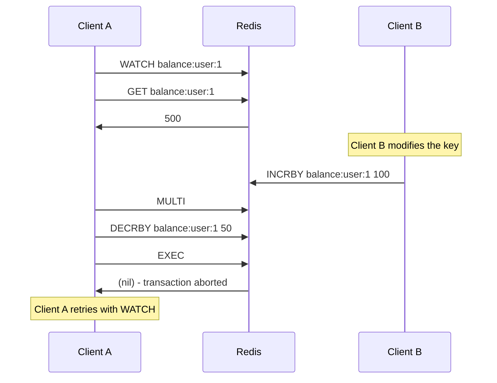

# How to Use WATCH in Redis for Optimistic Locking

Author: [nawazdhandala](https://www.github.com/nawazdhandala)

Tags: Redis, WATCH, Optimistic Locking, Transaction, MULTI, EXEC

Description: Learn how to use WATCH in Redis to implement optimistic locking, ensuring transactions only execute if watched keys have not been modified by another client.

---

## How WATCH Works

WATCH marks one or more keys to be watched for changes. If any watched key is modified by another client between WATCH and EXEC, the entire transaction is aborted - EXEC returns nil instead of executing the queued commands. This is Redis's mechanism for optimistic concurrency control.

The pattern is: WATCH the key, READ its current value, build a transaction based on that value, then EXEC. If another client modified the key in between, start over from the beginning.



## Syntax

```redis
WATCH key [key ...]
```

WATCH must be called before MULTI. It returns `OK` and remains active until:
- EXEC is called (whether or not the transaction was aborted)
- DISCARD is called
- The connection is closed
- UNWATCH is called

## Examples

### Basic WATCH pattern - optimistic balance update

```redis
SET balance:user:1 500

WATCH balance:user:1
GET balance:user:1
```

```text
"500"
```

```redis
MULTI
DECRBY balance:user:1 50
EXEC
```

If no other client modified `balance:user:1`:

```text
1) (integer) 450
```

### EXEC returns nil when watched key changed

```redis
# Client A watches
WATCH counter
GET counter
```

```text
"10"
```

Before Client A calls EXEC, Client B runs:

```redis
# Client B (separate connection)
INCR counter
```

Now Client A tries to commit:

```redis
MULTI
INCR counter
EXEC
```

```text
(nil)
```

EXEC returns nil. No commands were executed. Client A must retry.

### WATCH multiple keys

```redis
WATCH account:alice account:bob

# Read both values
GET account:alice
GET account:bob

MULTI
DECRBY account:alice 100
INCRBY account:bob 100
EXEC
```

If either key changes before EXEC, the transaction is aborted.

### Retry loop pattern

A robust retry loop in bash:

```bash
while true; do
  redis-cli WATCH balance:user:1
  current=$(redis-cli GET balance:user:1)
  new_balance=$((current - 50))

  result=$(redis-cli MULTI && redis-cli SET balance:user:1 $new_balance && redis-cli EXEC)

  if [ "$result" != "" ]; then
    echo "Success: $result"
    break
  fi

  echo "Conflict detected, retrying..."
done
```

### UNWATCH - cancel watches without aborting

```redis
WATCH key1 key2

# Decide not to proceed with the transaction
UNWATCH
```

UNWATCH clears all watched keys for the current connection without requiring a MULTI/EXEC cycle.

### Using WATCH with hash fields

You can only watch entire keys, not individual fields. If you watch a hash key, any modification to any field in that hash triggers the abort.

```redis
WATCH user:profile:42
HGET user:profile:42 email
# ... (another client modifies any field of user:profile:42)
MULTI
HSET user:profile:42 email "new@example.com"
EXEC
```

```text
(nil)
```

## WATCH vs Pessimistic Locking

| Aspect | WATCH (Optimistic) | Pessimistic Lock (SETNX) |
|---|---|---|
| Contention handling | Retry on conflict | Wait for lock release |
| Throughput under low contention | High | Medium |
| Throughput under high contention | Lower (retries) | Lower (waiting) |
| Risk of deadlock | None | Possible |
| Use case | Low-conflict reads followed by writes | High-conflict or complex critical sections |

## Use Cases

**Check-then-set operations** - Read a value, compute a new value based on it, then atomically update it only if it has not changed.

**Inventory decrement** - Check stock level, then atomically decrement it and record the sale, aborting if someone else changed the stock between the read and write.

**Conditional leaderboard updates** - Read a user's current score, compute the new rank, and update only if the score has not been modified by another process.

**Safe counter-based IDs** - Read the current max ID, compute the next ID, and set it atomically, retrying if another client grabbed the same ID.

## Summary

WATCH implements optimistic locking in Redis by monitoring keys for changes between a read and a transaction commit. If a watched key is modified before EXEC, the transaction returns nil and does not execute, signaling the caller to retry. This pattern works well for workloads with low contention. Combine WATCH with a retry loop for robust atomic read-modify-write operations. UNWATCH clears all watched keys explicitly, and DISCARD or EXEC automatically removes all watches.
