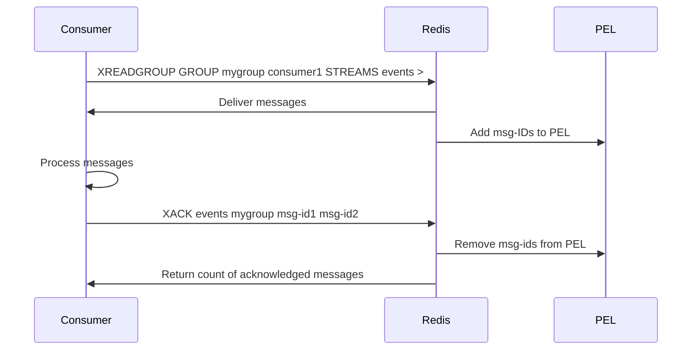

# How to Use XACK in Redis Streams Consumer Groups

Author: [nawazdhandala](https://www.github.com/nawazdhandala)

Tags: Redis, XACK, Stream, Consumer Group, Acknowledgment

Description: Learn how to use XACK in Redis Streams to acknowledge message processing within consumer groups, remove messages from the pending list, and build reliable at-least-once message processing.

---

## How XACK Works

In Redis Streams consumer groups, messages delivered to a consumer are tracked in a Pending Entry List (PEL) until they are acknowledged. XACK marks one or more messages as successfully processed, removing them from the PEL. Unacknowledged messages can be detected with XPENDING and re-delivered with XCLAIM or XAUTOCLAIM.

Without XACK, messages remain in the PEL indefinitely and will be re-delivered to another consumer if the original consumer is considered failed or idle for too long.



## Syntax

```redis
XACK key group id [id ...]
```

- `key` - the stream key
- `group` - the consumer group name
- `id [id ...]` - one or more message IDs to acknowledge

Returns an integer: the number of messages that were successfully acknowledged (i.e., were in the PEL and are now removed).

## Examples

### Setup - create stream, group, and read a message

```redis
XADD orders:stream * product "laptop" qty 1
XADD orders:stream * product "mouse" qty 2

XGROUP CREATE orders:stream order-processors $ MKSTREAM
XGROUP SETID orders:stream order-processors 0
```

Read messages as a consumer:

```redis
XREADGROUP GROUP order-processors worker-1 COUNT 10 STREAMS orders:stream >
```

```text
1) 1) "orders:stream"
   2) 1) 1) "1748700000000-0"
         2) 1) "product"
            2) "laptop"
            3) "qty"
            4) "1"
      2) 1) "1748700000001-0"
         2) 1) "product"
            2) "mouse"
            3) "qty"
            4) "2"
```

### Acknowledge one message

```redis
XACK orders:stream order-processors 1748700000000-0
```

```text
(integer) 1
```

### Acknowledge multiple messages at once

```redis
XACK orders:stream order-processors 1748700000000-0 1748700000001-0
```

```text
(integer) 2
```

### Check what is pending before and after XACK

Before acknowledging:

```redis
XPENDING orders:stream order-processors - + 10
```

```text
1) 1) "1748700000000-0"
   2) "worker-1"
   3) (integer) 5000
   4) (integer) 1
2) 1) "1748700000001-0"
   2) "worker-1"
   3) (integer) 5000
   4) (integer) 1
```

After acknowledging both:

```redis
XACK orders:stream order-processors 1748700000000-0 1748700000001-0
XPENDING orders:stream order-processors - + 10
```

```text
(empty array)
```

### XACK returns 0 for unknown IDs

If you try to acknowledge an ID that is not in the PEL (either already acknowledged, never delivered, or wrong stream):

```redis
XACK orders:stream order-processors 9999999999999-0
```

```text
(integer) 0
```

### Typical consumer loop with XACK

```bash
GROUP="order-processors"
CONSUMER="worker-1"
STREAM="orders:stream"

while true; do
  messages=$(redis-cli XREADGROUP GROUP $GROUP $CONSUMER COUNT 10 BLOCK 5000 STREAMS $STREAM ">")

  for msg_id in $(parse_ids "$messages"); do
    # Process the message
    process_message "$msg_id"

    # Acknowledge after successful processing
    redis-cli XACK $STREAM $GROUP $msg_id
  done
done
```

## At-Least-Once Processing Guarantee

The XACK model provides at-least-once delivery:

1. A consumer reads messages with XREADGROUP.
2. Messages enter the PEL.
3. If the consumer crashes before XACK, the message stays in the PEL.
4. Another consumer can claim orphaned messages with XAUTOCLAIM.
5. The message is reprocessed.

To avoid double-processing, implement idempotency in your message handlers so re-processing the same message has no harmful side effects.

## Use Cases

**Reliable job processing** - Workers acknowledge jobs only after successful completion. Crashed workers leave jobs in the PEL for recovery.

**Order processing** - Acknowledge an order only after it has been written to the database, ensuring no order is lost even if the worker crashes mid-processing.

**Audit trail** - Track which messages have been processed and which are still outstanding by monitoring PEL size with XPENDING.

**Backpressure** - Monitor PEL depth to detect processing lag and scale consumers accordingly.

## Summary

XACK removes one or more messages from a consumer group's Pending Entry List (PEL), marking them as successfully processed. Messages remain in the PEL until explicitly acknowledged, providing at-least-once delivery semantics. Always call XACK after successfully processing a message; never call it speculatively before processing. Use XPENDING to inspect unacknowledged messages and XAUTOCLAIM to recover messages from crashed consumers.
