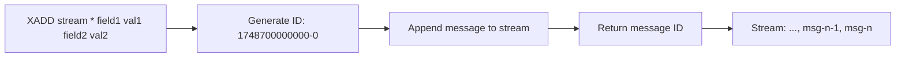

# How to Use XADD in Redis Streams to Append Messages

Author: [nawazdhandala](https://www.github.com/nawazdhandala)

Tags: Redis, XADD, Stream, Message Queue, Event Log

Description: Learn how to use XADD in Redis Streams to append messages with field-value pairs, control stream IDs, set maximum stream length, and model event logs and message queues.

---

## How XADD Works

XADD appends a new message to a Redis Stream. Each message is a set of field-value pairs identified by a unique, time-ordered ID. The default ID format is `<milliseconds>-<sequence>`, which Redis generates automatically when you use `*` as the ID. Messages are appended in ID order and cannot be inserted in the middle or at the beginning.

Streams are persistent by nature and retain all messages unless you explicitly trim them with XTRIM or the MAXLEN option in XADD.



## Syntax

```redis
XADD key [NOMKSTREAM] [MAXLEN | MINID [= | ~] threshold [LIMIT count]] *|id field value [field value ...]
```

- `key` - the stream key
- `NOMKSTREAM` - do not create the stream if it does not exist
- `MAXLEN ~ N` - trim to approximately N messages (efficient)
- `MAXLEN = N` - trim to exactly N messages (slower)
- `MINID ~ id` - trim messages with IDs older than the given ID
- `*` - auto-generate ID from current timestamp
- `id` - explicit ID in `ms-seq` format

## Examples

### Basic XADD with auto-generated ID

```redis
XADD events:log * action "user-login" user "alice" ip "192.168.1.1"
```

```text
"1748700000000-0"
```

### Append another message

```redis
XADD events:log * action "page-view" user "alice" page "/dashboard"
```

```text
"1748700000001-0"
```

### View messages in the stream

```redis
XRANGE events:log - +
```

```text
1) 1) "1748700000000-0"
   2) 1) "action"
      2) "user-login"
      3) "user"
      4) "alice"
      5) "ip"
      6) "192.168.1.1"
2) 1) "1748700000001-0"
   2) 1) "action"
      2) "page-view"
      3) "user"
      4) "alice"
      5) "page"
      6) "/dashboard"
```

### XADD with MAXLEN to cap stream size

Keep the stream at approximately 1000 messages:

```redis
XADD events:log MAXLEN ~ 1000 * action "purchase" user "bob" amount "99.99"
```

```text
"1748700000002-0"
```

The `~` (approximate) flag allows Redis to trim slightly more than needed for efficiency. Use `=` for exact trimming.

### XADD with explicit ID

Use an explicit ID when you need deterministic IDs (e.g., for replication or testing):

```redis
XADD events:log 1748700000100-0 action "logout" user "alice"
```

```text
"1748700000100-0"
```

### XADD with NOMKSTREAM

Only append if the stream already exists:

```redis
XADD events:log NOMKSTREAM * action "test"
```

If the stream does not exist, returns nil instead of creating it.

```text
(nil)
```

### XADD with MINID - trim by age

Trim messages older than a specific ID (e.g., messages older than 1 hour):

```redis
XADD events:log MINID ~ 1748696400000 * action "heartbeat" service "api"
```

Messages with IDs earlier than `1748696400000-0` are removed.

### Get stream length

```redis
XLEN events:log
```

```text
(integer) 4
```

## Message ID Structure

Redis Stream IDs have the format `<milliseconds>-<sequence>`:

- `1748700000000-0` - first message at timestamp 1748700000000ms
- `1748700000000-1` - second message at the same millisecond
- `1748700000001-0` - first message at the next millisecond

IDs are always monotonically increasing. Redis rejects XADD with an ID lower than the last message's ID.

## Use Cases

**Event logging** - Append application events (user actions, errors, system events) to a persistent, time-ordered stream.

**Message queue** - Use streams as a durable message queue where producers XADD messages and consumers XREAD or use consumer groups.

**Activity feeds** - Store user activity in a stream per user and read recent events with XREVRANGE.

**IoT sensor data** - Each sensor appends readings to its own stream. MAXLEN keeps memory bounded.

**Audit trail** - Build a tamper-resistant audit log where each record is immutably appended with a timestamp-based ID.

## Summary

XADD appends messages to a Redis Stream with an auto-generated time-ordered ID. Messages contain arbitrary field-value pairs. Use MAXLEN or MINID with the approximate `~` flag to keep stream size bounded in production. Explicit IDs are supported for controlled sequencing. Streams are persistent and ordered, making XADD the foundation for event logs, message queues, and audit trails in Redis.
