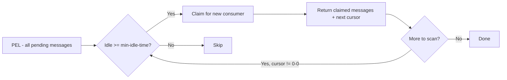

# How to Use XAUTOCLAIM in Redis Streams for Auto-Reassignment

Author: [nawazdhandala](https://www.github.com/nawazdhandala)

Tags: Redis, Stream, XAUTOCLAIM, Consumer Group, Fault Tolerance

Description: Learn how to use XAUTOCLAIM (Redis 6.2+) to automatically scan and reassign pending messages in a Redis Stream consumer group in a single atomic command.

---

Redis 6.2 introduced `XAUTOCLAIM` as a more efficient alternative to the manual `XPENDING` + `XCLAIM` workflow. It scans the Pending Entries List (PEL) for messages idle longer than a threshold and atomically transfers them to a new consumer - all in one command.

## How XAUTOCLAIM Works

`XAUTOCLAIM` starts scanning the PEL from a given ID and claims up to `COUNT` messages that have been idle for at least `min-idle-time` milliseconds. It returns the newly claimed messages along with a cursor for continuing the scan in subsequent calls - similar to how `SCAN` works for key iteration.



## Syntax

```redis
XAUTOCLAIM key group consumer min-idle-time start [COUNT count] [JUSTID]
```

- `key` - stream name
- `group` - consumer group name
- `consumer` - new consumer to claim the messages
- `min-idle-time` - claim messages idle for at least this many milliseconds
- `start` - PEL cursor to start scanning from (use `0-0` to begin from the start)
- `COUNT count` - maximum messages to claim per call (default 100)
- `JUSTID` - return only IDs, not full message payloads

## Examples

### Basic Auto-Claim

Claim up to 10 messages idle for more than 30 seconds, starting from the beginning of the PEL:

```redis
XAUTOCLAIM mystream workers recovery-consumer 30000 0-0 COUNT 10
```

Example output:

```text
1) "0-0"
2) 1) 1) "1711900000000-0"
         2) 1) "task"
            2) "process_order"
3) (empty array)
```

The response has three elements:
1. Next cursor (`0-0` means scan is complete)
2. Array of claimed messages with full data
3. Array of message IDs that were in the PEL but no longer exist in the stream (deleted)

### Paginated Scanning

When there are many pending messages, iterate using the returned cursor:

```redis
XAUTOCLAIM mystream workers recovery-consumer 60000 0-0 COUNT 100
```

If the cursor returned is not `0-0`, continue from that position:

```redis
XAUTOCLAIM mystream workers recovery-consumer 60000 1711900005000-0 COUNT 100
```

### Using JUSTID

Return only claimed message IDs without the full payload:

```redis
XAUTOCLAIM mystream workers recovery-consumer 30000 0-0 COUNT 50 JUSTID
```

## Full Recovery Loop Example

```bash
cursor="0-0"
while true; do
  result=$(redis-cli XAUTOCLAIM mystream workers recovery-consumer 30000 "$cursor" COUNT 100)
  # parse new cursor from result[0]
  # process claimed messages from result[1]
  # if cursor == "0-0", scan complete - sleep and restart
  break
done
```

## XAUTOCLAIM vs XCLAIM

| Feature | XCLAIM | XAUTOCLAIM |
|---|---|---|
| Requires XPENDING first | Yes | No |
| Atomic scan + claim | No | Yes |
| Cursor-based pagination | No | Yes |
| Reports deleted PEL entries | No | Yes |
| Redis version | All | 6.2+ |

## Use Cases

- **Automated watchdog processes** - periodically reclaim stalled messages without a separate XPENDING scan
- **Self-healing consumers** - each consumer attempts to reclaim its own stalled messages on startup
- **Dead-letter detection** - inspect the delivery count on claimed messages and route to error handling after N retries
- **High-throughput pipelines** - efficiently process large PELs with pagination

## Summary

`XAUTOCLAIM` simplifies fault-tolerant stream processing by combining PEL scanning and message claiming into a single atomic operation. Use the `0-0` cursor to start a full PEL scan, and iterate using the returned cursor until you receive `0-0` again. This makes it the preferred approach over the older `XPENDING` + `XCLAIM` pattern for Redis 6.2 and later deployments.
