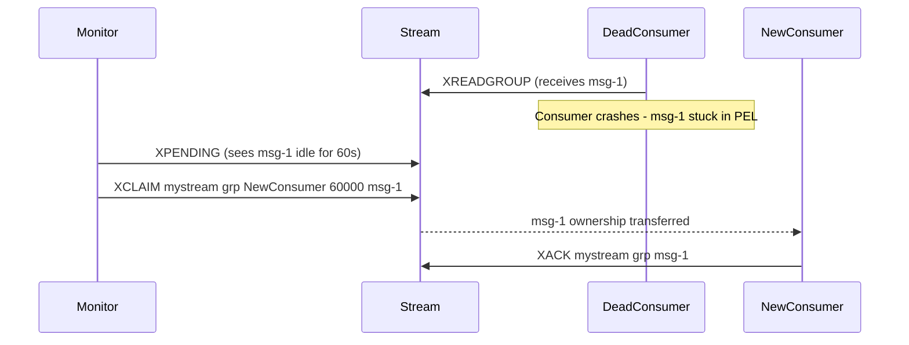

# How to Use XCLAIM in Redis Streams to Reassign Pending Messages

Author: [nawazdhandala](https://www.github.com/nawazdhandala)

Tags: Redis, Stream, XCLAIM, Consumer Group, Fault Tolerance

Description: Learn how to use XCLAIM to reassign stalled pending messages from one consumer to another in a Redis Stream consumer group for fault-tolerant processing.

---

In a Redis Streams consumer group, messages are tracked in a Pending Entries List (PEL) after delivery. If a consumer crashes or stalls, its pending messages are never acknowledged. `XCLAIM` lets you forcibly reassign those messages to a different consumer so processing can continue.

## How XCLAIM Works

`XCLAIM` transfers ownership of one or more pending messages from their current consumer to a new one. You specify a minimum idle time - messages that have been pending longer than this threshold are eligible for reassignment. This prevents healthy consumers from stealing messages that are still being actively processed.



## Syntax

```redis
XCLAIM key group consumer min-idle-time id [id ...] [IDLE ms] [TIME ms-unix-time] [RETRYCOUNT count] [FORCE] [JUSTID]
```

- `key` - stream name
- `group` - consumer group name
- `consumer` - new owner of the message
- `min-idle-time` - only claim if idle for at least this many milliseconds
- `id` - message ID(s) to claim
- `IDLE ms` - reset idle timer to this value instead of 0
- `RETRYCOUNT count` - manually set the delivery count
- `FORCE` - claim even if the message is not in PEL
- `JUSTID` - return only IDs, not full message data

## Examples

### Basic Claim

Find pending messages with `XPENDING` first, then claim those idle more than 60 seconds:

```redis
XPENDING mystream workers - + 10
```

Then claim a specific stalled message:

```redis
XCLAIM mystream workers backup-consumer 60000 1711900000000-0
```

### Claim Multiple Messages

You can claim several messages in one call:

```redis
XCLAIM mystream workers backup-consumer 60000 1711900000000-0 1711900001000-0 1711900002000-0
```

### Using JUSTID for Lightweight Response

When you only need the IDs without the full message payload:

```redis
XCLAIM mystream workers backup-consumer 60000 1711900000000-0 JUSTID
```

Example output:

```text
1) "1711900000000-0"
```

### Preserving Delivery Count

When reclaiming, Redis increments the delivery count. You can override it:

```redis
XCLAIM mystream workers backup-consumer 60000 1711900000000-0 RETRYCOUNT 3
```

## Typical Recovery Workflow

A monitoring process periodically scans for stalled messages and reassigns them:

```bash
# 1. List pending messages idle > 60 seconds
redis-cli XPENDING mystream workers - + 100

# 2. For each stalled message ID, claim it to the backup consumer
redis-cli XCLAIM mystream workers backup-consumer 60000 1711900000000-0

# 3. The backup consumer processes and acknowledges
redis-cli XACK mystream workers 1711900000000-0
```

## Use Cases

- **Crash recovery** - reassign messages from a crashed consumer to a healthy one
- **Slow consumer recovery** - detect and reassign messages stuck with an overloaded worker
- **Dead letter handling** - after N retries, route messages to a special error queue
- **Manual reprocessing** - force re-delivery of specific messages for debugging

## Summary

`XCLAIM` is the manual mechanism for recovering stalled messages in Redis Streams consumer groups. By checking idle time and delivery counts via `XPENDING`, you can implement robust failure detection and automatic recovery. For a more automated approach, Redis 6.2+ introduced `XAUTOCLAIM` which combines pending scanning and claiming in a single atomic command.
