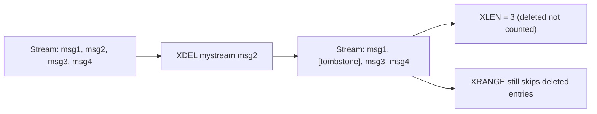

# How to Use XDEL in Redis Streams to Delete Messages

Author: [nawazdhandala](https://www.github.com/nawazdhandala)

Tags: Redis, Stream, XDEL, Message Management

Description: Learn how to use XDEL to remove specific messages from a Redis Stream by ID, including behavior with consumer groups and memory considerations.

---

Redis Streams are append-only by design, but `XDEL` lets you remove specific messages from a stream by their IDs. This is useful for compliance requirements, removing sensitive data, or cleaning up individual erroneous entries.

## How XDEL Works

`XDEL` removes one or more messages from a stream by their IDs. Unlike `XTRIM` which removes entries by length or time, `XDEL` targets specific message IDs. The stream's length reported by `XLEN` decreases, but the underlying radix tree may still reference the deleted entries as tombstones until the tree is compacted.



## Syntax

```redis
XDEL key id [id ...]
```

- `key` - stream name
- `id` - one or more message IDs to delete

Returns the number of messages actually deleted (IDs that did not exist are not counted).

## Examples

### Delete a Single Message

```redis
XDEL mystream 1711900000000-0
```

Returns `1` if the message existed and was deleted.

### Delete Multiple Messages

```redis
XDEL mystream 1711900000000-0 1711900001000-0 1711900002000-0
```

Returns the count of successfully deleted messages.

### Verify Deletion with XRANGE

After deletion, XRANGE skips the deleted IDs:

```redis
XRANGE mystream - +
```

### Check Stream Length

```redis
XLEN mystream
```

The count reflects deletions.

## Behavior with Consumer Groups

If you delete a message that is still pending in a consumer group's PEL, the message is removed from the stream but the PEL entry remains. When the consumer tries to acknowledge it, `XACK` succeeds (it removes the PEL entry), but the message data is gone. `XAUTOCLAIM` will return deleted PEL entries in its third return value.

```redis
# Message 1711900000000-0 is pending for consumer1
XDEL mystream 1711900000000-0

# Consumer1 can still acknowledge (removes PEL entry)
XACK mystream workers 1711900000000-0
```

## Memory Considerations

Deleted entries become tombstones in the stream's internal radix tree. The memory is not immediately reclaimed. To fully compact memory, follow `XDEL` with `XTRIM`:

```redis
XDEL mystream 1711900000000-0
XTRIM mystream MAXLEN ~ 1000
```

## Use Cases

- **GDPR/compliance** - remove messages containing user personal data on deletion requests
- **Error correction** - remove a mistakenly published message before consumers process it
- **Security** - purge messages containing accidentally logged secrets
- **Targeted cleanup** - remove specific test messages from a shared stream

## Summary

`XDEL` provides surgical removal of specific messages from a Redis Stream. It is the right tool when you need to target individual entries by ID, while `XTRIM` is better for bulk trimming by length or time. Be aware that deleted entries leave tombstones until the stream is trimmed, and that pending PEL references to deleted messages require explicit `XACK` cleanup.
