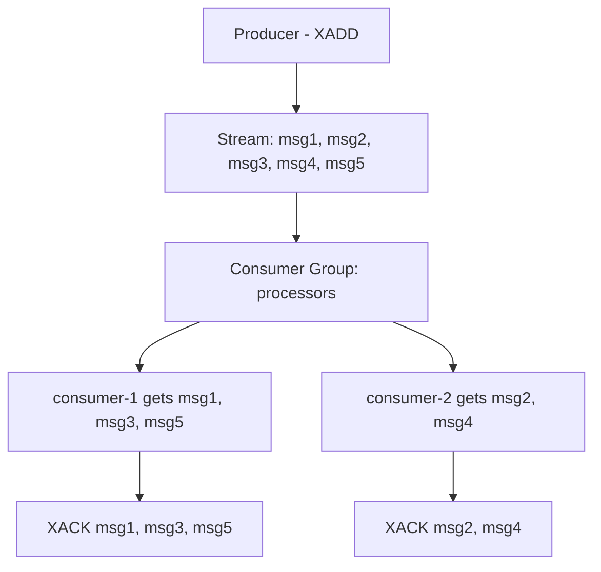

# How to Use XGROUP CREATE in Redis Streams Consumer Groups

Author: [nawazdhandala](https://www.github.com/nawazdhandala)

Tags: Redis, XGROUP CREATE, Stream, Consumer Group, XREADGROUP

Description: Learn how to use XGROUP CREATE in Redis Streams to set up consumer groups for parallel, fault-tolerant message processing with automatic load balancing across multiple consumers.

---

## How XGROUP CREATE Works

XGROUP CREATE creates a consumer group attached to a stream at a specific position. Consumer groups allow multiple consumers to read from the same stream cooperatively - each message is delivered to exactly one consumer in the group (unlike XREAD where all readers see all messages).

The group tracks which messages each consumer has received and acknowledged, enabling reliable at-least-once delivery and crash recovery via the Pending Entry List (PEL).



## Syntax

```redis
XGROUP CREATE key groupname id | $ [MKSTREAM] [ENTRIESREAD entries-read]
```

- `key` - the stream key
- `groupname` - the consumer group name
- `id` - the last ID the group has seen; consumers will receive messages after this ID
- `$` - special ID meaning "only deliver new messages from now on"
- `0` - process all existing messages from the beginning
- `MKSTREAM` - create the stream if it does not exist
- `ENTRIESREAD` - set the acknowledged count for lag calculation (Redis 7.0+)

## Examples

### Create a consumer group starting from now

```redis
XADD orders:stream * product "old-order" qty 1

XGROUP CREATE orders:stream order-workers $
```

```text
OK
```

This group will only receive new messages added after the XGROUP CREATE call.

### Create a consumer group to process all existing messages

```redis
XGROUP CREATE orders:stream order-workers 0
```

Using `0` as the ID means the group will start from the very first message.

### Create a group and the stream together (MKSTREAM)

```redis
XGROUP CREATE new:stream my-group $ MKSTREAM
```

```text
OK
```

If `new:stream` does not exist, it is created as an empty stream.

### List consumer groups on a stream

```redis
XINFO GROUPS orders:stream
```

```text
1) 1) "name"
   2) "order-workers"
   3) "consumers"
   4) (integer) 0
   5) "pending"
   6) (integer) 0
   7) "last-delivered-id"
   8) "1748700000000-0"
   9) "entries-read"
   10) (integer) 1
   11) "lag"
   12) (integer) 0
```

### Read messages as a consumer within the group

Use `>` as the ID to get the next undelivered messages:

```redis
XREADGROUP GROUP order-workers worker-1 COUNT 10 STREAMS orders:stream >
```

```text
1) 1) "orders:stream"
   2) 1) 1) "1748700000001-0"
         2) 1) "product"
            2) "new-order"
            3) "qty"
            4) "2"
```

### Acknowledge a processed message

```redis
XACK orders:stream order-workers 1748700000001-0
```

```text
(integer) 1
```

### Multiple consumers in the same group

Two workers consuming from the same group:

```redis
# Worker 1
XREADGROUP GROUP order-workers worker-1 COUNT 5 STREAMS orders:stream >

# Worker 2
XREADGROUP GROUP order-workers worker-2 COUNT 5 STREAMS orders:stream >
```

Each message is delivered to exactly one worker.

### Create a group at a specific historical ID

Resume from a known position after a restart:

```redis
XGROUP CREATE orders:stream order-workers 1748700000000-0
```

Messages after `1748700000000-0` will be delivered to consumers.

### Modify the group position with XGROUP SETID

Move the group cursor forward (skip old messages) or backward (reprocess):

```redis
XGROUP SETID orders:stream order-workers 1748700000010-0
```

```text
OK
```

### Delete a consumer group

```redis
XGROUP DESTROY orders:stream order-workers
```

```text
(integer) 1
```

Deletes the group and all its consumer tracking state. Pending messages are not deleted from the stream itself.

### Delete a specific consumer from a group

```redis
XGROUP DELCONSUMER orders:stream order-workers worker-1
```

```text
(integer) 3
```

Returns the number of pending messages that were owned by this consumer.

## Consumer Group vs Plain XREAD

| Feature | XREAD | Consumer Group (XREADGROUP) |
|---|---|---|
| Message delivery | All consumers see all messages | Each message to exactly one consumer |
| Position tracking | Manual (client tracks cursor) | Automatic per group |
| Fault tolerance | No pending tracking | PEL tracks unacknowledged messages |
| Load balancing | None | Automatic among group consumers |
| Use case | Fan-out / broadcast | Work queue / parallel processing |

## Use Cases

**Work queue processing** - Distribute jobs across multiple worker processes where each job must be processed exactly once.

**Microservice event consumption** - Each microservice creates its own consumer group on a shared event stream, ensuring each service processes all events independently.

**Parallel stream processing** - Scale throughput by adding more consumers to a group; Redis automatically distributes messages.

**Crash recovery** - Use XPENDING and XAUTOCLAIM to detect and re-assign messages from crashed consumers.

**Multi-stage pipelines** - Create multiple groups on the same stream for different processing stages (e.g., "validators", "processors", "notifiers").

## Summary

XGROUP CREATE establishes a named consumer group on a Redis Stream at a specified position. Use `$` to start from new messages only, or `0` to process the full stream history. Add MKSTREAM to create the stream automatically. Consumers in the group use XREADGROUP to fetch messages (each message goes to one consumer) and XACK to confirm processing. Consumer groups provide at-least-once delivery with automatic pending tracking, making them the right tool for reliable parallel stream processing.
