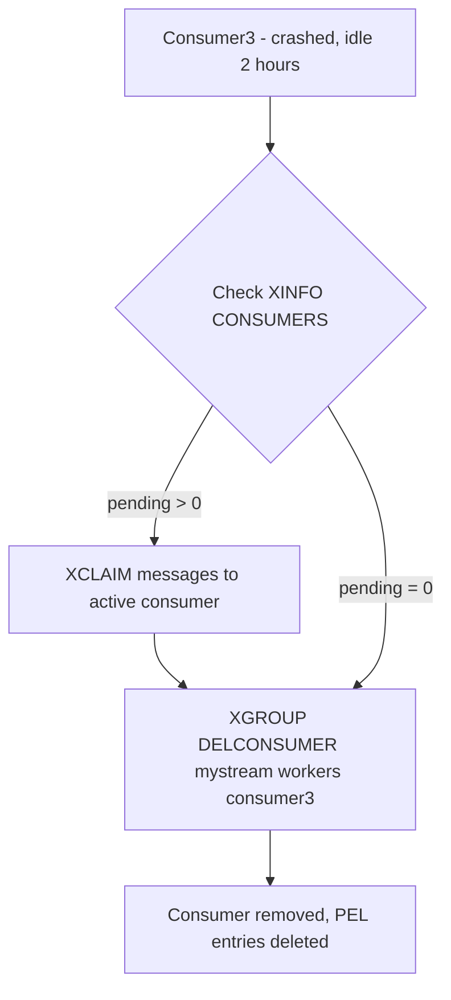

# How to Use XGROUP DELCONSUMER in Redis

Author: [nawazdhandala](https://www.github.com/nawazdhandala)

Tags: Redis, Stream, XGROUP, Consumer Group, Cleanup

Description: Learn how to use XGROUP DELCONSUMER to remove a consumer from a Redis Stream consumer group and handle its pending messages safely.

---

In a Redis Streams consumer group, consumers are automatically created when they first call `XREADGROUP`. Over time, terminated or replaced consumers accumulate as stale entries. `XGROUP DELCONSUMER` removes a consumer from the group, and also deletes any pending messages in its PEL.

## How XGROUP DELCONSUMER Works

When you delete a consumer, Redis removes its entry from the consumer group and purges all pending (unacknowledged) messages associated with it from the Pending Entries List. Those pending messages are permanently removed from the PEL - they will not be automatically re-delivered.



## Syntax

```redis
XGROUP DELCONSUMER key groupname consumername
```

- `key` - stream name
- `groupname` - consumer group name
- `consumername` - consumer to remove

Returns the number of pending messages that were deleted from the PEL.

## Examples

### Delete a Consumer with No Pending Messages

```redis
XGROUP DELCONSUMER mystream workers consumer2
```

Returns `0` if the consumer had no pending messages.

### Safe Deletion Workflow

Always check for pending messages before deleting:

```redis
XINFO CONSUMERS mystream workers
```

If `pending > 0` for the target consumer, claim its messages first:

```redis
XAUTOCLAIM mystream workers active-consumer 0 0-0 COUNT 100
```

Then delete the consumer:

```redis
XGROUP DELCONSUMER mystream workers consumer3
```

### Verify Deletion

After deletion, confirm the consumer is gone:

```redis
XINFO CONSUMERS mystream workers
```

## Return Value Behavior

The return value indicates how many PEL entries were deleted:

```text
# consumer3 had 8 pending messages
XGROUP DELCONSUMER mystream workers consumer3
(integer) 8
```

If you get a non-zero return, those messages were permanently removed from the PEL. They will not be redelivered unless you had already claimed them to another consumer before deletion.

## Automating Stale Consumer Cleanup

A maintenance script can periodically remove idle consumers that have no pending work:

```bash
# List consumers with idle > 3600000ms (1 hour) and pending = 0
redis-cli XINFO CONSUMERS mystream workers
# For each idle consumer with pending = 0:
redis-cli XGROUP DELCONSUMER mystream workers stale-consumer-name
```

## Use Cases

- **Horizontal scale-down** - remove consumers when reducing worker count
- **Rolling deployments** - clean up consumers from old pod instances
- **Testing cleanup** - remove test consumers after integration test runs
- **Stale consumer management** - periodic cleanup of consumers that no longer connect

## Summary

`XGROUP DELCONSUMER` removes a consumer and its PEL entries from a Redis Streams consumer group. The key safety concern is that pending messages are not re-delivered - they are simply deleted. Always use `XINFO CONSUMERS` to check pending counts and `XAUTOCLAIM` to rescue any outstanding messages before calling `XGROUP DELCONSUMER`.
