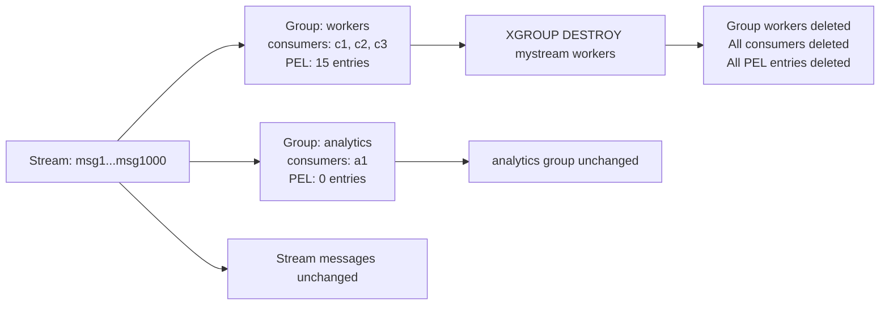

# How to Use XGROUP DESTROY in Redis to Remove Consumer Groups

Author: [nawazdhandala](https://www.github.com/nawazdhandala)

Tags: Redis, Stream, XGROUP, Consumer Group, Cleanup

Description: Learn how to use XGROUP DESTROY to completely remove a consumer group from a Redis Stream, including all its consumers and pending message entries.

---

When a consumer group is no longer needed, `XGROUP DESTROY` removes it entirely from the stream - along with all its consumers and their pending entries. The stream itself and its messages are unaffected.

## How XGROUP DESTROY Works

`XGROUP DESTROY` deletes the consumer group's metadata, every consumer registered in the group, and the entire Pending Entries List for the group. Messages still exist in the stream and can be consumed by other groups or via direct `XRANGE`/`XREAD` calls.



## Syntax

```redis
XGROUP DESTROY key groupname
```

- `key` - stream name
- `groupname` - consumer group to remove

Returns `1` if the group existed and was destroyed, `0` if it did not exist.

## Examples

### Destroy a Consumer Group

```redis
XGROUP DESTROY mystream workers
```

Returns `1` on success.

### Verify the Group is Gone

```redis
XINFO GROUPS mystream
```

The destroyed group will not appear in the output.

### Recreate with a Fresh Offset

After destroying and recreating a group, you control the starting position:

```redis
XGROUP DESTROY mystream workers
XGROUP CREATE mystream workers $ MKSTREAM
```

This effectively resets the group to consume only new messages.

## What Is and Is Not Deleted

| Item | Deleted? |
|---|---|
| Consumer group metadata | Yes |
| Consumer registrations | Yes |
| Pending Entries List (PEL) | Yes |
| Stream messages | No |
| Other consumer groups | No |
| Stream key itself | No |

## Safety Checklist Before Destruction

Before destroying a group in production, verify:

```redis
# 1. Check pending message count
XINFO GROUPS mystream
# Look at "pending" field for the group

# 2. List consumers and their pending counts
XINFO CONSUMERS mystream workers

# 3. Decide whether to drain or discard pending messages
# If draining: process and XACK all pending first
# If discarding: proceed with XGROUP DESTROY
```

## Use Cases

- **Decommissioning a service** - remove the consumer group when a downstream service is retired
- **Environment cleanup** - delete groups created for development or testing
- **Group rename/recreation** - destroy and recreate with a different name or starting offset
- **Removing broken groups** - clean up groups in an inconsistent state during incident recovery

## Summary

`XGROUP DESTROY` is a destructive but clean operation - it removes the consumer group and all associated state while leaving the stream data intact. Unlike `XGROUP DELCONSUMER` which removes one consumer at a time, `XGROUP DESTROY` wipes everything in one call. Always audit pending messages before destroying a production group, as unacknowledged messages will be permanently lost from the PEL.
