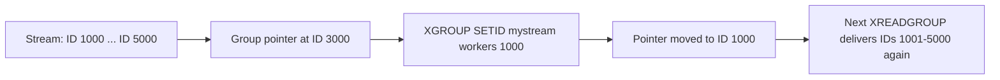

# How to Use XGROUP SETID in Redis to Set Consumer Group Offset

Author: [nawazdhandala](https://www.github.com/nawazdhandala)

Tags: Redis, Stream, XGROUP, Consumer Group, Offset

Description: Learn how to use XGROUP SETID to reposition a Redis Stream consumer group's read offset, enabling replay from any point or skipping old messages.

---

A Redis Stream consumer group maintains a `last-delivered-id` that tracks which messages have been delivered. `XGROUP SETID` lets you manually reposition this offset - rewinding to replay historical messages or fast-forwarding to skip a backlog.

## How XGROUP SETID Works

Each consumer group has a last-delivered-id pointer. When consumers call `XREADGROUP` with `>`, they receive messages after this pointer. `XGROUP SETID` moves the pointer to any valid stream ID, changing what "new" messages means for that group.



## Syntax

```redis
XGROUP SETID key groupname id [ENTRIESREAD entries-read]
```

- `key` - stream name
- `groupname` - consumer group name
- `id` - new last-delivered-id; use `$` to advance to the latest message, `0` to rewind to the beginning
- `ENTRIESREAD entries-read` - manually set the entries-read counter (affects lag calculation)

## Examples

### Rewind to Beginning (Full Replay)

Set the group offset to `0` so the next `XREADGROUP` re-delivers all messages from the start:

```redis
XGROUP SETID mystream workers 0
```

### Fast-Forward to Latest (Skip Backlog)

Move the pointer to `$` (the current last message) so consumers only see future messages:

```redis
XGROUP SETID mystream workers $
```

### Set to a Specific ID

Reprocess messages from a known good checkpoint:

```redis
XGROUP SETID mystream workers 1711900000000-0
```

Consumers will next receive messages with IDs greater than `1711900000000-0`.

### Update ENTRIESREAD for Correct Lag

When rewinding, the `entries-read` counter becomes inaccurate. Reset it to fix lag reporting:

```redis
XGROUP SETID mystream workers 0 ENTRIESREAD 0
```

## Common Scenarios

### Replay After a Bug Fix

A processing bug corrupted results. After deploying the fix, rewind the group to replay from the beginning:

```redis
# 1. Stop consumers
# 2. Reset group offset
XGROUP SETID mystream workers 0
# 3. Restart consumers - they will re-process all messages
```

### Skip a Stuck Backlog

A group has accumulated millions of unprocessable messages. Skip to current:

```redis
XGROUP SETID mystream workers $
```

### Roll Back to a Checkpoint

After a partial deployment failure, roll back to last known-good ID:

```redis
XGROUP SETID mystream workers 1711899000000-0
```

## Important Notes

- `XGROUP SETID` does NOT affect the Pending Entries List (PEL). Pending messages remain pending until acknowledged or claimed.
- Moving the pointer backward will re-deliver messages to consumers as new, but messages already in the PEL remain there.
- Use `XPENDING` to check for outstanding pending messages before rewinding.

## Use Cases

- **Replay pipelines** - reprocess all historical messages after a schema change
- **Recovery from bugs** - rewind to before a bad deployment and reprocess
- **Onboarding a new group** - position a new group at a specific historical point
- **Backlog management** - skip old irrelevant messages and start fresh

## Summary

`XGROUP SETID` gives you direct control over a consumer group's read position in a Redis Stream. Use `0` to rewind for full replay, `$` to skip to current, or a specific ID for checkpoint-based recovery. Always account for existing PEL entries separately, as the offset change only affects future `XREADGROUP` calls with the `>` ID.
