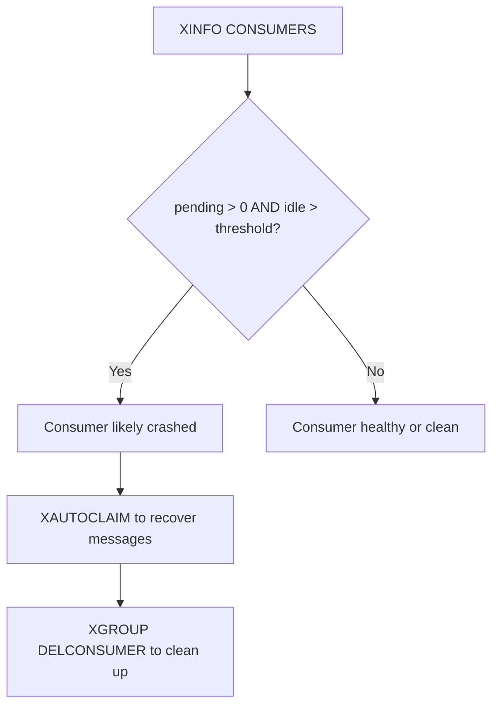

# How to Use XINFO CONSUMERS in Redis

Author: [nawazdhandala](https://www.github.com/nawazdhandala)

Tags: Redis, Stream, XINFO, Consumer Group, Monitoring

Description: Learn how to use XINFO CONSUMERS to list all consumers within a Redis Stream consumer group, including their pending counts and idle times.

---

Within a Redis Stream consumer group, individual consumers are tracked with their own pending message counts and activity timestamps. `XINFO CONSUMERS` gives you per-consumer visibility so you can identify idle, crashed, or overloaded workers.

## How XINFO CONSUMERS Works

`XINFO CONSUMERS` returns one record per consumer registered in a specific consumer group. Each record includes the consumer's name, how many messages are in their PEL (pending entries list), when they last interacted with the stream, and when they were created.

## Syntax

```redis
XINFO CONSUMERS key groupname
```

- `key` - stream name
- `groupname` - the consumer group to inspect

## Examples

### List All Consumers in a Group

```redis
XINFO CONSUMERS mystream workers
```

Example output:

```text
1) 1) "name"
   2) "consumer1"
   3) "pending"
   4) (integer) 4
   5) "idle"
   6) (integer) 75234
   7) "inactive"
   8) (integer) 75234
2) 1) "name"
   2) "consumer2"
   3) "pending"
   4) (integer) 0
   5) "idle"
   6) (integer) 3100
   7) "inactive"
   8) (integer) 3100
3) 1) "name"
   2) "consumer3"
   3) "pending"
   4) (integer) 8
   5) "idle"
   6) (integer) 120000
   7) "inactive"
   8) (integer) 120000
```

Key fields:
- `name` - consumer identifier (set when calling XREADGROUP)
- `pending` - number of messages delivered but not yet acknowledged
- `idle` - milliseconds since the consumer last interacted with the stream
- `inactive` - milliseconds since the consumer was last active (Redis 7.2+)

### Identifying Crashed Consumers

A consumer with a high `idle` time and non-zero `pending` count is likely crashed or stalled:

```redis
XINFO CONSUMERS mystream workers
# consumer3: idle=120000ms, pending=8 -> likely crashed
```

Use `XCLAIM` or `XAUTOCLAIM` to reassign its messages:

```redis
XAUTOCLAIM mystream workers recovery-worker 60000 0-0 COUNT 100
```

### Checking Consumer Activity Before Deletion

Before removing a consumer with `XGROUP DELCONSUMER`, verify it has no pending messages:

```redis
XINFO CONSUMERS mystream workers
# If pending > 0, reassign or acknowledge before deleting
```



## Use Cases

- **Dead consumer detection** - alert when idle time exceeds your consumer's heartbeat interval
- **Load balancing audit** - verify messages are distributed evenly across consumers
- **Pre-deletion check** - confirm a consumer has no pending messages before removing it
- **Debugging stuck pipelines** - find which consumer holds the oldest unacknowledged message

## Summary

`XINFO CONSUMERS` provides the granular, per-consumer view needed to manage a Redis Streams consumer group in production. Monitor the `pending` and `idle` fields together - a consumer with both a high idle time and outstanding pending messages is your primary indicator of a processing failure that requires intervention via `XCLAIM` or `XAUTOCLAIM`.
