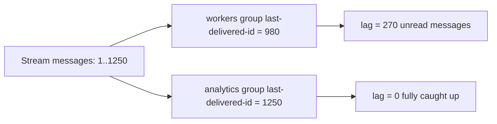

# How to Use XINFO GROUPS in Redis to List Consumer Groups

Author: [nawazdhandala](https://www.github.com/nawazdhandala)

Tags: Redis, Stream, XINFO, Consumer Group, Monitoring

Description: Learn how to use XINFO GROUPS to list all consumer groups attached to a Redis Stream, including their offsets, pending counts, and consumer details.

---

When running multiple consumer groups on a Redis Stream, you need visibility into each group's processing state. `XINFO GROUPS` returns a summary of every consumer group attached to a stream, showing their current offset, pending message counts, and consumer membership.

## How XINFO GROUPS Works

`XINFO GROUPS` queries the stream's internal group metadata and returns one record per group. Each record shows the group's last acknowledged ID (its current read position), how many messages are pending across all consumers, and how many consumers are registered.

## Syntax

```redis
XINFO GROUPS key
```

- `key` - stream name

## Examples

### List All Consumer Groups

```redis
XINFO GROUPS mystream
```

Example output:

```text
1) 1) "name"
   2) "workers"
   3) "consumers"
   4) (integer) 3
   5) "pending"
   6) (integer) 12
   7) "last-delivered-id"
   8) "1711900450000-0"
   9) "entries-read"
  10) (integer) 980
  11) "lag"
  12) (integer) 270
2) 1) "name"
   2) "analytics"
   3) "consumers"
   4) (integer) 1
   5) "pending"
   6) (integer) 0
   7) "last-delivered-id"
   8) "1711900500000-0"
   9) "entries-read"
  10) (integer) 1250
  11) "lag"
  12) (integer) 0
```

Key fields explained:
- `name` - consumer group name
- `consumers` - number of active consumers in this group
- `pending` - total pending (unacknowledged) messages across all consumers
- `last-delivered-id` - the ID of the last message delivered to this group
- `entries-read` - total messages consumed since group creation
- `lag` - number of messages in the stream that have not yet been delivered to this group

### Monitoring Group Lag

The `lag` field is critical for detecting a backlog. A high lag means the group is falling behind the producer:

```redis
XINFO GROUPS mystream
# Check the "lag" field for each group
```

### Combining with XLEN

Compare group lag to total stream length to understand relative progress:

```redis
XLEN mystream
XINFO GROUPS mystream
```

## Understanding Consumer Group Offset

The `last-delivered-id` represents where the group's read position is. If you need to rewind or fast-forward a group's offset, use `XGROUP SETID`.



## Use Cases

- **Processing lag monitoring** - alert when `lag` exceeds a threshold
- **Group audit** - verify expected consumer groups exist after deployments
- **Pending message investigation** - high `pending` count may indicate consumer crashes
- **Capacity planning** - track `entries-read` to measure consumer throughput

## Summary

`XINFO GROUPS` is the essential command for monitoring consumer group health in Redis Streams. The `lag` and `pending` fields are the most actionable metrics - a growing lag indicates the consumer group cannot keep up with the producer, while a high pending count suggests acknowledgment failures. Use these alongside `XINFO CONSUMERS` to drill down into individual consumer state.
